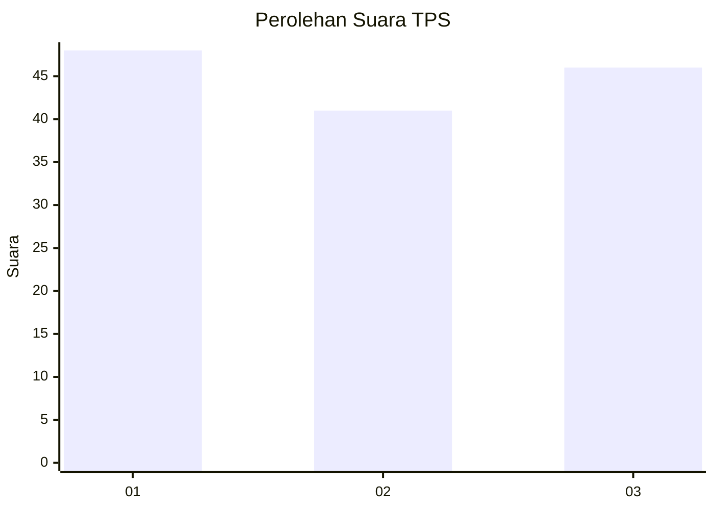
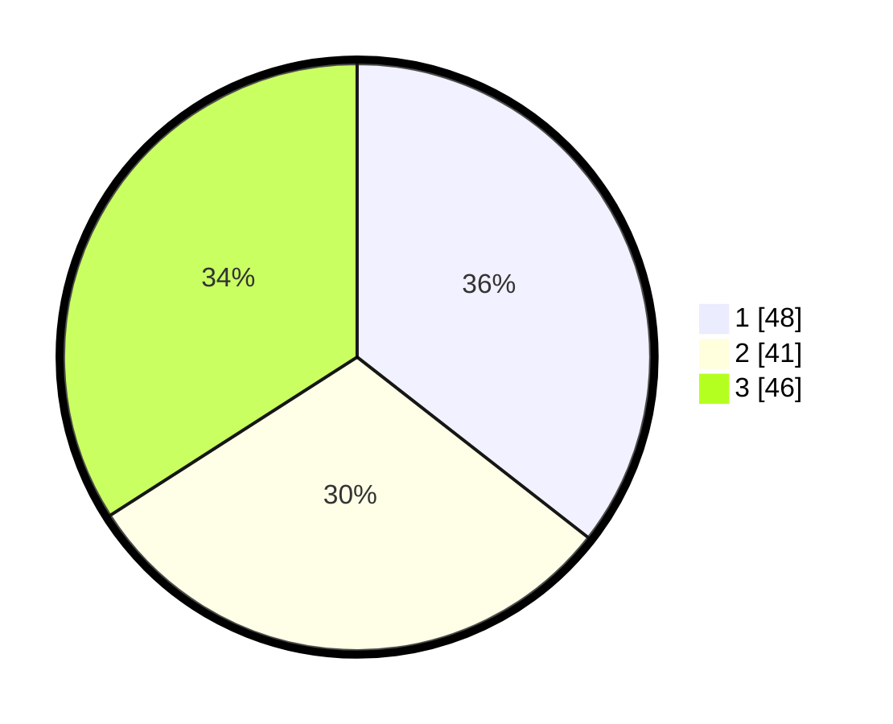

# Hasil

## Grafik

## Tabel

| No. | Nama Paslon    | Suara | Suara (raw) | Persentase |
|:--- |:-------------- | -----:| -----------:| ----------:|
| 1   | ANIES MUHAIMIN | 48    | [48][p-1]   | 35,56      |
| 2   | PRABOWO GIBRAN | 41    | [41][p-2]   | 30,37      |
| 3   | GANJAR MAHFUD  | 46    | [46][p-3]   | 34,07      |

[p-1]: https://github.com/gigit-pemilu/pemilu-2024/blob/main/pilpres/hitung-suara/sub/33-jawa-tengah/sub/29-brebes/sub/03-bumiayu/sub/2001-adisana/sub/015-tps/sub/paslon-1.txt
[p-2]: https://github.com/gigit-pemilu/pemilu-2024/blob/main/pilpres/hitung-suara/sub/33-jawa-tengah/sub/29-brebes/sub/03-bumiayu/sub/2001-adisana/sub/015-tps/sub/paslon-2.txt
[p-3]: https://github.com/gigit-pemilu/pemilu-2024/blob/main/pilpres/hitung-suara/sub/33-jawa-tengah/sub/29-brebes/sub/03-bumiayu/sub/2001-adisana/sub/015-tps/sub/paslon-3.txt

## Foto C Plano

https://sirekap-obj-formc.kpu.go.id/f609/pemilu/ppwp/33/29/03/20/01/3329032001015-20240214-141216--0c807641-deb2-4c68-a0d7-e766d3119db9.jpg

https://sirekap-obj-formc.kpu.go.id/f609/pemilu/ppwp/33/29/03/20/01/3329032001015-20240214-140941--0a9f9f02-fa6c-4729-8791-4b3a2ce594a8.jpg

https://sirekap-obj-formc.kpu.go.id/f609/pemilu/ppwp/33/29/03/20/01/3329032001015-20240220-154422--c3e8cd8d-cdd3-41d1-af44-8a756ba353a3.jpg

## Metadata

| Key        | Value               |
| ---------- | ------------------- |
| Time Stamp | 2024-02-20 16:00:00 |

