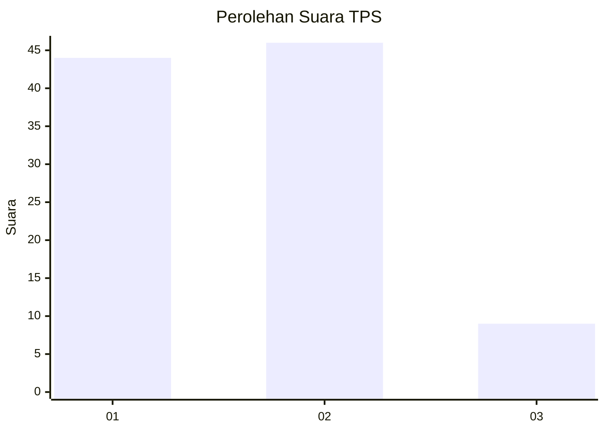
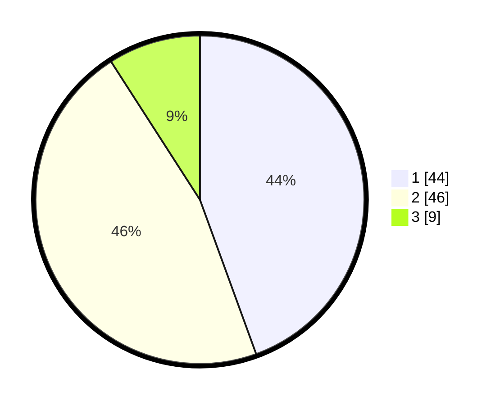

# Hasil

## Grafik

## Tabel

| No. | Nama Paslon    | Suara | Suara (raw) | Persentase |
|:--- |:-------------- | -----:| -----------:| ----------:|
| 1   | ANIES MUHAIMIN | 44    | [44][p-1]   | 44,44      |
| 2   | PRABOWO GIBRAN | 46    | [46][p-2]   | 46,46      |
| 3   | GANJAR MAHFUD  | 9     | [9][p-3]    | 9,09       |

[p-1]: https://github.com/gigit-pemilu/pemilu-2024/blob/main/pilpres/hitung-suara/sub/33-jawa-tengah/sub/29-brebes/sub/03-bumiayu/sub/2001-adisana/sub/023-tps/sub/paslon-1.txt
[p-2]: https://github.com/gigit-pemilu/pemilu-2024/blob/main/pilpres/hitung-suara/sub/33-jawa-tengah/sub/29-brebes/sub/03-bumiayu/sub/2001-adisana/sub/023-tps/sub/paslon-2.txt
[p-3]: https://github.com/gigit-pemilu/pemilu-2024/blob/main/pilpres/hitung-suara/sub/33-jawa-tengah/sub/29-brebes/sub/03-bumiayu/sub/2001-adisana/sub/023-tps/sub/paslon-3.txt

## Foto C Plano

https://sirekap-obj-formc.kpu.go.id/8c74/pemilu/ppwp/33/29/03/20/01/3329032001023-20240220-142938--95acf57b-9b0e-4fd0-9280-0dc2617aa362.jpg

https://sirekap-obj-formc.kpu.go.id/8c74/pemilu/ppwp/33/29/03/20/01/3329032001023-20240220-135217--2a481614-f71b-41eb-84e6-79a29bd63756.jpg

https://sirekap-obj-formc.kpu.go.id/8c74/pemilu/ppwp/33/29/03/20/01/3329032001023-20240221-205002--6ab25417-6e57-40f7-ad62-5af2eb9afd98.jpg

## Metadata

| Key        | Value               |
| ---------- | ------------------- |
| Time Stamp | 2024-02-24 22:31:28 |

