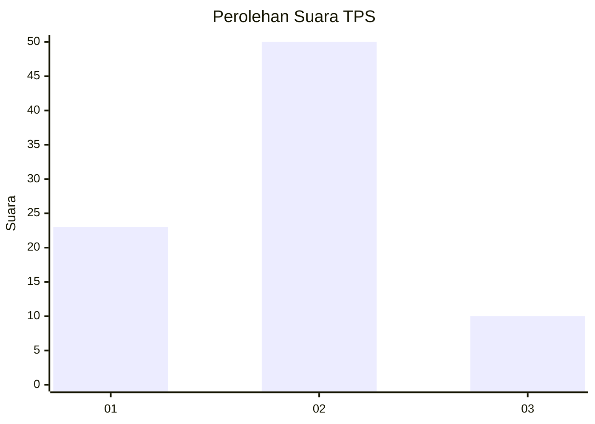
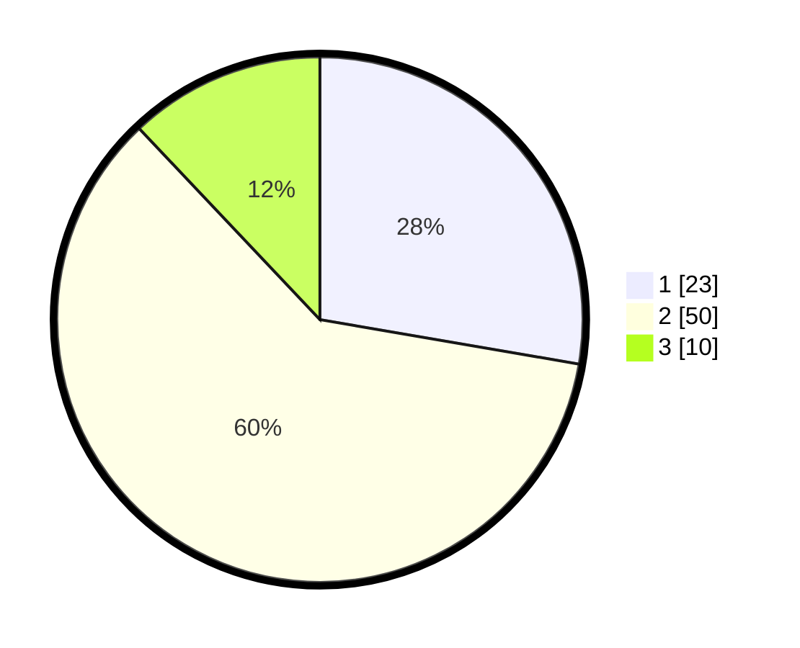

# Hasil

## Grafik

## Tabel

| No. | Nama Paslon    | Suara | Suara (raw) | Persentase |
|:--- |:-------------- | -----:| -----------:| ----------:|
| 1   | ANIES MUHAIMIN | 23    | [23][p-1]   | 27,71      |
| 2   | PRABOWO GIBRAN | 50    | [50][p-2]   | 60,24      |
| 3   | GANJAR MAHFUD  | 10    | [10][p-3]   | 12,05      |

[p-1]: https://github.com/gigit-pemilu/pemilu-2024-33-jawa-tengah/blob/main/pilpres/hitung-suara/sub/33-jawa-tengah/sub/29-brebes/sub/03-bumiayu/sub/2001-adisana/sub/036-tps/sub/paslon-1.txt
[p-2]: https://github.com/gigit-pemilu/pemilu-2024-33-jawa-tengah/blob/main/pilpres/hitung-suara/sub/33-jawa-tengah/sub/29-brebes/sub/03-bumiayu/sub/2001-adisana/sub/036-tps/sub/paslon-2.txt
[p-3]: https://github.com/gigit-pemilu/pemilu-2024-33-jawa-tengah/blob/main/pilpres/hitung-suara/sub/33-jawa-tengah/sub/29-brebes/sub/03-bumiayu/sub/2001-adisana/sub/036-tps/sub/paslon-3.txt

## Foto C Plano

https://sirekap-obj-formc.kpu.go.id/87ac/pemilu/ppwp/33/29/03/20/01/3329032001036-20240214-140953--1b733def-55da-4081-8f3f-a25b0982782b.jpg

https://sirekap-obj-formc.kpu.go.id/87ac/pemilu/ppwp/33/29/03/20/01/3329032001036-20240214-212820--aa29700b-68c9-4232-94bc-bdb53ca0c63a.jpg

https://sirekap-obj-formc.kpu.go.id/87ac/pemilu/ppwp/33/29/03/20/01/3329032001036-20240215-050405--68865625-7e05-462a-aa3a-d0296e057bda.jpg

## Metadata

| Key        | Value               |
| ---------- | ------------------- |
| Time Stamp | 2024-02-15 17:00:25 |

