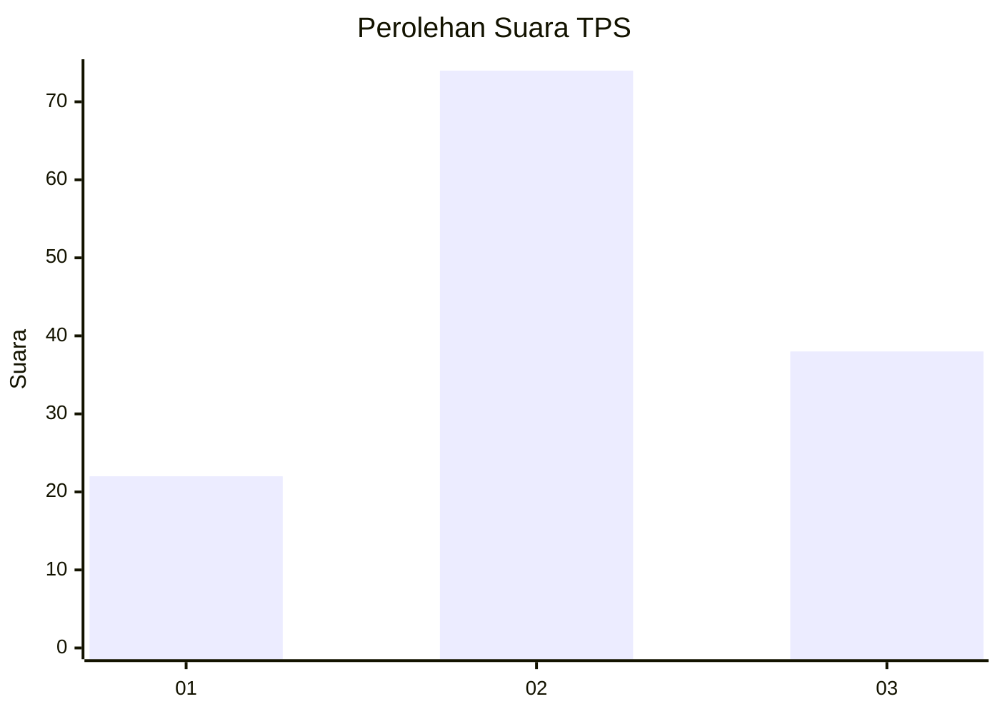
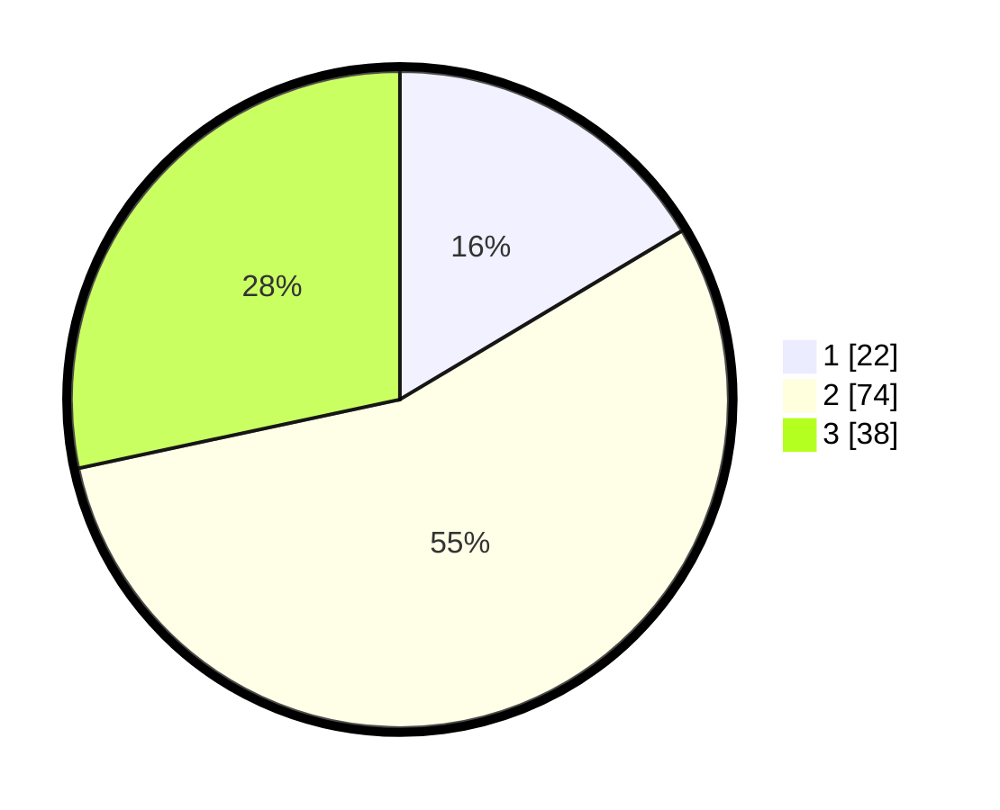

# Hasil

## Grafik

## Tabel

| No. | Nama Paslon    | Suara | Suara (raw) | Persentase |
|:--- |:-------------- | -----:| -----------:| ----------:|
| 1   | ANIES MUHAIMIN | 22    | [22][p-1]   | 16,42      |
| 2   | PRABOWO GIBRAN | 74    | [74][p-2]   | 55,22      |
| 3   | GANJAR MAHFUD  | 38    | [38][p-3]   | 28,36      |

[p-1]: https://github.com/gigit-pemilu/pemilu-2024-33-jawa-tengah/blob/main/pilpres/hitung-suara/sub/33-jawa-tengah/sub/29-brebes/sub/03-bumiayu/sub/2006-kalilangkap/sub/004-tps/sub/paslon-1.txt
[p-2]: https://github.com/gigit-pemilu/pemilu-2024-33-jawa-tengah/blob/main/pilpres/hitung-suara/sub/33-jawa-tengah/sub/29-brebes/sub/03-bumiayu/sub/2006-kalilangkap/sub/004-tps/sub/paslon-2.txt
[p-3]: https://github.com/gigit-pemilu/pemilu-2024-33-jawa-tengah/blob/main/pilpres/hitung-suara/sub/33-jawa-tengah/sub/29-brebes/sub/03-bumiayu/sub/2006-kalilangkap/sub/004-tps/sub/paslon-3.txt

## Foto C Plano

https://sirekap-obj-formc.kpu.go.id/de0d/pemilu/ppwp/33/29/03/20/06/3329032006004-20240219-222948--55857260-8029-4285-bdbf-1d59fe9135d1.jpg

https://sirekap-obj-formc.kpu.go.id/de0d/pemilu/ppwp/33/29/03/20/06/3329032006004-20240219-223014--0bc618f0-56e1-4578-ab2c-78610776d297.jpg

https://sirekap-obj-formc.kpu.go.id/de0d/pemilu/ppwp/33/29/03/20/06/3329032006004-20240219-223542--c0980a61-3cc1-4efb-b3c5-c29876302202.jpg

## Metadata

| Key        | Value               |
| ---------- | ------------------- |
| Time Stamp | 2024-02-26 00:00:00 |

