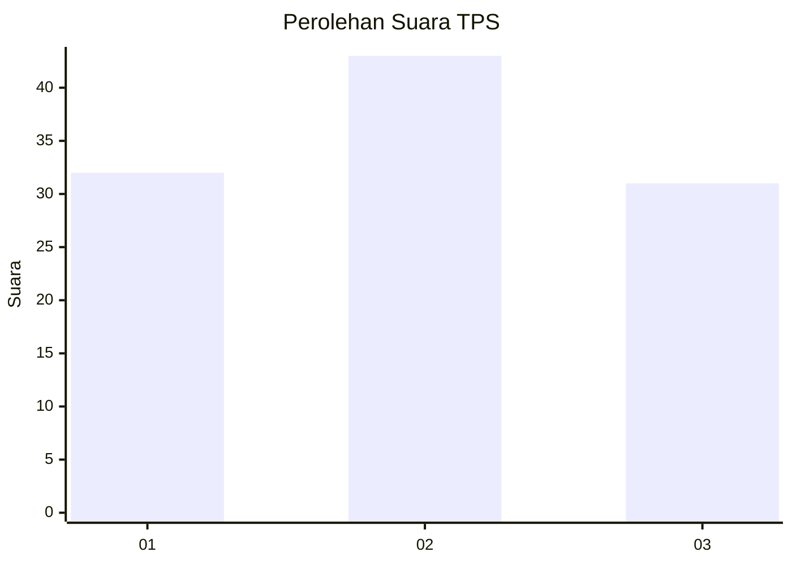
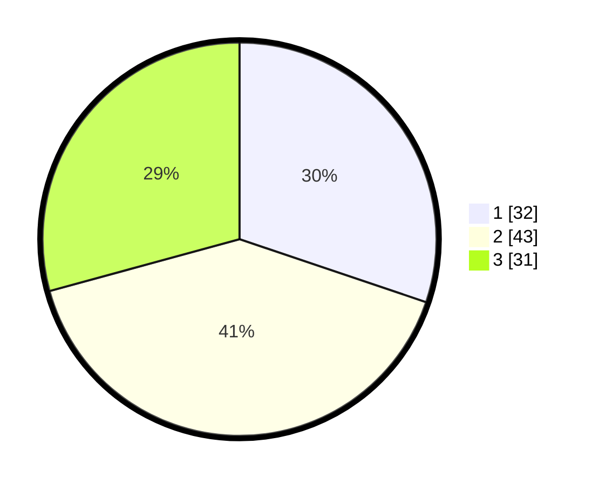

# Hasil

## Grafik

## Tabel

| No. | Nama Paslon    | Suara | Suara (raw) | Persentase |
|:--- |:-------------- | -----:| -----------:| ----------:|
| 1   | ANIES MUHAIMIN | 32    | [32][p-1]   | 30,19      |
| 2   | PRABOWO GIBRAN | 43    | [43][p-2]   | 40,57      |
| 3   | GANJAR MAHFUD  | 31    | [31][p-3]   | 29,25      |

[p-1]: https://github.com/gigit-pemilu/pemilu-2024/blob/main/pilpres/hitung-suara/sub/33-jawa-tengah/sub/29-brebes/sub/03-bumiayu/sub/2006-kalilangkap/sub/012-tps/sub/paslon-1.txt
[p-2]: https://github.com/gigit-pemilu/pemilu-2024/blob/main/pilpres/hitung-suara/sub/33-jawa-tengah/sub/29-brebes/sub/03-bumiayu/sub/2006-kalilangkap/sub/012-tps/sub/paslon-2.txt
[p-3]: https://github.com/gigit-pemilu/pemilu-2024/blob/main/pilpres/hitung-suara/sub/33-jawa-tengah/sub/29-brebes/sub/03-bumiayu/sub/2006-kalilangkap/sub/012-tps/sub/paslon-3.txt

## Foto C Plano

https://sirekap-obj-formc.kpu.go.id/d1fd/pemilu/ppwp/33/29/03/20/06/3329032006012-20240214-141817--c6af22c4-b2fd-4da6-b435-41529beb3a77.jpg

https://sirekap-obj-formc.kpu.go.id/d1fd/pemilu/ppwp/33/29/03/20/06/3329032006012-20240214-141822--bdf767da-27da-4eea-a95f-39e36e7f767c.jpg

https://sirekap-obj-formc.kpu.go.id/d1fd/pemilu/ppwp/33/29/03/20/06/3329032006012-20240218-175410--b63d7192-542c-480f-ae72-a1829f3602a7.jpg

## Metadata

| Key        | Value               |
| ---------- | ------------------- |
| Time Stamp | 2024-02-19 06:16:00 |

