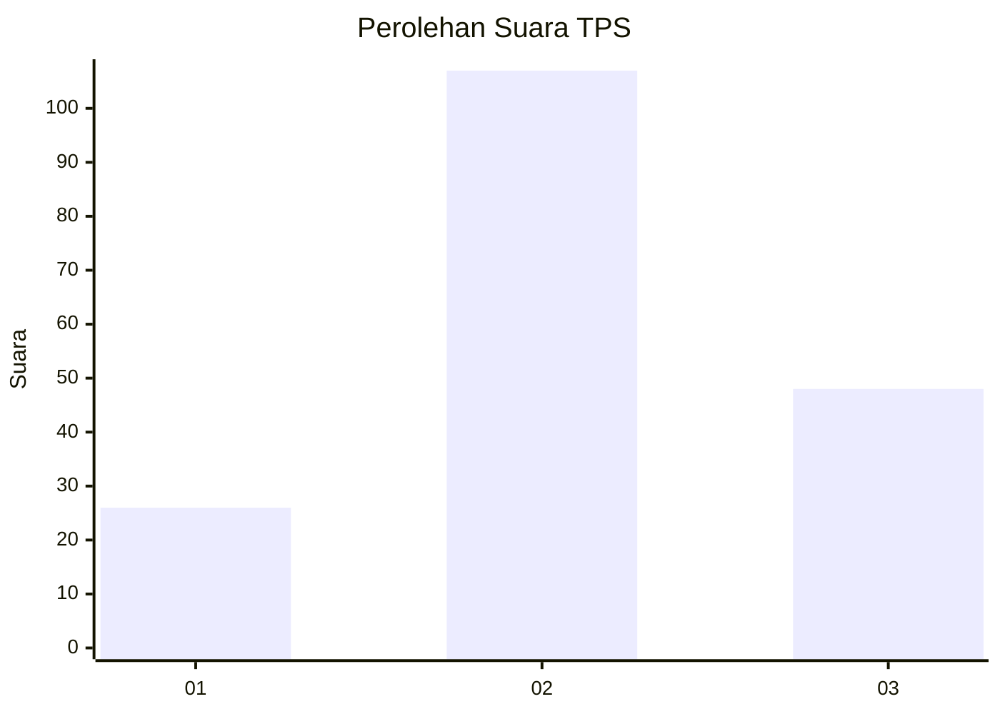
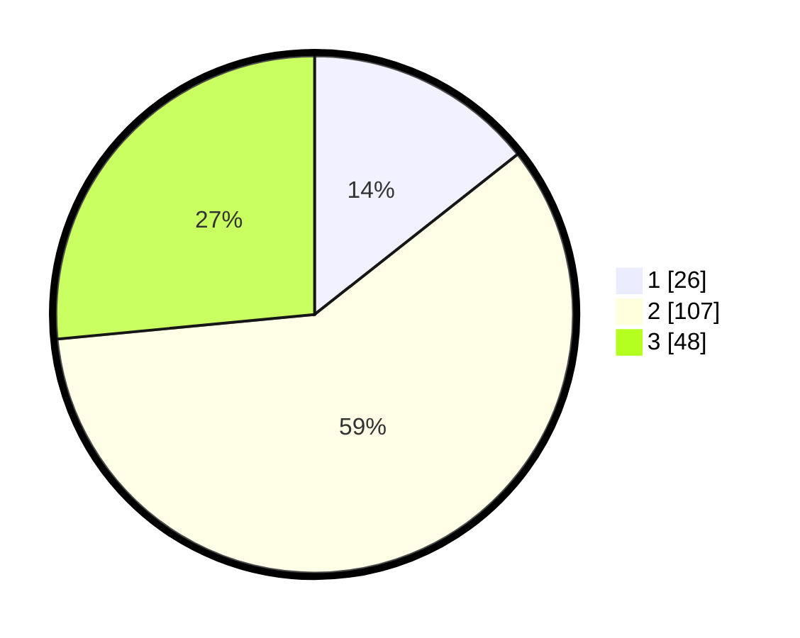

# Hasil

## Grafik

## Tabel

| No. | Nama Paslon    | Suara | Suara (raw) | Persentase |
|:--- |:-------------- | -----:| -----------:| ----------:|
| 1   | ANIES MUHAIMIN | 26    | [26][p-1]   | 14,36      |
| 2   | PRABOWO GIBRAN | 107   | [107][p-2]  | 59,12      |
| 3   | GANJAR MAHFUD  | 48    | [48][p-3]   | 26,52      |

[p-1]: https://github.com/gigit-pemilu/pemilu-2024/blob/main/pilpres/hitung-suara/sub/33-jawa-tengah/sub/29-brebes/sub/03-bumiayu/sub/2008-kalisumur/sub/002-tps/sub/paslon-1.txt
[p-2]: https://github.com/gigit-pemilu/pemilu-2024/blob/main/pilpres/hitung-suara/sub/33-jawa-tengah/sub/29-brebes/sub/03-bumiayu/sub/2008-kalisumur/sub/002-tps/sub/paslon-2.txt
[p-3]: https://github.com/gigit-pemilu/pemilu-2024/blob/main/pilpres/hitung-suara/sub/33-jawa-tengah/sub/29-brebes/sub/03-bumiayu/sub/2008-kalisumur/sub/002-tps/sub/paslon-3.txt

## Foto C Plano

https://sirekap-obj-formc.kpu.go.id/1c7b/pemilu/ppwp/33/29/03/20/08/3329032008002-20240214-224601--c5c8ac9a-fea6-42b2-9906-cdbd34dd9c1f.jpg

https://sirekap-obj-formc.kpu.go.id/1c7b/pemilu/ppwp/33/29/03/20/08/3329032008002-20240214-224635--a0f25222-3231-4380-aa03-3b1c8b6cda4d.jpg

https://sirekap-obj-formc.kpu.go.id/1c7b/pemilu/ppwp/33/29/03/20/08/3329032008002-20240214-224658--58b1dcfd-b99c-4d22-b589-321a57d5a411.jpg

## Metadata

| Key        | Value               |
| ---------- | ------------------- |
| Time Stamp | 2024-02-25 12:00:00 |

