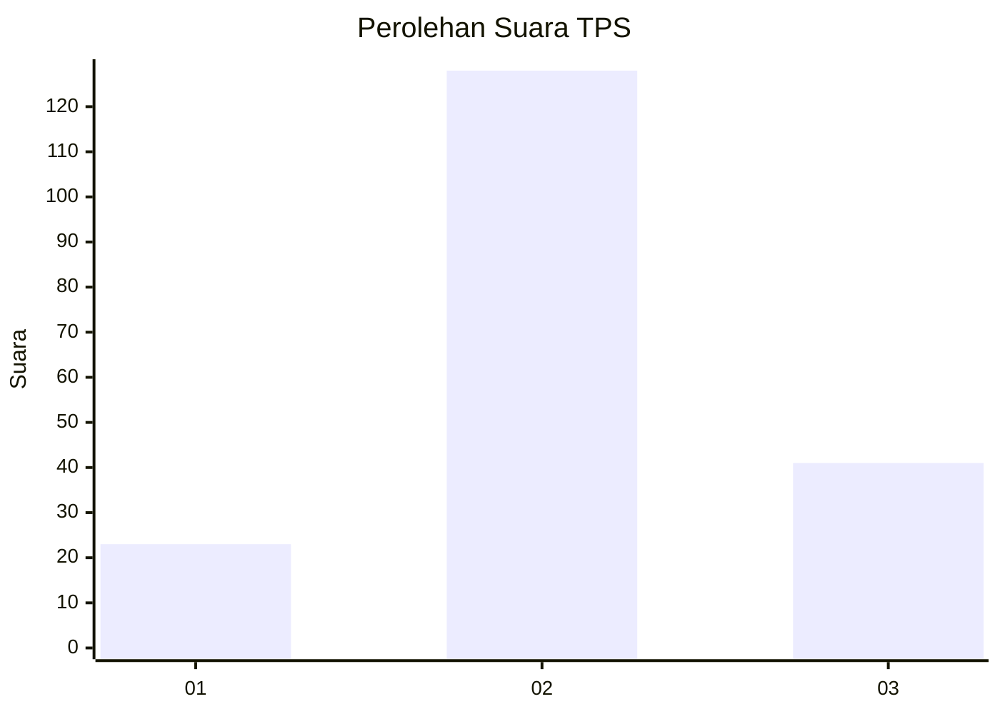
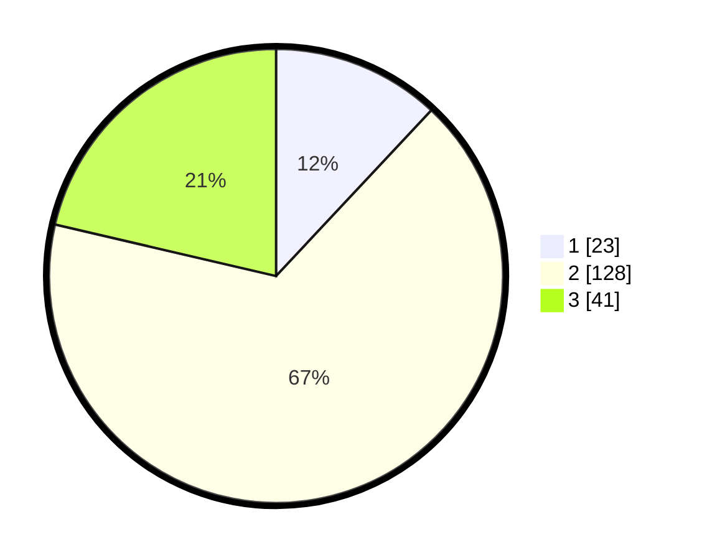

# Hasil

## Grafik

## Tabel

| No. | Nama Paslon    | Suara | Suara (raw) | Persentase |
|:--- |:-------------- | -----:| -----------:| ----------:|
| 1   | ANIES MUHAIMIN | 23    | [23][p-1]   | 11,98      |
| 2   | PRABOWO GIBRAN | 128   | [128][p-2]  | 66,67      |
| 3   | GANJAR MAHFUD  | 41    | [41][p-3]   | 21,35      |

[p-1]: https://github.com/gigit-pemilu/pemilu-2024/blob/main/pilpres/hitung-suara/sub/33-jawa-tengah/sub/29-brebes/sub/03-bumiayu/sub/2014-penggarutan/sub/001-tps/sub/paslon-1.txt
[p-2]: https://github.com/gigit-pemilu/pemilu-2024/blob/main/pilpres/hitung-suara/sub/33-jawa-tengah/sub/29-brebes/sub/03-bumiayu/sub/2014-penggarutan/sub/001-tps/sub/paslon-2.txt
[p-3]: https://github.com/gigit-pemilu/pemilu-2024/blob/main/pilpres/hitung-suara/sub/33-jawa-tengah/sub/29-brebes/sub/03-bumiayu/sub/2014-penggarutan/sub/001-tps/sub/paslon-3.txt

## Foto C Plano

https://sirekap-obj-formc.kpu.go.id/cb31/pemilu/ppwp/33/29/03/20/14/3329032014001-20240216-161132--b6f51f56-0a1b-4ecc-b94e-4db03bcc8dfd.jpg

https://sirekap-obj-formc.kpu.go.id/cb31/pemilu/ppwp/33/29/03/20/14/3329032014001-20240216-194906--ddab0ed3-f0c3-43f4-9f23-06e582a7d9f6.jpg

https://sirekap-obj-formc.kpu.go.id/cb31/pemilu/ppwp/33/29/03/20/14/3329032014001-20240216-215949--143d798c-1fe2-49ab-b758-f6bab974e919.jpg

## Metadata

| Key        | Value               |
| ---------- | ------------------- |
| Time Stamp | 2024-02-17 19:30:00 |

