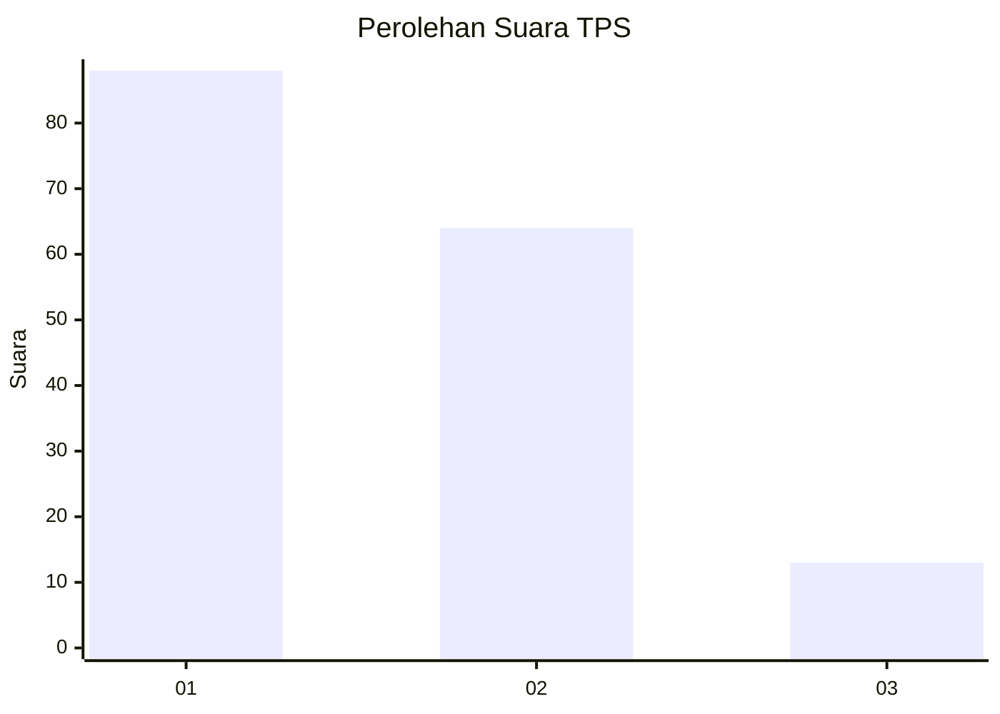
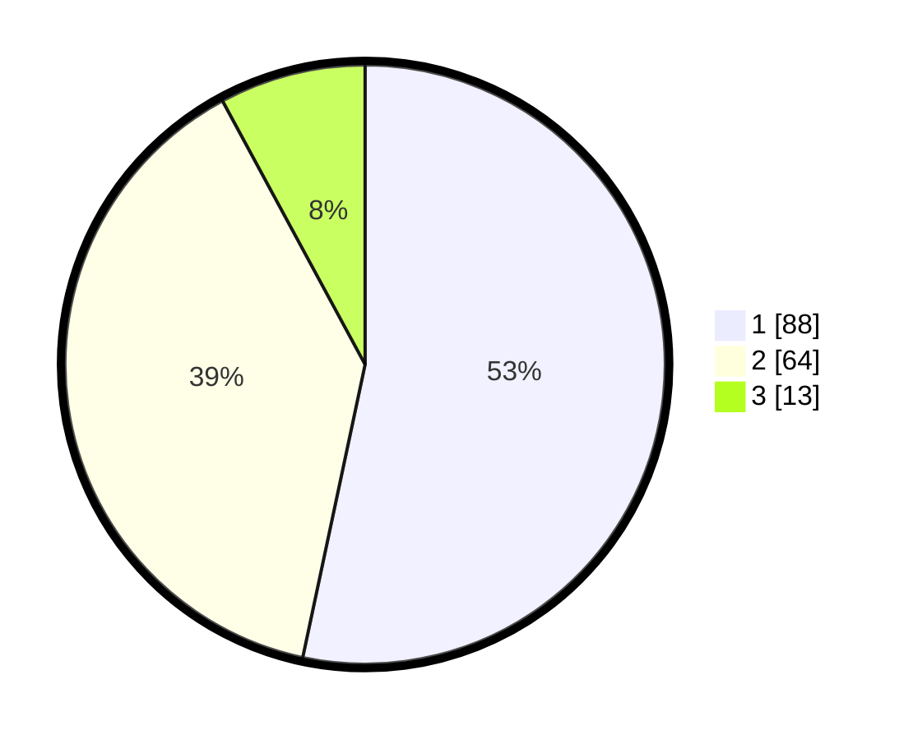

# Hasil

## Grafik

## Tabel

| No. | Nama Paslon    | Suara | Suara (raw) | Persentase |
|:--- |:-------------- | -----:| -----------:| ----------:|
| 1   | ANIES MUHAIMIN | 88    | [88][p-1]   | 53,33      |
| 2   | PRABOWO GIBRAN | 64    | [64][p-2]   | 38,79      |
| 3   | GANJAR MAHFUD  | 13    | [13][p-3]   | 7,88       |

[p-1]: https://github.com/gigit-pemilu/pemilu-2024/blob/main/pilpres/hitung-suara/sub/33-jawa-tengah/sub/29-brebes/sub/03-bumiayu/sub/2014-penggarutan/sub/006-tps/sub/paslon-1.txt
[p-2]: https://github.com/gigit-pemilu/pemilu-2024/blob/main/pilpres/hitung-suara/sub/33-jawa-tengah/sub/29-brebes/sub/03-bumiayu/sub/2014-penggarutan/sub/006-tps/sub/paslon-2.txt
[p-3]: https://github.com/gigit-pemilu/pemilu-2024/blob/main/pilpres/hitung-suara/sub/33-jawa-tengah/sub/29-brebes/sub/03-bumiayu/sub/2014-penggarutan/sub/006-tps/sub/paslon-3.txt

## Foto C Plano

https://sirekap-obj-formc.kpu.go.id/f91f/pemilu/ppwp/33/29/03/20/14/3329032014006-20240215-022510--e8fb44e9-31ec-4e34-89c7-b335d3510d26.jpg

https://sirekap-obj-formc.kpu.go.id/f91f/pemilu/ppwp/33/29/03/20/14/3329032014006-20240215-022701--2ebb33f4-c4be-4a6c-a89e-a9e3b8403df5.jpg

https://sirekap-obj-formc.kpu.go.id/f91f/pemilu/ppwp/33/29/03/20/14/3329032014006-20240215-022753--ae47a8d7-7d14-4e68-a1e1-9718e7c8b8d0.jpg

## Metadata

| Key        | Value               |
| ---------- | ------------------- |
| Time Stamp | 2024-02-25 10:00:00 |

