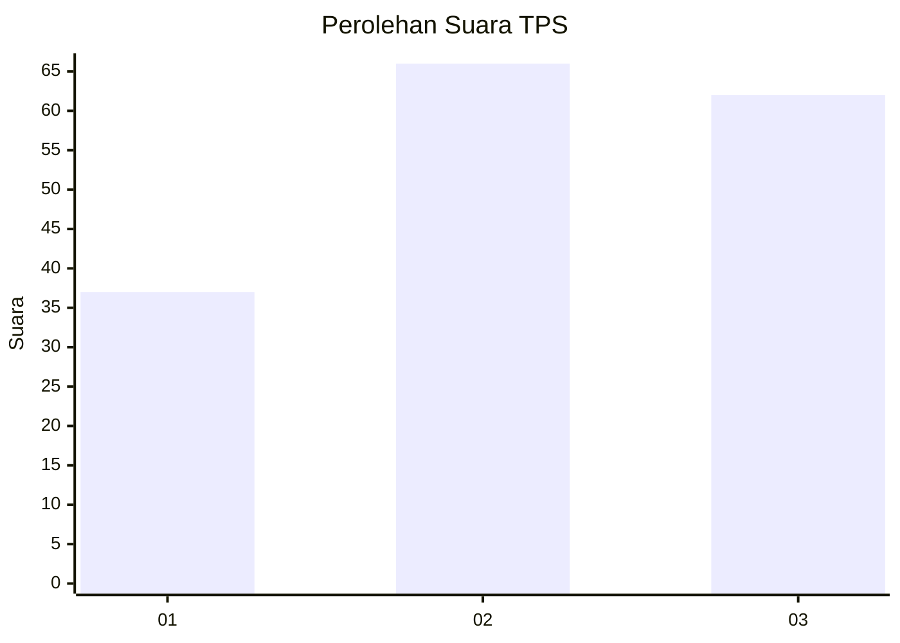
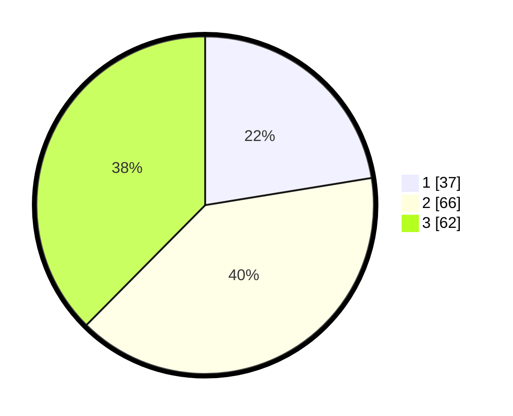

# Hasil

## Grafik

## Tabel

| No. | Nama Paslon    | Suara | Suara (raw) | Persentase |
|:--- |:-------------- | -----:| -----------:| ----------:|
| 1   | ANIES MUHAIMIN | 37    | [37][p-1]   | 22,42      |
| 2   | PRABOWO GIBRAN | 66    | [66][p-2]   | 40,00      |
| 3   | GANJAR MAHFUD  | 62    | [62][p-3]   | 37,58      |

[p-1]: https://github.com/gigit-pemilu/pemilu-2024-33-jawa-tengah/blob/main/pilpres/hitung-suara/sub/33-jawa-tengah/sub/29-brebes/sub/03-bumiayu/sub/2015-pruwatan/sub/005-tps/sub/paslon-1.txt
[p-2]: https://github.com/gigit-pemilu/pemilu-2024-33-jawa-tengah/blob/main/pilpres/hitung-suara/sub/33-jawa-tengah/sub/29-brebes/sub/03-bumiayu/sub/2015-pruwatan/sub/005-tps/sub/paslon-2.txt
[p-3]: https://github.com/gigit-pemilu/pemilu-2024-33-jawa-tengah/blob/main/pilpres/hitung-suara/sub/33-jawa-tengah/sub/29-brebes/sub/03-bumiayu/sub/2015-pruwatan/sub/005-tps/sub/paslon-3.txt

## Foto C Plano

https://sirekap-obj-formc.kpu.go.id/fd7f/pemilu/ppwp/33/29/03/20/15/3329032015005-20240218-173637--016b53a7-3378-422c-80a9-4aa3a769c161.jpg

https://sirekap-obj-formc.kpu.go.id/fd7f/pemilu/ppwp/33/29/03/20/15/3329032015005-20240218-193832--315c0cec-601d-447e-b95c-0ad5a407a75e.jpg

https://sirekap-obj-formc.kpu.go.id/fd7f/pemilu/ppwp/33/29/03/20/15/3329032015005-20240218-174755--e4e7081b-04d6-4a3f-9f47-500c34b974f1.jpg

## Metadata

| Key        | Value               |
| ---------- | ------------------- |
| Time Stamp | 2024-02-24 22:31:28 |

