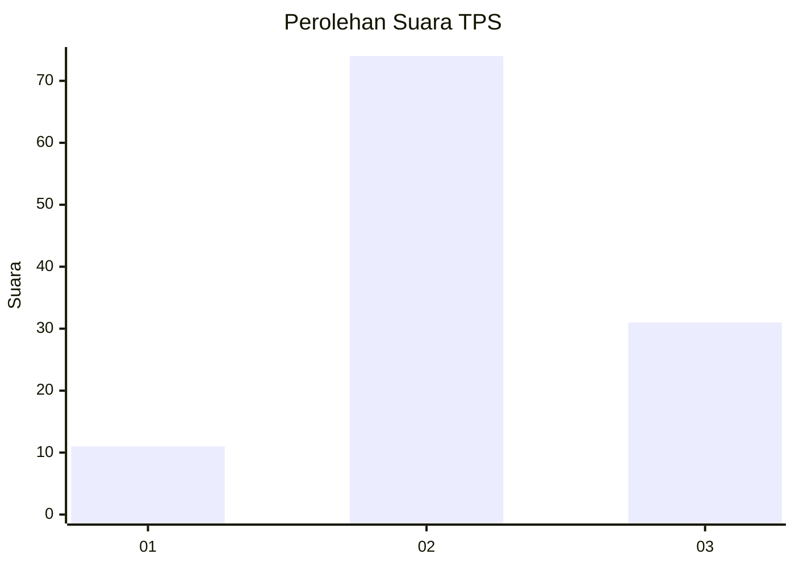
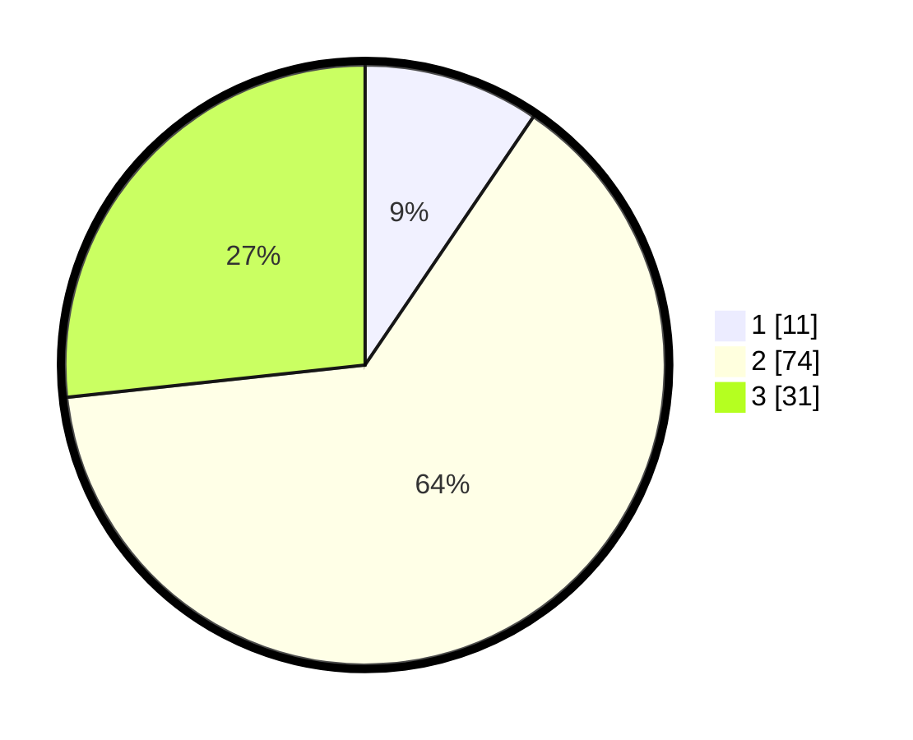

# Hasil

## Grafik

## Tabel

| No. | Nama Paslon    | Suara | Suara (raw) | Persentase |
|:--- |:-------------- | -----:| -----------:| ----------:|
| 1   | ANIES MUHAIMIN | 11    | [11][p-1]   | 9,48       |
| 2   | PRABOWO GIBRAN | 74    | [74][p-2]   | 63,79      |
| 3   | GANJAR MAHFUD  | 31    | [31][p-3]   | 26,72      |

[p-1]: https://github.com/gigit-pemilu/pemilu-2024-33-jawa-tengah/blob/main/pilpres/hitung-suara/sub/33-jawa-tengah/sub/29-brebes/sub/03-bumiayu/sub/2015-pruwatan/sub/016-tps/sub/paslon-1.txt
[p-2]: https://github.com/gigit-pemilu/pemilu-2024-33-jawa-tengah/blob/main/pilpres/hitung-suara/sub/33-jawa-tengah/sub/29-brebes/sub/03-bumiayu/sub/2015-pruwatan/sub/016-tps/sub/paslon-2.txt
[p-3]: https://github.com/gigit-pemilu/pemilu-2024-33-jawa-tengah/blob/main/pilpres/hitung-suara/sub/33-jawa-tengah/sub/29-brebes/sub/03-bumiayu/sub/2015-pruwatan/sub/016-tps/sub/paslon-3.txt

## Foto C Plano

https://sirekap-obj-formc.kpu.go.id/0488/pemilu/ppwp/33/29/03/20/15/3329032015016-20240214-141649--c1181f9a-8a51-47b2-b679-a86a873c844d.jpg

https://sirekap-obj-formc.kpu.go.id/0488/pemilu/ppwp/33/29/03/20/15/3329032015016-20240214-141559--0c8b0378-ee6c-45e4-b803-8521d8cff851.jpg

https://sirekap-obj-formc.kpu.go.id/0488/pemilu/ppwp/33/29/03/20/15/3329032015016-20240214-231838--77ffea35-6aaf-43ce-977a-40b204df1366.jpg

## Metadata

| Key        | Value               |
| ---------- | ------------------- |
| Time Stamp | 2024-02-15 16:30:25 |

