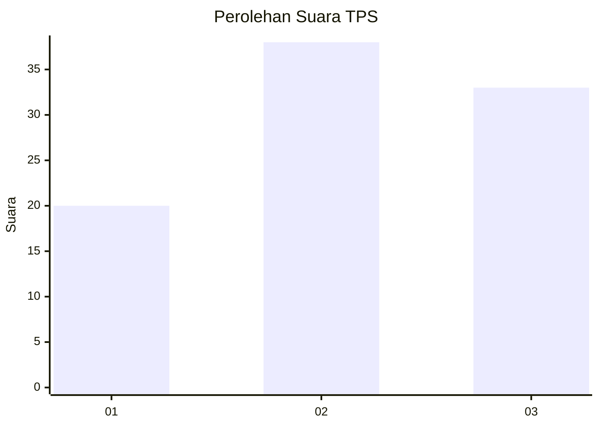
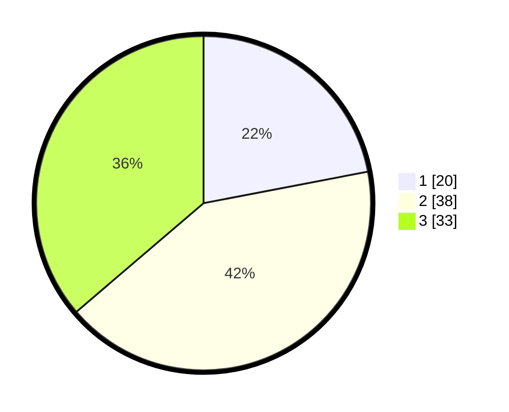

# Hasil

## Grafik

## Tabel

| No. | Nama Paslon    | Suara | Suara (raw) | Persentase |
|:--- |:-------------- | -----:| -----------:| ----------:|
| 1   | ANIES MUHAIMIN | 20    | [20][p-1]   | 21,98      |
| 2   | PRABOWO GIBRAN | 38    | [38][p-2]   | 41,76      |
| 3   | GANJAR MAHFUD  | 33    | [33][p-3]   | 36,26      |

[p-1]: https://github.com/gigit-pemilu/pemilu-2024-33-jawa-tengah/blob/main/pilpres/hitung-suara/sub/33-jawa-tengah/sub/29-brebes/sub/03-bumiayu/sub/2015-pruwatan/sub/043-tps/sub/paslon-1.txt
[p-2]: https://github.com/gigit-pemilu/pemilu-2024-33-jawa-tengah/blob/main/pilpres/hitung-suara/sub/33-jawa-tengah/sub/29-brebes/sub/03-bumiayu/sub/2015-pruwatan/sub/043-tps/sub/paslon-2.txt
[p-3]: https://github.com/gigit-pemilu/pemilu-2024-33-jawa-tengah/blob/main/pilpres/hitung-suara/sub/33-jawa-tengah/sub/29-brebes/sub/03-bumiayu/sub/2015-pruwatan/sub/043-tps/sub/paslon-3.txt

## Foto C Plano

https://sirekap-obj-formc.kpu.go.id/d0e3/pemilu/ppwp/33/29/03/20/15/3329032015043-20240214-232925--d1fc765e-8b33-4e1f-a757-d86257005c27.jpg

https://sirekap-obj-formc.kpu.go.id/d0e3/pemilu/ppwp/33/29/03/20/15/3329032015043-20240214-234203--024a736c-ae8d-4d4b-9ff8-147a18c53ed6.jpg

https://sirekap-obj-formc.kpu.go.id/d0e3/pemilu/ppwp/33/29/03/20/15/3329032015043-20240215-000109--db4e8ca7-5d04-4956-8441-e7d568e4d357.jpg

## Metadata

| Key        | Value               |
| ---------- | ------------------- |
| Time Stamp | 2024-02-25 12:00:00 |

