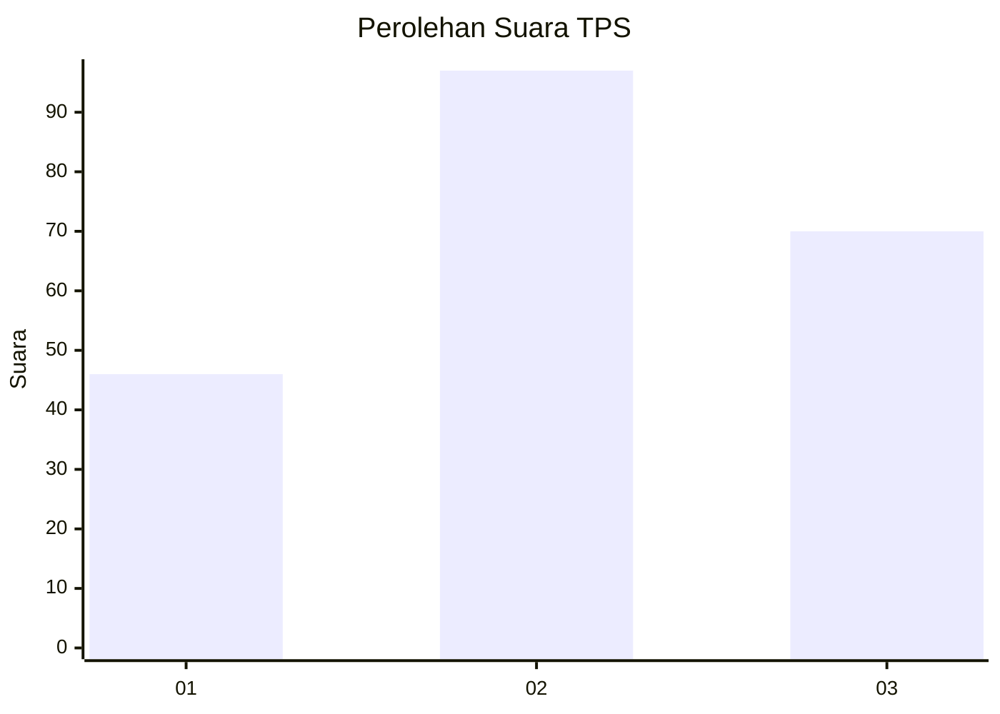
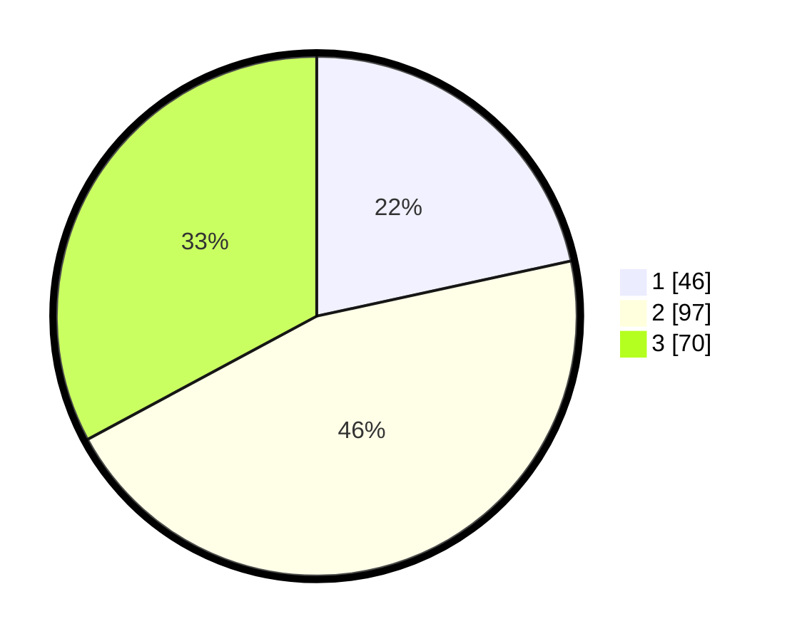

# Hasil

## Grafik

## Tabel

| No. | Nama Paslon    | Suara | Suara (raw) | Persentase |
|:--- |:-------------- | -----:| -----------:| ----------:|
| 1   | ANIES MUHAIMIN | 46    | [46][p-1]   | 21,60      |
| 2   | PRABOWO GIBRAN | 97    | [97][p-2]   | 45,54      |
| 3   | GANJAR MAHFUD  | 70    | [70][p-3]   | 32,86      |

[p-1]: https://github.com/gigit-pemilu/pemilu-2024-33-jawa-tengah/blob/main/pilpres/hitung-suara/sub/33-jawa-tengah/sub/29-brebes/sub/04-paguyangan/sub/2001-cilibur/sub/003-tps/sub/paslon-1.txt
[p-2]: https://github.com/gigit-pemilu/pemilu-2024-33-jawa-tengah/blob/main/pilpres/hitung-suara/sub/33-jawa-tengah/sub/29-brebes/sub/04-paguyangan/sub/2001-cilibur/sub/003-tps/sub/paslon-2.txt
[p-3]: https://github.com/gigit-pemilu/pemilu-2024-33-jawa-tengah/blob/main/pilpres/hitung-suara/sub/33-jawa-tengah/sub/29-brebes/sub/04-paguyangan/sub/2001-cilibur/sub/003-tps/sub/paslon-3.txt

## Foto C Plano

https://sirekap-obj-formc.kpu.go.id/f437/pemilu/ppwp/33/29/04/20/01/3329042001003-20240214-224449--eb28ed55-49d1-49e9-9497-ae302a3f87a4.jpg

https://sirekap-obj-formc.kpu.go.id/f437/pemilu/ppwp/33/29/04/20/01/3329042001003-20240214-225438--c21f4ade-d2a3-402a-949a-a976400f2bdb.jpg

https://sirekap-obj-formc.kpu.go.id/f437/pemilu/ppwp/33/29/04/20/01/3329042001003-20240214-225338--2f24ec35-d961-4c0f-a3b5-4688fd7c953f.jpg

## Metadata

| Key        | Value               |
| ---------- | ------------------- |
| Time Stamp | 2024-02-22 00:00:00 |

