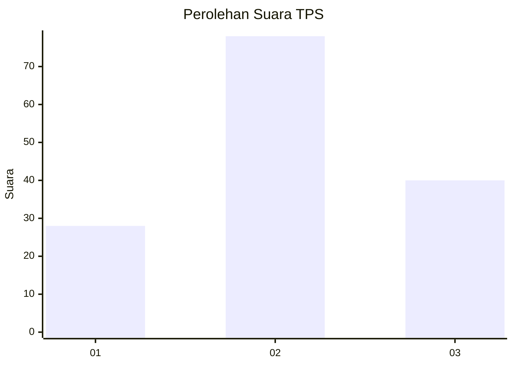
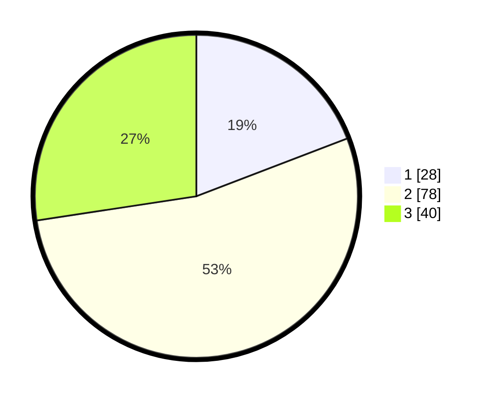

# Hasil

## Grafik

## Tabel

| No. | Nama Paslon    | Suara | Suara (raw) | Persentase |
|:--- |:-------------- | -----:| -----------:| ----------:|
| 1   | ANIES MUHAIMIN | 28    | [28][p-1]   | 19,18      |
| 2   | PRABOWO GIBRAN | 78    | [78][p-2]   | 53,42      |
| 3   | GANJAR MAHFUD  | 40    | [40][p-3]   | 27,40      |

[p-1]: https://github.com/gigit-pemilu/pemilu-2024/blob/main/pilpres/hitung-suara/sub/33-jawa-tengah/sub/29-brebes/sub/04-paguyangan/sub/2001-cilibur/sub/010-tps/sub/paslon-1.txt
[p-2]: https://github.com/gigit-pemilu/pemilu-2024/blob/main/pilpres/hitung-suara/sub/33-jawa-tengah/sub/29-brebes/sub/04-paguyangan/sub/2001-cilibur/sub/010-tps/sub/paslon-2.txt
[p-3]: https://github.com/gigit-pemilu/pemilu-2024/blob/main/pilpres/hitung-suara/sub/33-jawa-tengah/sub/29-brebes/sub/04-paguyangan/sub/2001-cilibur/sub/010-tps/sub/paslon-3.txt

## Foto C Plano

https://sirekap-obj-formc.kpu.go.id/7355/pemilu/ppwp/33/29/04/20/01/3329042001010-20240214-234407--88940b56-5fe0-4d43-8910-d993006034ea.jpg

https://sirekap-obj-formc.kpu.go.id/7355/pemilu/ppwp/33/29/04/20/01/3329042001010-20240214-234622--0e20ee09-7988-4c84-8c5f-cb64d5ea86dd.jpg

https://sirekap-obj-formc.kpu.go.id/7355/pemilu/ppwp/33/29/04/20/01/3329042001010-20240214-234716--be720ee6-624a-44a0-a5b0-52657bd45807.jpg

## Metadata

| Key        | Value               |
| ---------- | ------------------- |
| Time Stamp | 2024-02-24 22:31:28 |

