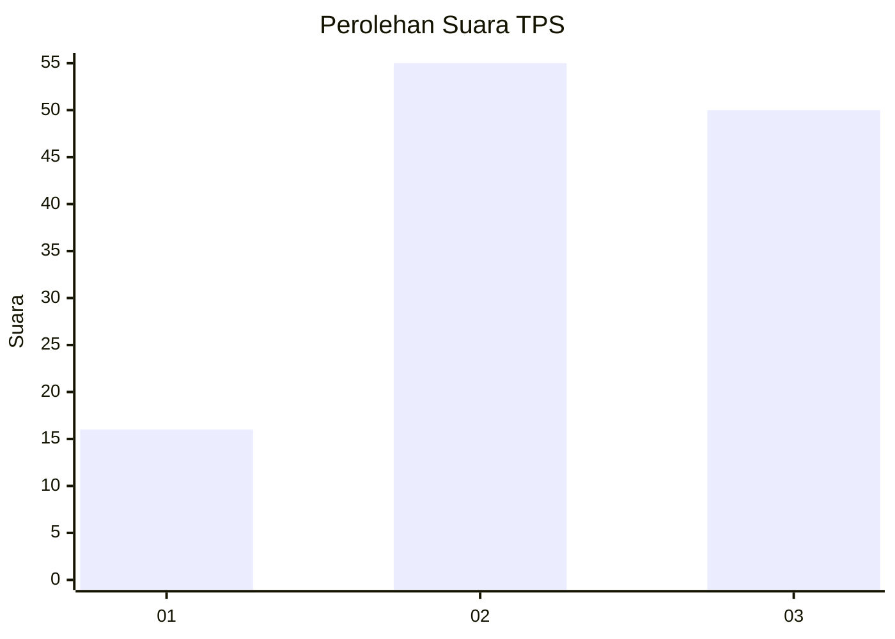
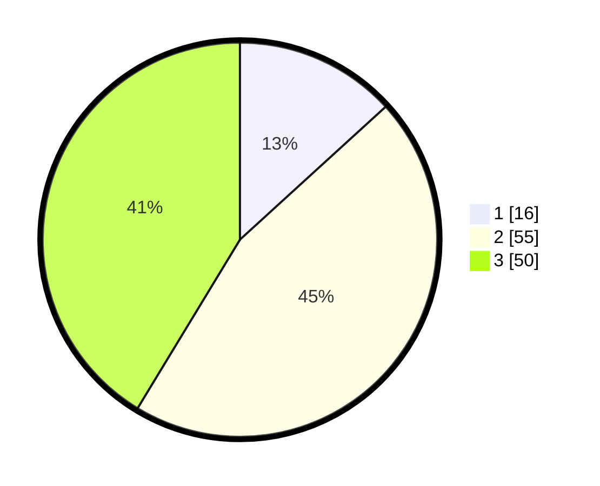

# Hasil

## Grafik

## Tabel

| No. | Nama Paslon    | Suara | Suara (raw) | Persentase |
|:--- |:-------------- | -----:| -----------:| ----------:|
| 1   | ANIES MUHAIMIN | 16    | [16][p-1]   | 13,22      |
| 2   | PRABOWO GIBRAN | 55    | [55][p-2]   | 45,45      |
| 3   | GANJAR MAHFUD  | 50    | [50][p-3]   | 41,32      |

[p-1]: https://github.com/gigit-pemilu/pemilu-2024/blob/main/pilpres/hitung-suara/sub/33-jawa-tengah/sub/29-brebes/sub/04-paguyangan/sub/2001-cilibur/sub/019-tps/sub/paslon-1.txt
[p-2]: https://github.com/gigit-pemilu/pemilu-2024/blob/main/pilpres/hitung-suara/sub/33-jawa-tengah/sub/29-brebes/sub/04-paguyangan/sub/2001-cilibur/sub/019-tps/sub/paslon-2.txt
[p-3]: https://github.com/gigit-pemilu/pemilu-2024/blob/main/pilpres/hitung-suara/sub/33-jawa-tengah/sub/29-brebes/sub/04-paguyangan/sub/2001-cilibur/sub/019-tps/sub/paslon-3.txt

## Foto C Plano

https://sirekap-obj-formc.kpu.go.id/db64/pemilu/ppwp/33/29/04/20/01/3329042001019-20240214-210703--db209dc2-ca2c-4550-866f-c817a48103a3.jpg

https://sirekap-obj-formc.kpu.go.id/db64/pemilu/ppwp/33/29/04/20/01/3329042001019-20240214-210815--de431020-b1eb-49c3-809d-8eccfba1a2aa.jpg

https://sirekap-obj-formc.kpu.go.id/db64/pemilu/ppwp/33/29/04/20/01/3329042001019-20240214-192416--9afd293d-13fd-4dba-a250-2c48422e2134.jpg

## Metadata

| Key        | Value               |
| ---------- | ------------------- |
| Time Stamp | 2024-02-15 16:00:26 |

