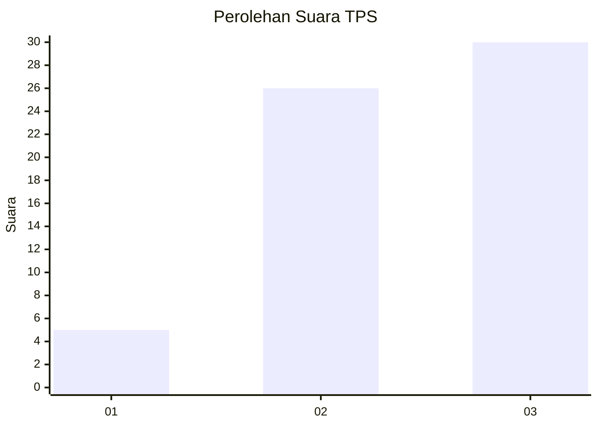
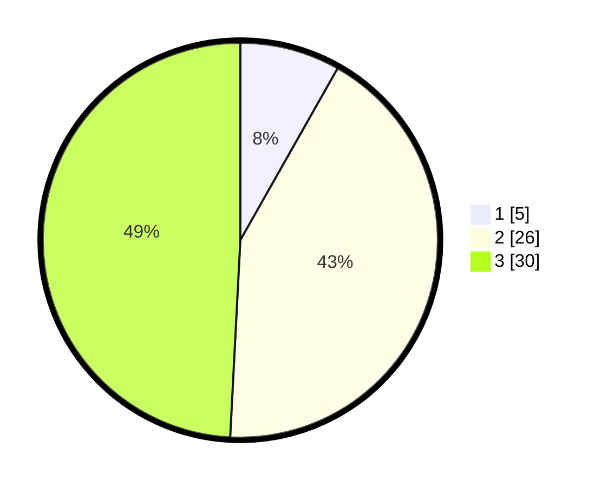

# Hasil

## Grafik

## Tabel

| No. | Nama Paslon    | Suara | Suara (raw) | Persentase |
|:--- |:-------------- | -----:| -----------:| ----------:|
| 1   | ANIES MUHAIMIN | 5     | [5][p-1]    | 8,20       |
| 2   | PRABOWO GIBRAN | 26    | [26][p-2]   | 42,62      |
| 3   | GANJAR MAHFUD  | 30    | [30][p-3]   | 49,18      |

[p-1]: https://github.com/gigit-pemilu/pemilu-2024-33-jawa-tengah/blob/main/pilpres/hitung-suara/sub/33-jawa-tengah/sub/29-brebes/sub/04-paguyangan/sub/2001-cilibur/sub/022-tps/sub/paslon-1.txt
[p-2]: https://github.com/gigit-pemilu/pemilu-2024-33-jawa-tengah/blob/main/pilpres/hitung-suara/sub/33-jawa-tengah/sub/29-brebes/sub/04-paguyangan/sub/2001-cilibur/sub/022-tps/sub/paslon-2.txt
[p-3]: https://github.com/gigit-pemilu/pemilu-2024-33-jawa-tengah/blob/main/pilpres/hitung-suara/sub/33-jawa-tengah/sub/29-brebes/sub/04-paguyangan/sub/2001-cilibur/sub/022-tps/sub/paslon-3.txt

## Foto C Plano

https://sirekap-obj-formc.kpu.go.id/bcae/pemilu/ppwp/33/29/04/20/01/3329042001022-20240214-141451--57da77f6-4631-4a87-9fd5-8e6bca93e31c.jpg

https://sirekap-obj-formc.kpu.go.id/bcae/pemilu/ppwp/33/29/04/20/01/3329042001022-20240214-141641--ad1f92a8-4bc5-44dd-b875-de73c15b9119.jpg

https://sirekap-obj-formc.kpu.go.id/bcae/pemilu/ppwp/33/29/04/20/01/3329042001022-20240214-141922--828dd55f-dfac-4c32-8653-67cb25775996.jpg

## Metadata

| Key        | Value               |
| ---------- | ------------------- |
| Time Stamp | 2024-02-24 22:31:28 |

