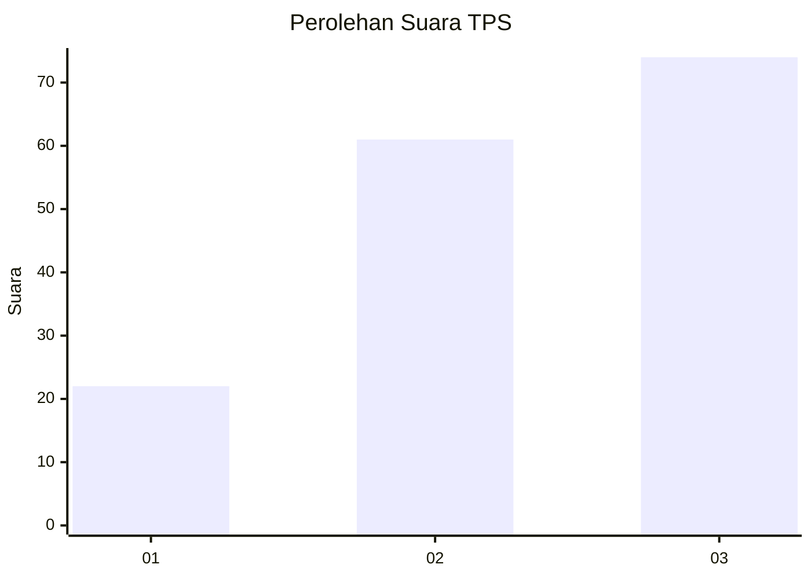
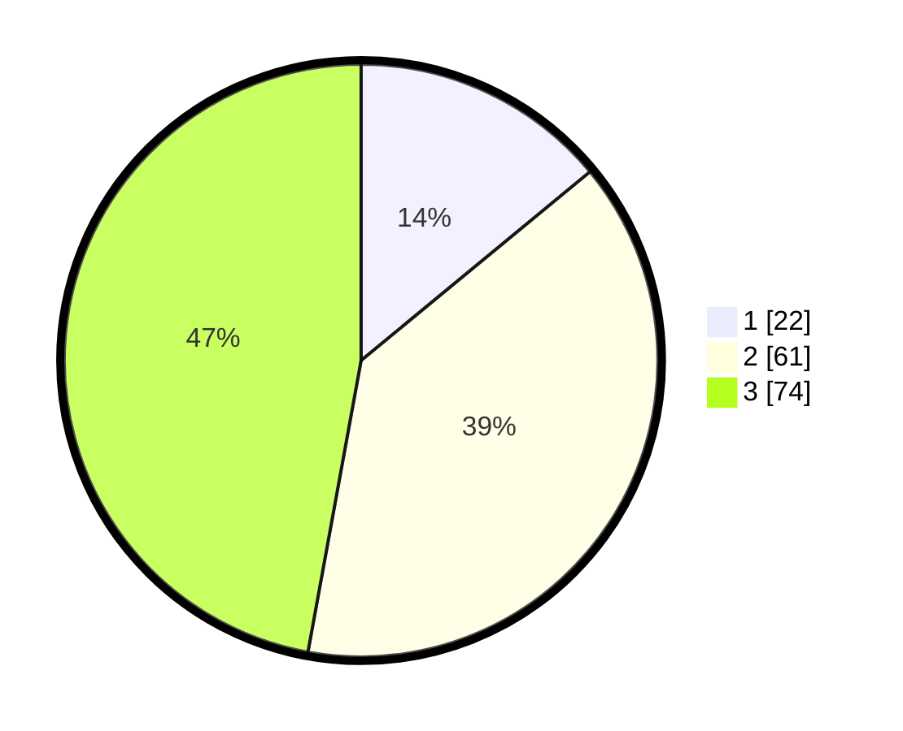

# Hasil

## Grafik

## Tabel

| No. | Nama Paslon    | Suara | Suara (raw) | Persentase |
|:--- |:-------------- | -----:| -----------:| ----------:|
| 1   | ANIES MUHAIMIN | 22    | [22][p-1]   | 14,01      |
| 2   | PRABOWO GIBRAN | 61    | [61][p-2]   | 38,85      |
| 3   | GANJAR MAHFUD  | 74    | [74][p-3]   | 47,13      |

[p-1]: https://github.com/gigit-pemilu/pemilu-2024/blob/main/pilpres/hitung-suara/sub/33-jawa-tengah/sub/29-brebes/sub/04-paguyangan/sub/2003-kedungoleng/sub/003-tps/sub/paslon-1.txt
[p-2]: https://github.com/gigit-pemilu/pemilu-2024/blob/main/pilpres/hitung-suara/sub/33-jawa-tengah/sub/29-brebes/sub/04-paguyangan/sub/2003-kedungoleng/sub/003-tps/sub/paslon-2.txt
[p-3]: https://github.com/gigit-pemilu/pemilu-2024/blob/main/pilpres/hitung-suara/sub/33-jawa-tengah/sub/29-brebes/sub/04-paguyangan/sub/2003-kedungoleng/sub/003-tps/sub/paslon-3.txt

## Foto C Plano

https://sirekap-obj-formc.kpu.go.id/cef9/pemilu/ppwp/33/29/04/20/03/3329042003003-20240214-234818--8907c4e1-0df6-4b29-8941-09cbb07f490d.jpg

https://sirekap-obj-formc.kpu.go.id/cef9/pemilu/ppwp/33/29/04/20/03/3329042003003-20240214-235105--3bb3350c-f70e-42f4-ab04-912ff9474e92.jpg

https://sirekap-obj-formc.kpu.go.id/cef9/pemilu/ppwp/33/29/04/20/03/3329042003003-20240214-235314--734e48ea-3e8f-4c6d-8fc5-037cb86ff924.jpg

## Metadata

| Key        | Value               |
| ---------- | ------------------- |
| Time Stamp | 2024-02-15 16:00:26 |

