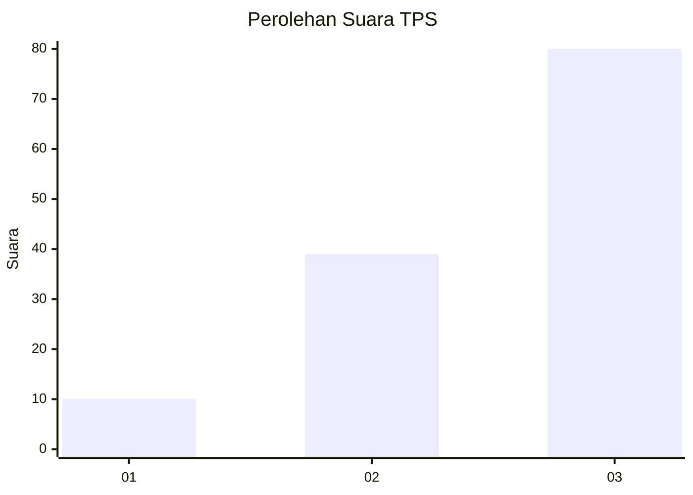
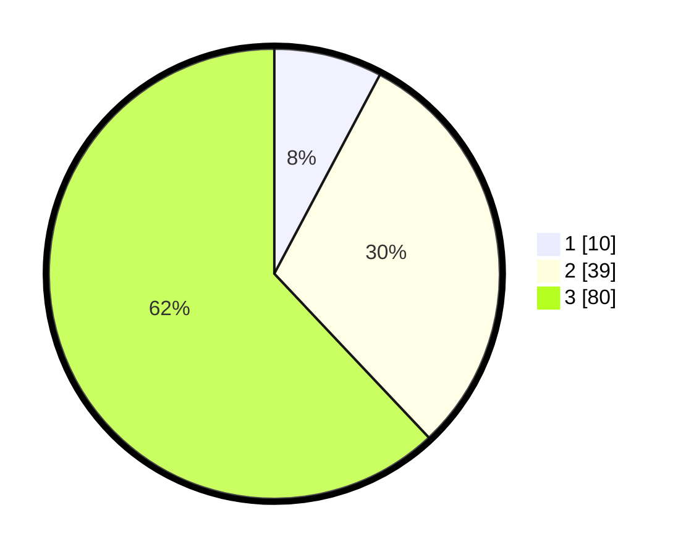

# Hasil

## Grafik

## Tabel

| No. | Nama Paslon    | Suara | Suara (raw) | Persentase |
|:--- |:-------------- | -----:| -----------:| ----------:|
| 1   | ANIES MUHAIMIN | 10    | [10][p-1]   | 7,75       |
| 2   | PRABOWO GIBRAN | 39    | [39][p-2]   | 30,23      |
| 3   | GANJAR MAHFUD  | 80    | [80][p-3]   | 62,02      |

[p-1]: https://github.com/gigit-pemilu/pemilu-2024/blob/main/pilpres/hitung-suara/sub/33-jawa-tengah/sub/29-brebes/sub/04-paguyangan/sub/2003-kedungoleng/sub/014-tps/sub/paslon-1.txt
[p-2]: https://github.com/gigit-pemilu/pemilu-2024/blob/main/pilpres/hitung-suara/sub/33-jawa-tengah/sub/29-brebes/sub/04-paguyangan/sub/2003-kedungoleng/sub/014-tps/sub/paslon-2.txt
[p-3]: https://github.com/gigit-pemilu/pemilu-2024/blob/main/pilpres/hitung-suara/sub/33-jawa-tengah/sub/29-brebes/sub/04-paguyangan/sub/2003-kedungoleng/sub/014-tps/sub/paslon-3.txt

## Foto C Plano

https://sirekap-obj-formc.kpu.go.id/cfe5/pemilu/ppwp/33/29/04/20/03/3329042003014-20240214-224835--2ba2c8c4-6669-442e-a628-8eafcba3c50f.jpg

https://sirekap-obj-formc.kpu.go.id/cfe5/pemilu/ppwp/33/29/04/20/03/3329042003014-20240214-225033--c0020172-4b61-43f7-9197-8179ad9419d1.jpg

https://sirekap-obj-formc.kpu.go.id/cfe5/pemilu/ppwp/33/29/04/20/03/3329042003014-20240214-225159--e6056a33-a3b7-4a38-bc1a-ab7e14c6952f.jpg

## Metadata

| Key        | Value               |
| ---------- | ------------------- |
| Time Stamp | 2024-02-15 16:00:26 |

