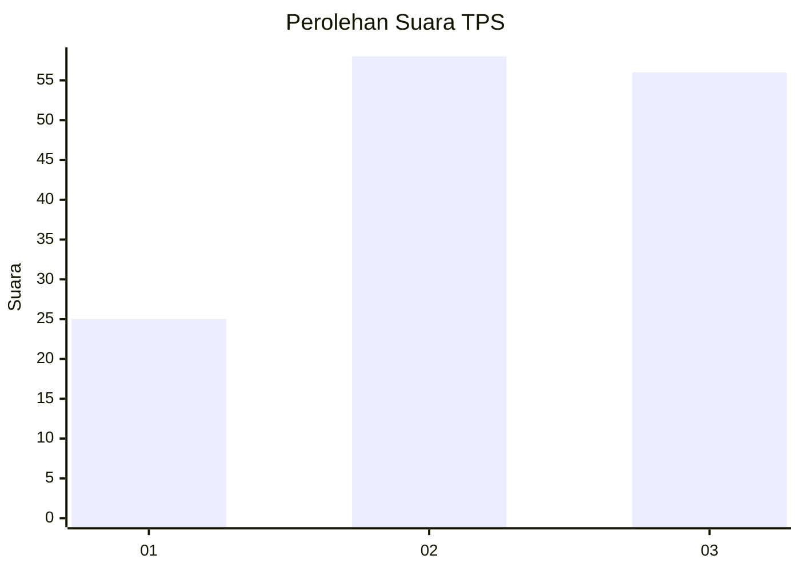
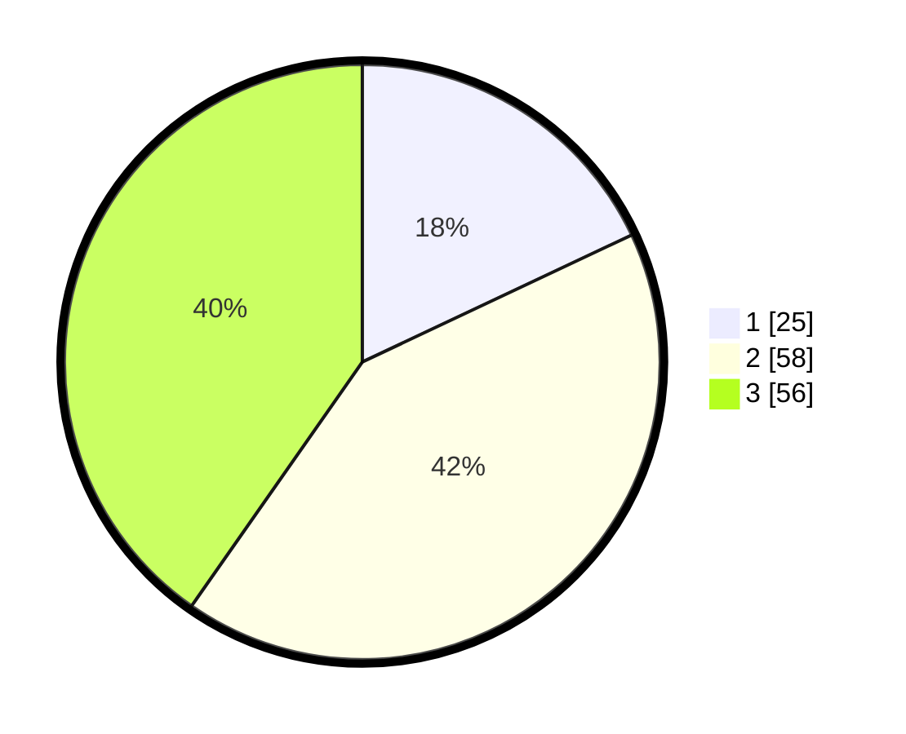

# Hasil

## Grafik

## Tabel

| No. | Nama Paslon    | Suara | Suara (raw) | Persentase |
|:--- |:-------------- | -----:| -----------:| ----------:|
| 1   | ANIES MUHAIMIN | 25    | [25][p-1]   | 17,99      |
| 2   | PRABOWO GIBRAN | 58    | [58][p-2]   | 41,73      |
| 3   | GANJAR MAHFUD  | 56    | [56][p-3]   | 40,29      |

[p-1]: https://github.com/gigit-pemilu/pemilu-2024/blob/main/pilpres/hitung-suara/sub/33-jawa-tengah/sub/29-brebes/sub/04-paguyangan/sub/2007-pakujati/sub/001-tps/sub/paslon-1.txt
[p-2]: https://github.com/gigit-pemilu/pemilu-2024/blob/main/pilpres/hitung-suara/sub/33-jawa-tengah/sub/29-brebes/sub/04-paguyangan/sub/2007-pakujati/sub/001-tps/sub/paslon-2.txt
[p-3]: https://github.com/gigit-pemilu/pemilu-2024/blob/main/pilpres/hitung-suara/sub/33-jawa-tengah/sub/29-brebes/sub/04-paguyangan/sub/2007-pakujati/sub/001-tps/sub/paslon-3.txt

## Foto C Plano

https://sirekap-obj-formc.kpu.go.id/97c5/pemilu/ppwp/33/29/04/20/07/3329042007001-20240214-201619--a8290848-cf0a-4af0-8577-53e4701b0c63.jpg

https://sirekap-obj-formc.kpu.go.id/97c5/pemilu/ppwp/33/29/04/20/07/3329042007001-20240214-201852--dee2b93f-0423-42cb-b63c-27ce2a18a617.jpg

https://sirekap-obj-formc.kpu.go.id/97c5/pemilu/ppwp/33/29/04/20/07/3329042007001-20240214-202329--5e05d094-f318-4b7d-8ceb-a9311fd781e9.jpg

## Metadata

| Key        | Value               |
| ---------- | ------------------- |
| Time Stamp | 2024-02-15 16:30:25 |

