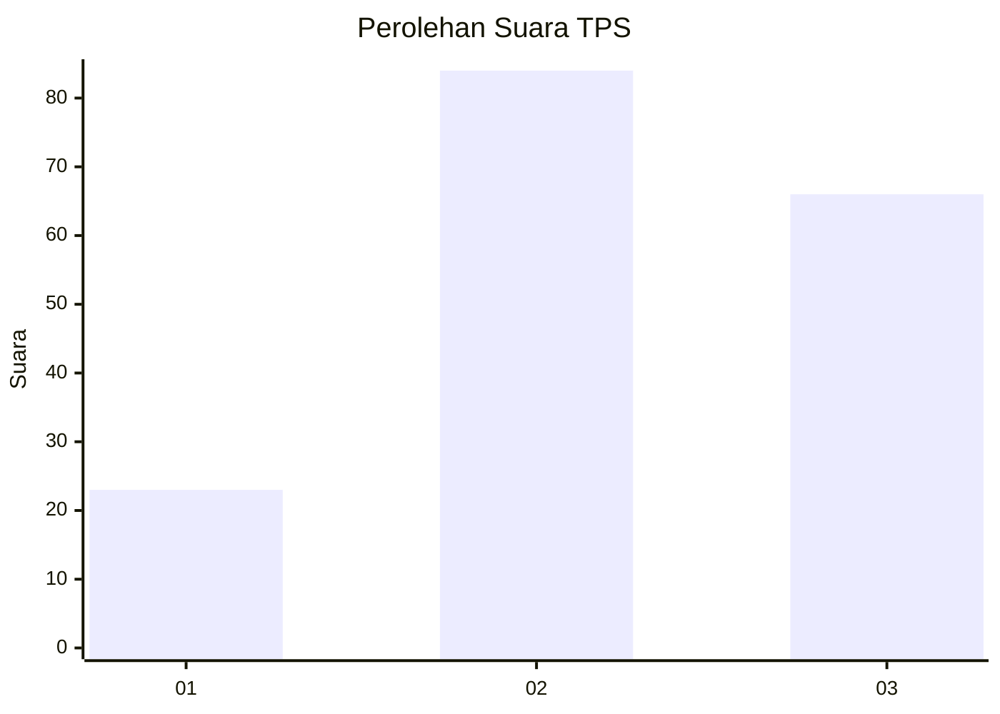
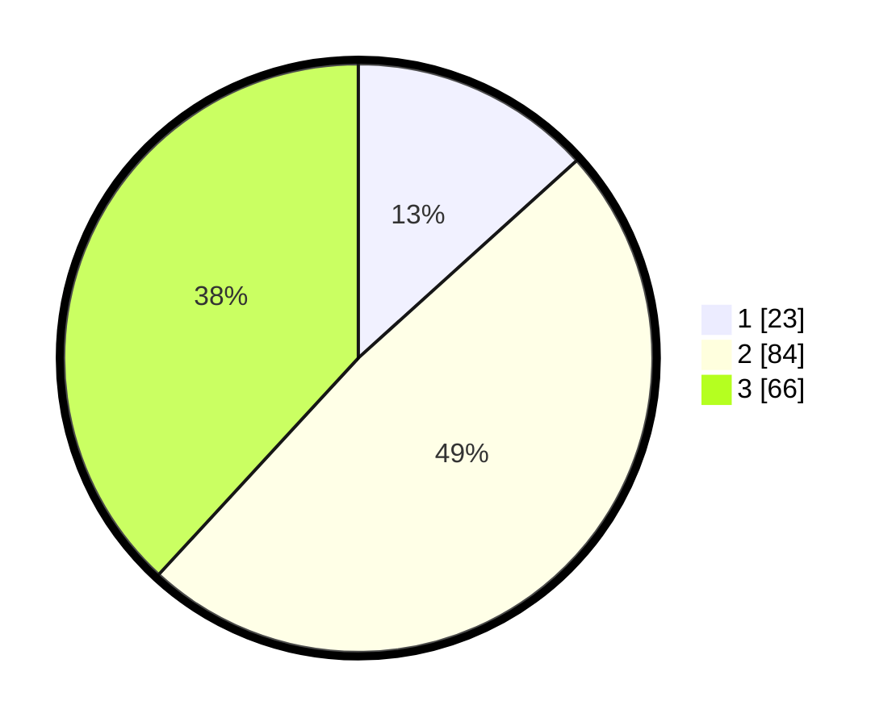

# Hasil

## Grafik

## Tabel

| No. | Nama Paslon    | Suara | Suara (raw) | Persentase |
|:--- |:-------------- | -----:| -----------:| ----------:|
| 1   | ANIES MUHAIMIN | 23    | [23][p-1]   | 13,29      |
| 2   | PRABOWO GIBRAN | 84    | [84][p-2]   | 48,55      |
| 3   | GANJAR MAHFUD  | 66    | [66][p-3]   | 38,15      |

[p-1]: https://github.com/gigit-pemilu/pemilu-2024/blob/main/pilpres/hitung-suara/sub/33-jawa-tengah/sub/29-brebes/sub/04-paguyangan/sub/2007-pakujati/sub/004-tps/sub/paslon-1.txt
[p-2]: https://github.com/gigit-pemilu/pemilu-2024/blob/main/pilpres/hitung-suara/sub/33-jawa-tengah/sub/29-brebes/sub/04-paguyangan/sub/2007-pakujati/sub/004-tps/sub/paslon-2.txt
[p-3]: https://github.com/gigit-pemilu/pemilu-2024/blob/main/pilpres/hitung-suara/sub/33-jawa-tengah/sub/29-brebes/sub/04-paguyangan/sub/2007-pakujati/sub/004-tps/sub/paslon-3.txt

## Foto C Plano

https://sirekap-obj-formc.kpu.go.id/7bc1/pemilu/ppwp/33/29/04/20/07/3329042007004-20240214-221510--20b22c28-27d5-40e0-a64b-e87a4d108177.jpg

https://sirekap-obj-formc.kpu.go.id/7bc1/pemilu/ppwp/33/29/04/20/07/3329042007004-20240214-221830--c16ffcbf-8d7a-4eaa-8387-1a1b5283547a.jpg

https://sirekap-obj-formc.kpu.go.id/7bc1/pemilu/ppwp/33/29/04/20/07/3329042007004-20240214-222010--6b3b9db0-b417-4f51-8730-f76eeb5d57ec.jpg

## Metadata

| Key        | Value               |
| ---------- | ------------------- |
| Time Stamp | 2024-02-15 17:00:25 |

