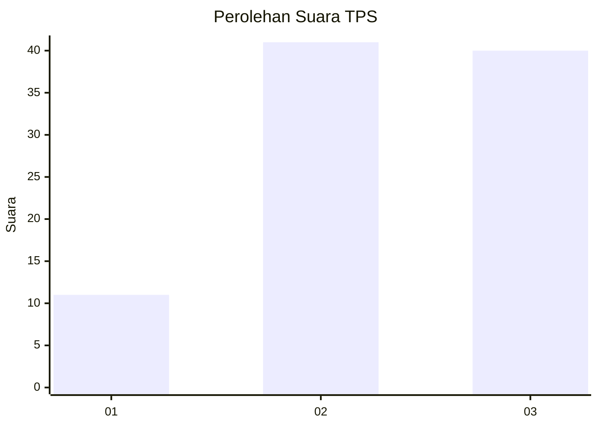
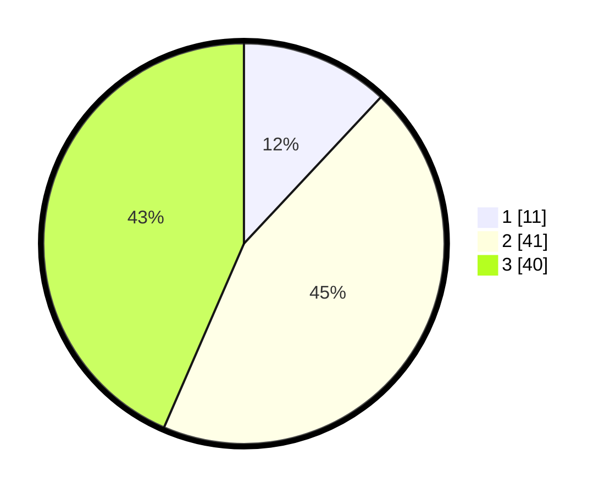

# Hasil

## Grafik

## Tabel

| No. | Nama Paslon    | Suara | Suara (raw) | Persentase |
|:--- |:-------------- | -----:| -----------:| ----------:|
| 1   | ANIES MUHAIMIN | 11    | [11][p-1]   | 11,96      |
| 2   | PRABOWO GIBRAN | 41    | [41][p-2]   | 44,57      |
| 3   | GANJAR MAHFUD  | 40    | [40][p-3]   | 43,48      |

[p-1]: https://github.com/gigit-pemilu/pemilu-2024/blob/main/pilpres/hitung-suara/sub/33-jawa-tengah/sub/29-brebes/sub/04-paguyangan/sub/2007-pakujati/sub/015-tps/sub/paslon-1.txt
[p-2]: https://github.com/gigit-pemilu/pemilu-2024/blob/main/pilpres/hitung-suara/sub/33-jawa-tengah/sub/29-brebes/sub/04-paguyangan/sub/2007-pakujati/sub/015-tps/sub/paslon-2.txt
[p-3]: https://github.com/gigit-pemilu/pemilu-2024/blob/main/pilpres/hitung-suara/sub/33-jawa-tengah/sub/29-brebes/sub/04-paguyangan/sub/2007-pakujati/sub/015-tps/sub/paslon-3.txt

## Foto C Plano

https://sirekap-obj-formc.kpu.go.id/8ab3/pemilu/ppwp/33/29/04/20/07/3329042007015-20240214-221151--60b1a6a6-7354-4192-a0bf-ffa74c2b66b7.jpg

https://sirekap-obj-formc.kpu.go.id/8ab3/pemilu/ppwp/33/29/04/20/07/3329042007015-20240214-221331--d642e792-faf4-4d5f-8c95-4b509ab56b6c.jpg

https://sirekap-obj-formc.kpu.go.id/8ab3/pemilu/ppwp/33/29/04/20/07/3329042007015-20240214-221426--deb96908-4b1d-447e-991e-43b460080298.jpg

## Metadata

| Key        | Value               |
| ---------- | ------------------- |
| Time Stamp | 2024-02-24 22:31:28 |

