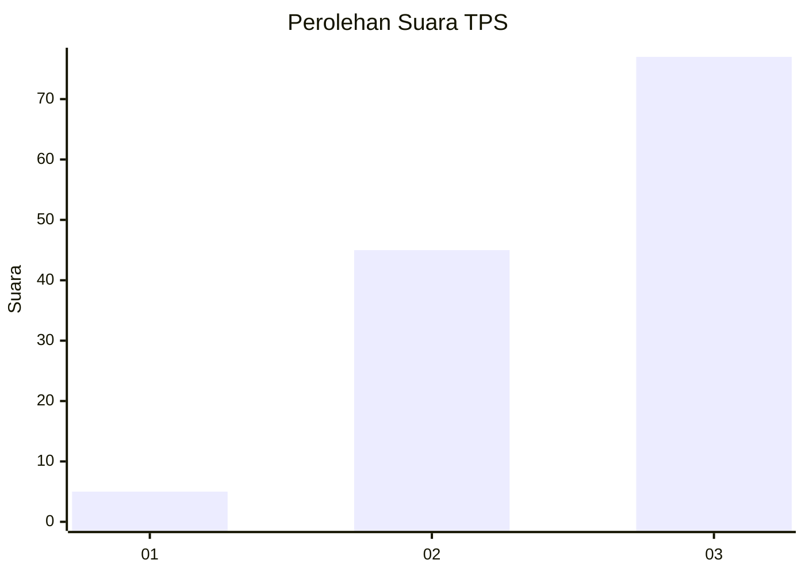
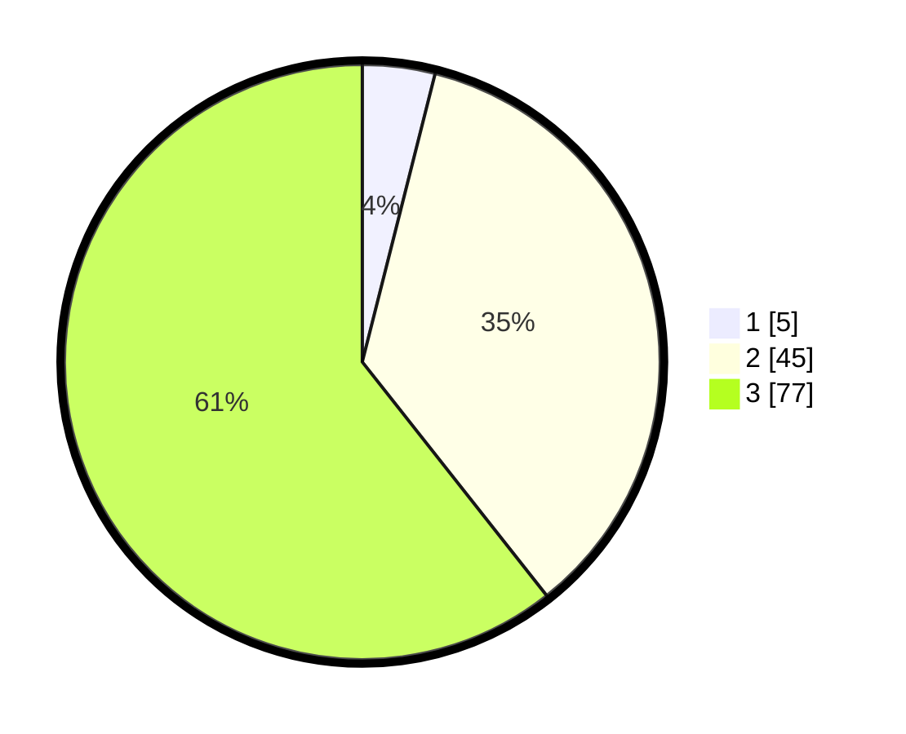

# Hasil

## Grafik

## Tabel

| No. | Nama Paslon    | Suara | Suara (raw) | Persentase |
|:--- |:-------------- | -----:| -----------:| ----------:|
| 1   | ANIES MUHAIMIN | 5     | [5][p-1]    | 3,94       |
| 2   | PRABOWO GIBRAN | 45    | [45][p-2]   | 35,43      |
| 3   | GANJAR MAHFUD  | 77    | [77][p-3]   | 60,63      |

[p-1]: https://github.com/gigit-pemilu/pemilu-2024-33-jawa-tengah/blob/main/pilpres/hitung-suara/sub/33-jawa-tengah/sub/29-brebes/sub/04-paguyangan/sub/2009-ragatunjung/sub/006-tps/sub/paslon-1.txt
[p-2]: https://github.com/gigit-pemilu/pemilu-2024-33-jawa-tengah/blob/main/pilpres/hitung-suara/sub/33-jawa-tengah/sub/29-brebes/sub/04-paguyangan/sub/2009-ragatunjung/sub/006-tps/sub/paslon-2.txt
[p-3]: https://github.com/gigit-pemilu/pemilu-2024-33-jawa-tengah/blob/main/pilpres/hitung-suara/sub/33-jawa-tengah/sub/29-brebes/sub/04-paguyangan/sub/2009-ragatunjung/sub/006-tps/sub/paslon-3.txt

## Foto C Plano

https://sirekap-obj-formc.kpu.go.id/34cd/pemilu/ppwp/33/29/04/20/09/3329042009006-20240214-223612--11b8c3bf-726e-46d3-aee1-3787ecc1a7fb.jpg

https://sirekap-obj-formc.kpu.go.id/34cd/pemilu/ppwp/33/29/04/20/09/3329042009006-20240214-224612--8d632fa3-8b0d-4b8a-b880-a22f40fd4f72.jpg

https://sirekap-obj-formc.kpu.go.id/34cd/pemilu/ppwp/33/29/04/20/09/3329042009006-20240214-225132--d4938132-f5f2-4e41-80b2-cd0a518b60c1.jpg

## Metadata

| Key        | Value               |
| ---------- | ------------------- |
| Time Stamp | 2024-02-15 19:00:26 |

