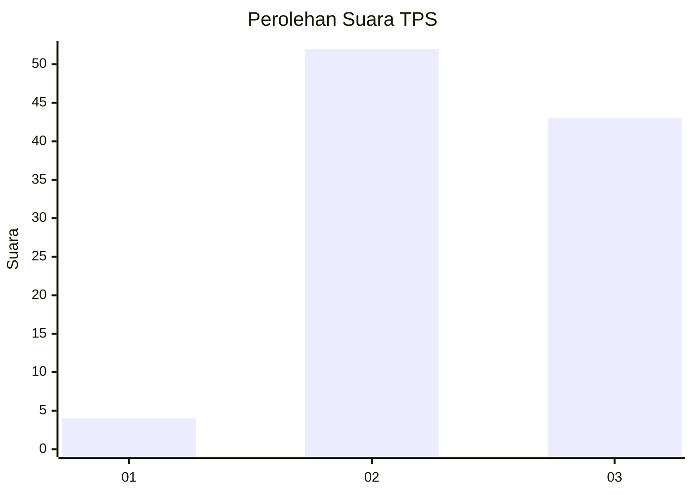
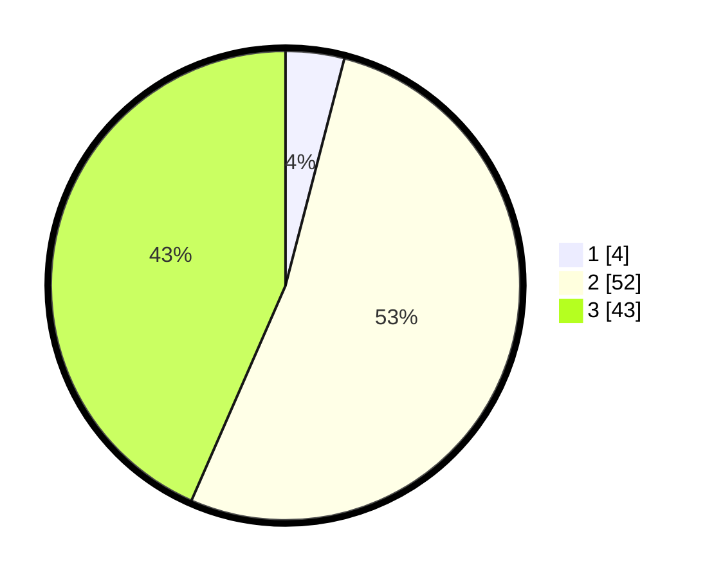

# Hasil

## Grafik

## Tabel

| No. | Nama Paslon    | Suara | Suara (raw) | Persentase |
|:--- |:-------------- | -----:| -----------:| ----------:|
| 1   | ANIES MUHAIMIN | 4     | [4][p-1]    | 4,04       |
| 2   | PRABOWO GIBRAN | 52    | [52][p-2]   | 52,53      |
| 3   | GANJAR MAHFUD  | 43    | [43][p-3]   | 43,43      |

[p-1]: https://github.com/gigit-pemilu/pemilu-2024-33-jawa-tengah/blob/main/pilpres/hitung-suara/sub/33-jawa-tengah/sub/29-brebes/sub/04-paguyangan/sub/2010-taraban/sub/006-tps/sub/paslon-1.txt
[p-2]: https://github.com/gigit-pemilu/pemilu-2024-33-jawa-tengah/blob/main/pilpres/hitung-suara/sub/33-jawa-tengah/sub/29-brebes/sub/04-paguyangan/sub/2010-taraban/sub/006-tps/sub/paslon-2.txt
[p-3]: https://github.com/gigit-pemilu/pemilu-2024-33-jawa-tengah/blob/main/pilpres/hitung-suara/sub/33-jawa-tengah/sub/29-brebes/sub/04-paguyangan/sub/2010-taraban/sub/006-tps/sub/paslon-3.txt

## Foto C Plano

https://sirekap-obj-formc.kpu.go.id/77f0/pemilu/ppwp/33/29/04/20/10/3329042010006-20240214-231256--c5d9de86-c132-4eb6-b1fe-c605dc2fe134.jpg

https://sirekap-obj-formc.kpu.go.id/77f0/pemilu/ppwp/33/29/04/20/10/3329042010006-20240214-231539--14d48423-f92a-4402-85ac-7da8cd00ea02.jpg

https://sirekap-obj-formc.kpu.go.id/77f0/pemilu/ppwp/33/29/04/20/10/3329042010006-20240214-231749--e2815017-2946-4d68-a2ed-d13bd27945c9.jpg

## Metadata

| Key        | Value               |
| ---------- | ------------------- |
| Time Stamp | 2024-02-16 14:00:34 |

