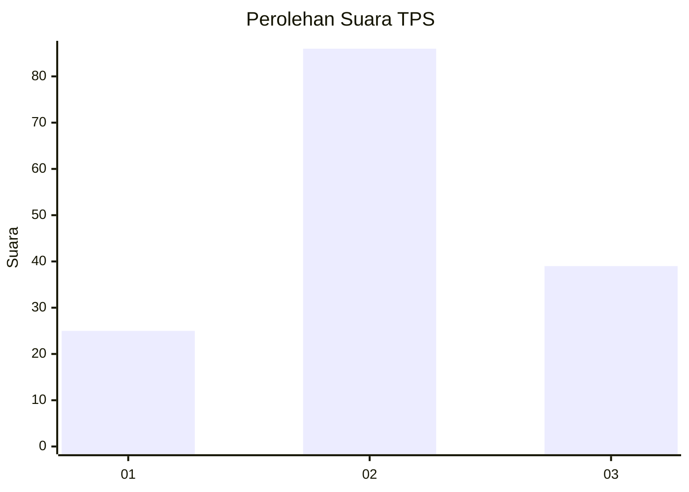
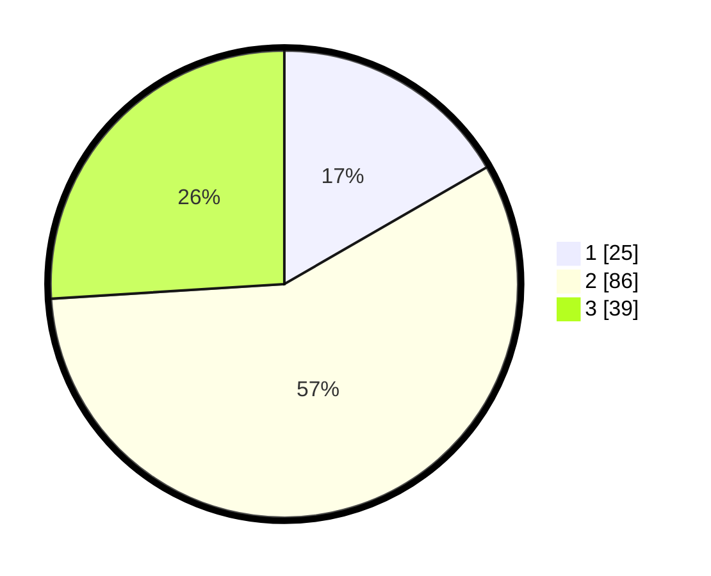

# Hasil

## Grafik

## Tabel

| No. | Nama Paslon    | Suara | Suara (raw) | Persentase |
|:--- |:-------------- | -----:| -----------:| ----------:|
| 1   | ANIES MUHAIMIN | 25    | [25][p-1]   | 16,67      |
| 2   | PRABOWO GIBRAN | 86    | [86][p-2]   | 57,33      |
| 3   | GANJAR MAHFUD  | 39    | [39][p-3]   | 26,00      |

[p-1]: https://github.com/gigit-pemilu/pemilu-2024/blob/main/pilpres/hitung-suara/sub/33-jawa-tengah/sub/29-brebes/sub/04-paguyangan/sub/2011-wanatirta/sub/004-tps/sub/paslon-1.txt
[p-2]: https://github.com/gigit-pemilu/pemilu-2024/blob/main/pilpres/hitung-suara/sub/33-jawa-tengah/sub/29-brebes/sub/04-paguyangan/sub/2011-wanatirta/sub/004-tps/sub/paslon-2.txt
[p-3]: https://github.com/gigit-pemilu/pemilu-2024/blob/main/pilpres/hitung-suara/sub/33-jawa-tengah/sub/29-brebes/sub/04-paguyangan/sub/2011-wanatirta/sub/004-tps/sub/paslon-3.txt

## Foto C Plano

https://sirekap-obj-formc.kpu.go.id/0261/pemilu/ppwp/33/29/04/20/11/3329042011004-20240215-003857--5b92eb38-fb33-4106-9f87-8a6a2a3f8ad7.jpg

https://sirekap-obj-formc.kpu.go.id/0261/pemilu/ppwp/33/29/04/20/11/3329042011004-20240215-003934--700bfa3f-6320-4d0f-a25c-30367a8474d3.jpg

https://sirekap-obj-formc.kpu.go.id/0261/pemilu/ppwp/33/29/04/20/11/3329042011004-20240215-004016--8d1c9ecf-7db5-47bf-b4de-17e180c9f2e2.jpg

## Metadata

| Key        | Value               |
| ---------- | ------------------- |
| Time Stamp | 2024-02-25 15:00:00 |

