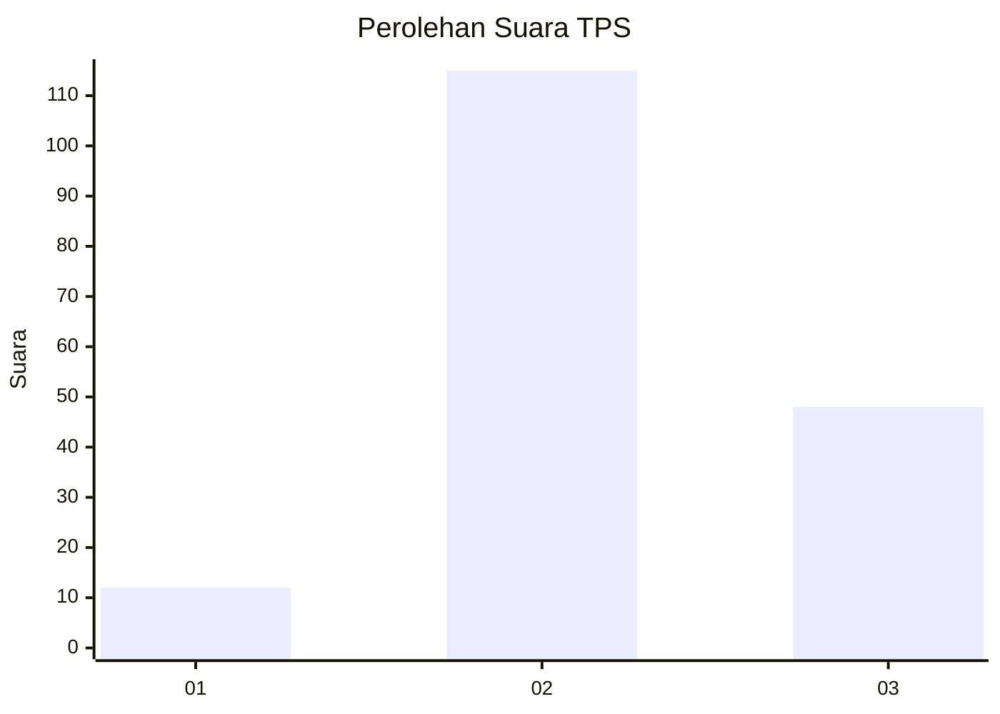

# Hasil

## Grafik

## Tabel

| No. | Nama Paslon    | Suara | Suara (raw) | Persentase |
|:--- |:-------------- | -----:| -----------:| ----------:|
| 1   | ANIES MUHAIMIN | 12    | [12][p-1]   | 6,86       |
| 2   | PRABOWO GIBRAN | 115   | [115][p-2]  | 65,71      |
| 3   | GANJAR MAHFUD  | 48    | [48][p-3]   | 27,43      |

[p-1]: https://github.com/gigit-pemilu/pemilu-2024/blob/main/pilpres/hitung-suara/sub/33-jawa-tengah/sub/29-brebes/sub/04-paguyangan/sub/2011-wanatirta/sub/007-tps/sub/paslon-1.txt
[p-2]: https://github.com/gigit-pemilu/pemilu-2024/blob/main/pilpres/hitung-suara/sub/33-jawa-tengah/sub/29-brebes/sub/04-paguyangan/sub/2011-wanatirta/sub/007-tps/sub/paslon-2.txt
[p-3]: https://github.com/gigit-pemilu/pemilu-2024/blob/main/pilpres/hitung-suara/sub/33-jawa-tengah/sub/29-brebes/sub/04-paguyangan/sub/2011-wanatirta/sub/007-tps/sub/paslon-3.txt

## Foto C Plano

https://sirekap-obj-formc.kpu.go.id/3519/pemilu/ppwp/33/29/04/20/11/3329042011007-20240214-155216--ea7af40b-6f9b-4268-93a2-2b59c0a440d4.jpg

https://sirekap-obj-formc.kpu.go.id/3519/pemilu/ppwp/33/29/04/20/11/3329042011007-20240214-155508--b1bd5359-606d-4f11-b014-7b6e8ec8d418.jpg

https://sirekap-obj-formc.kpu.go.id/3519/pemilu/ppwp/33/29/04/20/11/3329042011007-20240214-155607--40db7e9e-cfd4-41d2-94e0-b27e3bda0687.jpg

## Metadata

| Key        | Value               |
| ---------- | ------------------- |
| Time Stamp | 2024-02-25 15:00:00 |

