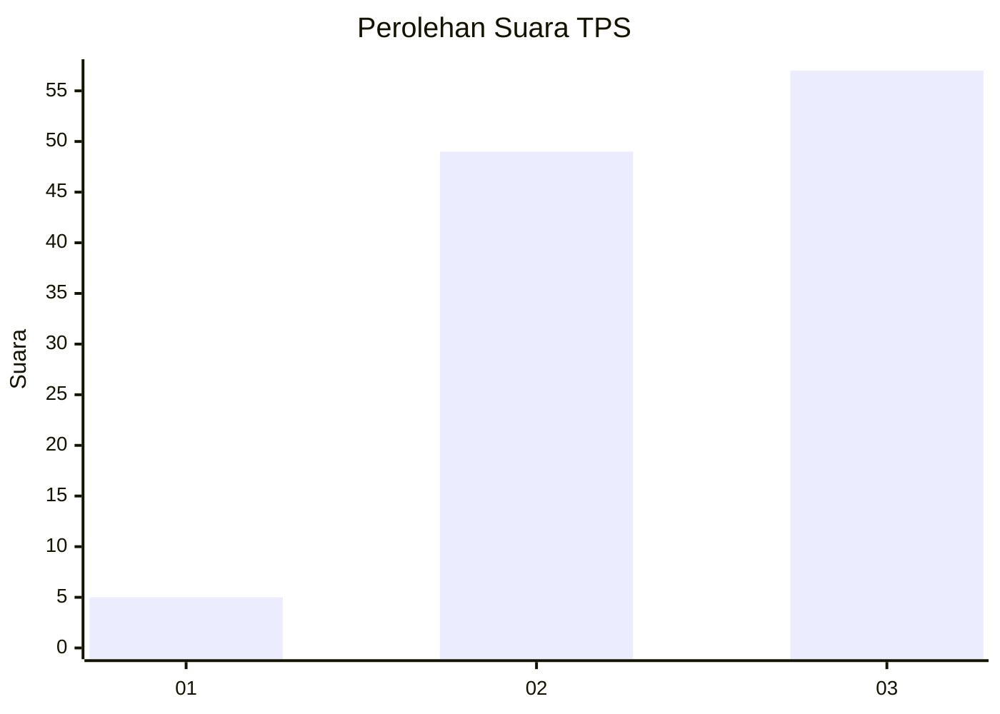
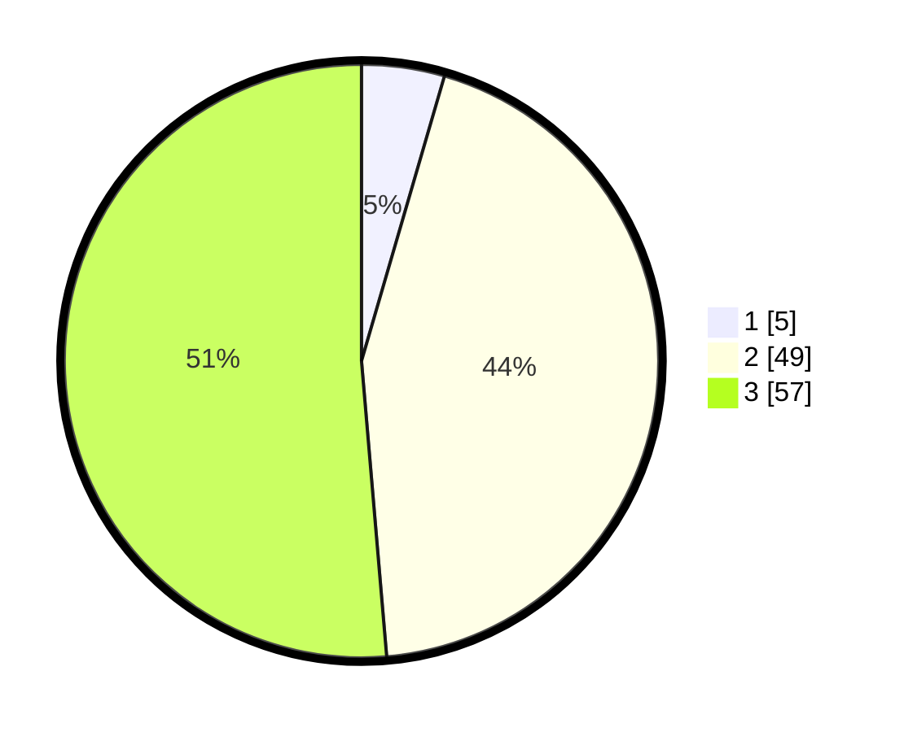

# Hasil

## Grafik

## Tabel

| No. | Nama Paslon    | Suara | Suara (raw) | Persentase |
|:--- |:-------------- | -----:| -----------:| ----------:|
| 1   | ANIES MUHAIMIN | 5     | [5][p-1]    | 4,50       |
| 2   | PRABOWO GIBRAN | 49    | [49][p-2]   | 44,14      |
| 3   | GANJAR MAHFUD  | 57    | [57][p-3]   | 51,35      |

[p-1]: https://github.com/gigit-pemilu/pemilu-2024/blob/main/pilpres/hitung-suara/sub/33-jawa-tengah/sub/29-brebes/sub/04-paguyangan/sub/2011-wanatirta/sub/038-tps/sub/paslon-1.txt
[p-2]: https://github.com/gigit-pemilu/pemilu-2024/blob/main/pilpres/hitung-suara/sub/33-jawa-tengah/sub/29-brebes/sub/04-paguyangan/sub/2011-wanatirta/sub/038-tps/sub/paslon-2.txt
[p-3]: https://github.com/gigit-pemilu/pemilu-2024/blob/main/pilpres/hitung-suara/sub/33-jawa-tengah/sub/29-brebes/sub/04-paguyangan/sub/2011-wanatirta/sub/038-tps/sub/paslon-3.txt

## Foto C Plano

https://sirekap-obj-formc.kpu.go.id/9df3/pemilu/ppwp/33/29/04/20/11/3329042011038-20240214-213012--53fa64e8-1510-4408-9946-f14a5dae95c0.jpg

https://sirekap-obj-formc.kpu.go.id/9df3/pemilu/ppwp/33/29/04/20/11/3329042011038-20240214-213425--06935882-6ed5-4ce2-a0d1-539091d68a9c.jpg

https://sirekap-obj-formc.kpu.go.id/9df3/pemilu/ppwp/33/29/04/20/11/3329042011038-20240214-213640--9e6bcaa9-69da-44a0-8f80-e9c685bad4e5.jpg

## Metadata

| Key        | Value               |
| ---------- | ------------------- |
| Time Stamp | 2024-02-16 10:00:28 |

