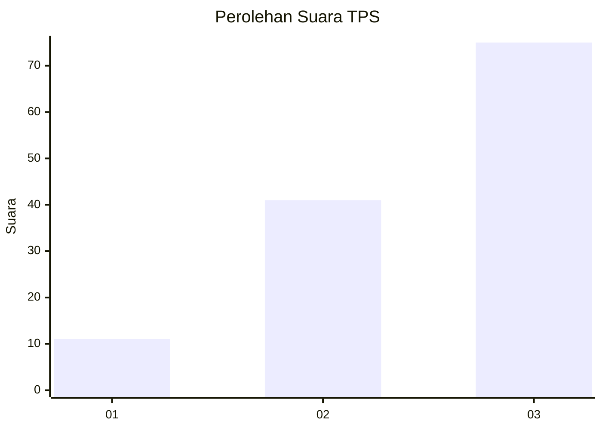
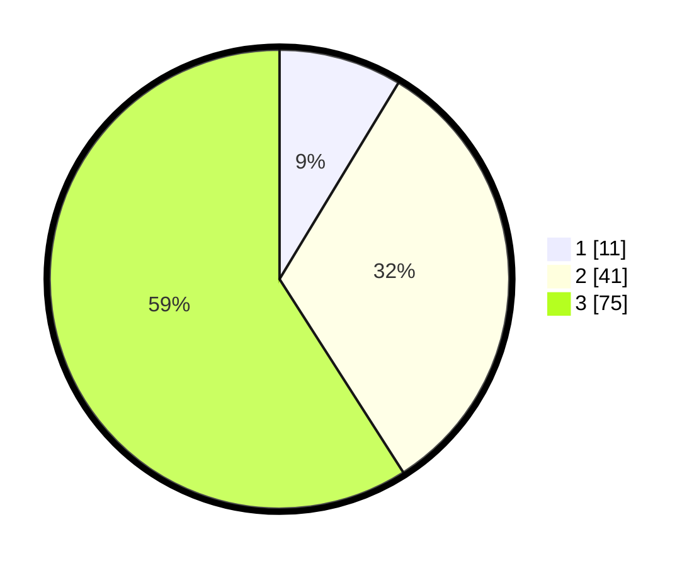

# Hasil

## Grafik

## Tabel

| No. | Nama Paslon    | Suara | Suara (raw) | Persentase |
|:--- |:-------------- | -----:| -----------:| ----------:|
| 1   | ANIES MUHAIMIN | 11    | [11][p-1]   | 8,66       |
| 2   | PRABOWO GIBRAN | 41    | [41][p-2]   | 32,28      |
| 3   | GANJAR MAHFUD  | 75    | [75][p-3]   | 59,06      |

[p-1]: https://github.com/gigit-pemilu/pemilu-2024/blob/main/pilpres/hitung-suara/sub/33-jawa-tengah/sub/29-brebes/sub/04-paguyangan/sub/2012-winduaji/sub/008-tps/sub/paslon-1.txt
[p-2]: https://github.com/gigit-pemilu/pemilu-2024/blob/main/pilpres/hitung-suara/sub/33-jawa-tengah/sub/29-brebes/sub/04-paguyangan/sub/2012-winduaji/sub/008-tps/sub/paslon-2.txt
[p-3]: https://github.com/gigit-pemilu/pemilu-2024/blob/main/pilpres/hitung-suara/sub/33-jawa-tengah/sub/29-brebes/sub/04-paguyangan/sub/2012-winduaji/sub/008-tps/sub/paslon-3.txt

## Foto C Plano

https://sirekap-obj-formc.kpu.go.id/ef9d/pemilu/ppwp/33/29/04/20/12/3329042012008-20240214-222528--25b4dc25-9397-40af-b8d7-75cce45811b0.jpg

https://sirekap-obj-formc.kpu.go.id/ef9d/pemilu/ppwp/33/29/04/20/12/3329042012008-20240214-201246--c94204fc-1a03-42e3-8b02-5e6ac84fbb72.jpg

https://sirekap-obj-formc.kpu.go.id/ef9d/pemilu/ppwp/33/29/04/20/12/3329042012008-20240214-201513--a8cac69f-00c9-4576-9493-6652c9dd4b53.jpg

## Metadata

| Key        | Value               |
| ---------- | ------------------- |
| Time Stamp | 2024-02-15 09:00:24 |

