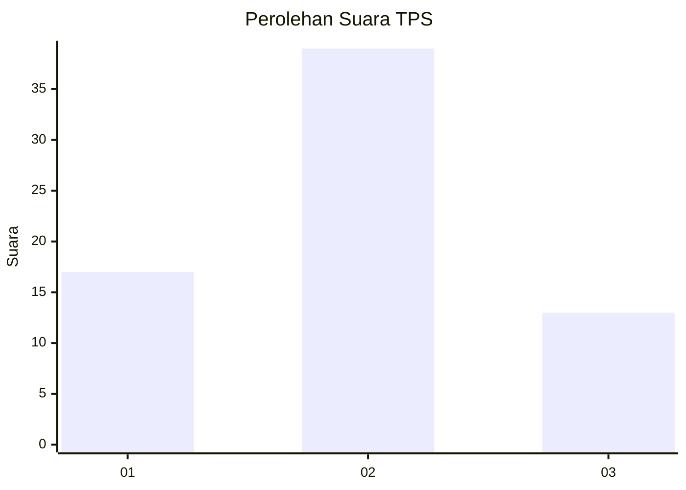
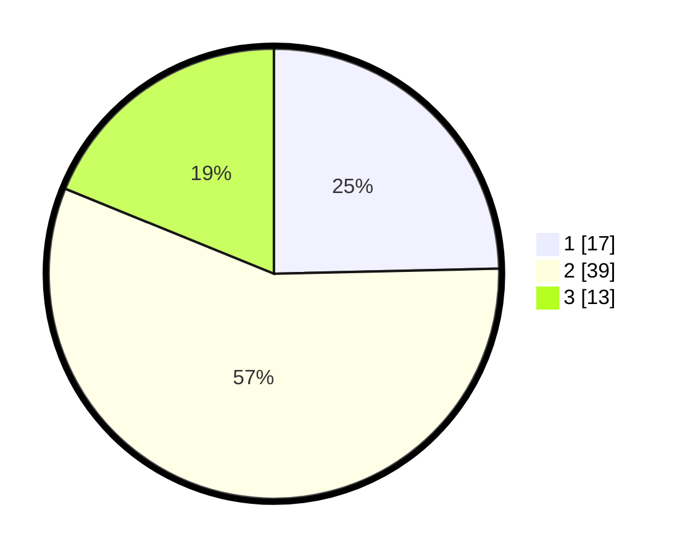

# Hasil

## Grafik

## Tabel

| No. | Nama Paslon    | Suara | Suara (raw) | Persentase |
|:--- |:-------------- | -----:| -----------:| ----------:|
| 1   | ANIES MUHAIMIN | 17    | [17][p-1]   | 24,64      |
| 2   | PRABOWO GIBRAN | 39    | [39][p-2]   | 56,52      |
| 3   | GANJAR MAHFUD  | 13    | [13][p-3]   | 18,84      |

[p-1]: https://github.com/gigit-pemilu/pemilu-2024-33-jawa-tengah/blob/main/pilpres/hitung-suara/sub/33-jawa-tengah/sub/29-brebes/sub/04-paguyangan/sub/2012-winduaji/sub/022-tps/sub/paslon-1.txt
[p-2]: https://github.com/gigit-pemilu/pemilu-2024-33-jawa-tengah/blob/main/pilpres/hitung-suara/sub/33-jawa-tengah/sub/29-brebes/sub/04-paguyangan/sub/2012-winduaji/sub/022-tps/sub/paslon-2.txt
[p-3]: https://github.com/gigit-pemilu/pemilu-2024-33-jawa-tengah/blob/main/pilpres/hitung-suara/sub/33-jawa-tengah/sub/29-brebes/sub/04-paguyangan/sub/2012-winduaji/sub/022-tps/sub/paslon-3.txt

## Foto C Plano

https://sirekap-obj-formc.kpu.go.id/add6/pemilu/ppwp/33/29/04/20/12/3329042012022-20240214-214807--c5babef4-6b86-4ffa-9629-24e4e84852db.jpg

https://sirekap-obj-formc.kpu.go.id/add6/pemilu/ppwp/33/29/04/20/12/3329042012022-20240214-215009--7b7bee6b-de19-4c0f-9693-6bfc3ddcdf7e.jpg

https://sirekap-obj-formc.kpu.go.id/add6/pemilu/ppwp/33/29/04/20/12/3329042012022-20240214-215105--f175e939-eab5-48e6-99b4-bac4c9e3f494.jpg

## Metadata

| Key        | Value               |
| ---------- | ------------------- |
| Time Stamp | 2024-02-25 15:00:00 |

