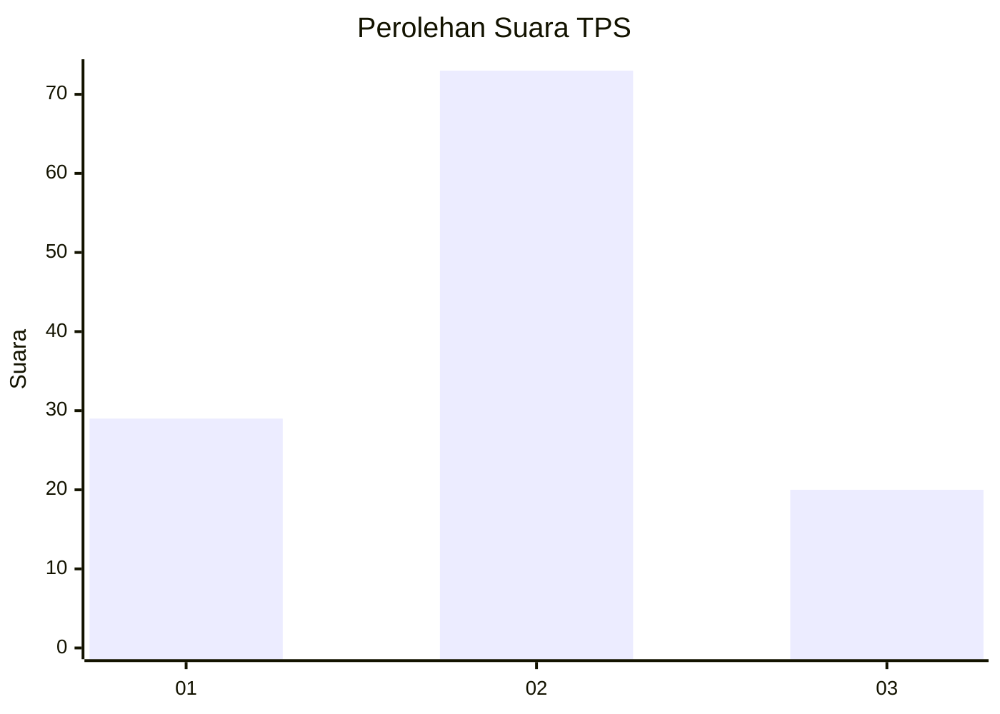
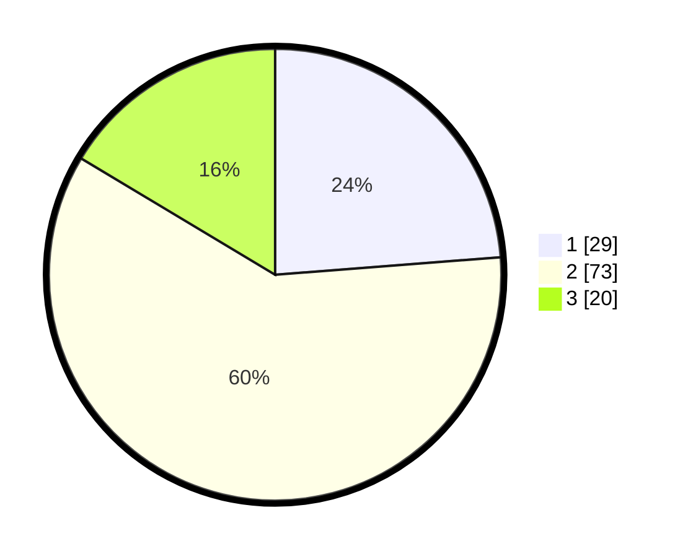

# Hasil

## Grafik

## Tabel

| No. | Nama Paslon    | Suara | Suara (raw) | Persentase |
|:--- |:-------------- | -----:| -----------:| ----------:|
| 1   | ANIES MUHAIMIN | 29    | [29][p-1]   | 23,77      |
| 2   | PRABOWO GIBRAN | 73    | [73][p-2]   | 59,84      |
| 3   | GANJAR MAHFUD  | 20    | [20][p-3]   | 16,39      |

[p-1]: https://github.com/gigit-pemilu/pemilu-2024-33-jawa-tengah/blob/main/pilpres/hitung-suara/sub/33-jawa-tengah/sub/29-brebes/sub/04-paguyangan/sub/2012-winduaji/sub/047-tps/sub/paslon-1.txt
[p-2]: https://github.com/gigit-pemilu/pemilu-2024-33-jawa-tengah/blob/main/pilpres/hitung-suara/sub/33-jawa-tengah/sub/29-brebes/sub/04-paguyangan/sub/2012-winduaji/sub/047-tps/sub/paslon-2.txt
[p-3]: https://github.com/gigit-pemilu/pemilu-2024-33-jawa-tengah/blob/main/pilpres/hitung-suara/sub/33-jawa-tengah/sub/29-brebes/sub/04-paguyangan/sub/2012-winduaji/sub/047-tps/sub/paslon-3.txt

## Foto C Plano

https://sirekap-obj-formc.kpu.go.id/46a6/pemilu/ppwp/33/29/04/20/12/3329042012047-20240215-015349--d8288b47-df6a-45cd-928a-e884101249d1.jpg

https://sirekap-obj-formc.kpu.go.id/46a6/pemilu/ppwp/33/29/04/20/12/3329042012047-20240215-015605--914f2321-819d-4af5-9144-1178bb303cf8.jpg

https://sirekap-obj-formc.kpu.go.id/46a6/pemilu/ppwp/33/29/04/20/12/3329042012047-20240215-015625--f0f9ad69-5c92-4ef3-8856-8ddf80bbf261.jpg

## Metadata

| Key        | Value               |
| ---------- | ------------------- |
| Time Stamp | 2024-02-15 15:30:25 |

