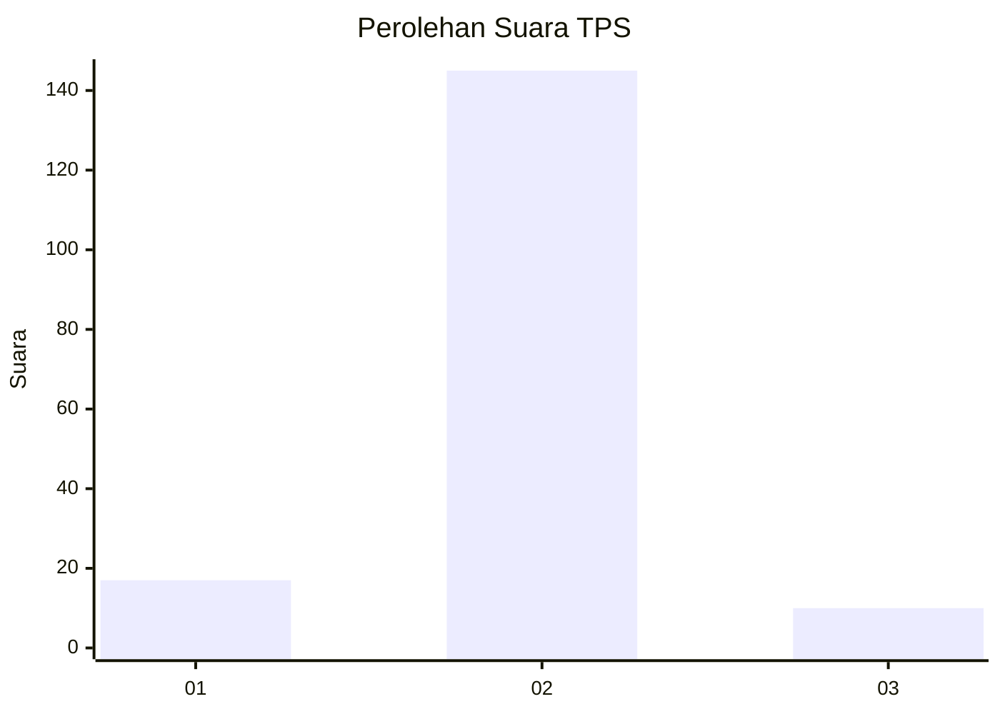
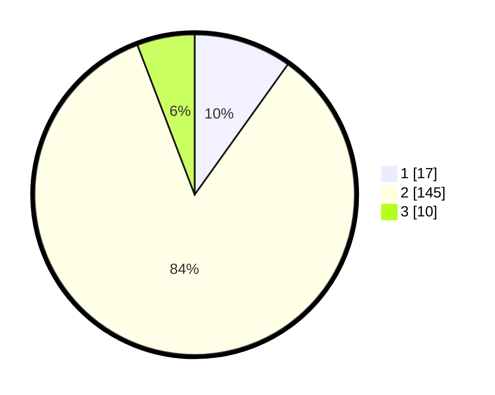

# Hasil

## Grafik

## Tabel

| No. | Nama Paslon    | Suara | Suara (raw) | Persentase |
|:--- |:-------------- | -----:| -----------:| ----------:|
| 1   | ANIES MUHAIMIN | 17    | [17][p-1]   | 9,88       |
| 2   | PRABOWO GIBRAN | 145   | [145][p-2]  | 84,30      |
| 3   | GANJAR MAHFUD  | 10    | [10][p-3]   | 5,81       |

[p-1]: https://github.com/gigit-pemilu/pemilu-2024/blob/main/pilpres/hitung-suara/sub/33-jawa-tengah/sub/29-brebes/sub/05-sirampog/sub/2001-batursari/sub/003-tps/sub/paslon-1.txt
[p-2]: https://github.com/gigit-pemilu/pemilu-2024/blob/main/pilpres/hitung-suara/sub/33-jawa-tengah/sub/29-brebes/sub/05-sirampog/sub/2001-batursari/sub/003-tps/sub/paslon-2.txt
[p-3]: https://github.com/gigit-pemilu/pemilu-2024/blob/main/pilpres/hitung-suara/sub/33-jawa-tengah/sub/29-brebes/sub/05-sirampog/sub/2001-batursari/sub/003-tps/sub/paslon-3.txt

## Foto C Plano

https://sirekap-obj-formc.kpu.go.id/849d/pemilu/ppwp/33/29/05/20/01/3329052001003-20240214-141211--82351d46-14a2-463d-bf3a-16fe63f2fb71.jpg

https://sirekap-obj-formc.kpu.go.id/849d/pemilu/ppwp/33/29/05/20/01/3329052001003-20240214-141305--71565dd3-a507-43b3-9eed-323279854b5f.jpg

https://sirekap-obj-formc.kpu.go.id/849d/pemilu/ppwp/33/29/05/20/01/3329052001003-20240214-141614--45a3e01a-b46d-4fd5-aea5-813344798a69.jpg

## Metadata

| Key        | Value               |
| ---------- | ------------------- |
| Time Stamp | 2024-02-24 22:31:28 |

