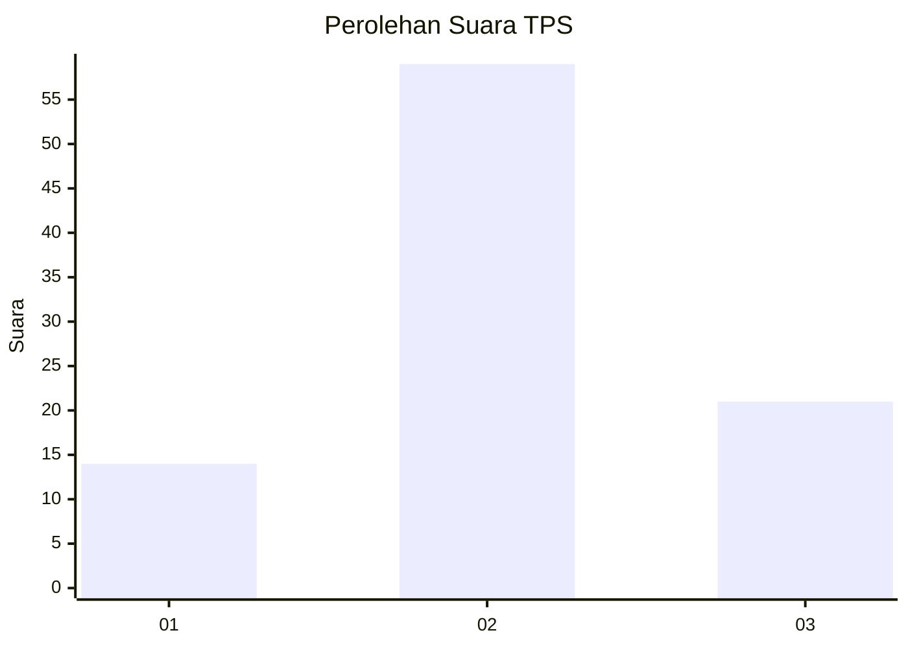
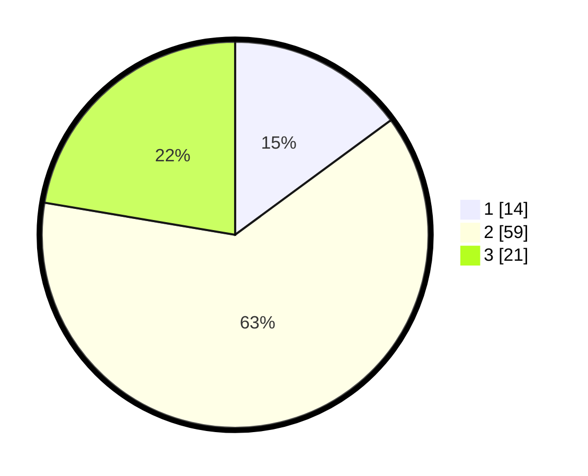

# Hasil

## Grafik

## Tabel

| No. | Nama Paslon    | Suara | Suara (raw) | Persentase |
|:--- |:-------------- | -----:| -----------:| ----------:|
| 1   | ANIES MUHAIMIN | 14    | [14][p-1]   | 14,89      |
| 2   | PRABOWO GIBRAN | 59    | [59][p-2]   | 62,77      |
| 3   | GANJAR MAHFUD  | 21    | [21][p-3]   | 22,34      |

[p-1]: https://github.com/gigit-pemilu/pemilu-2024-33-jawa-tengah/blob/main/pilpres/hitung-suara/sub/33-jawa-tengah/sub/29-brebes/sub/05-sirampog/sub/2003-buniwah/sub/003-tps/sub/paslon-1.txt
[p-2]: https://github.com/gigit-pemilu/pemilu-2024-33-jawa-tengah/blob/main/pilpres/hitung-suara/sub/33-jawa-tengah/sub/29-brebes/sub/05-sirampog/sub/2003-buniwah/sub/003-tps/sub/paslon-2.txt
[p-3]: https://github.com/gigit-pemilu/pemilu-2024-33-jawa-tengah/blob/main/pilpres/hitung-suara/sub/33-jawa-tengah/sub/29-brebes/sub/05-sirampog/sub/2003-buniwah/sub/003-tps/sub/paslon-3.txt

## Foto C Plano

https://sirekap-obj-formc.kpu.go.id/0d42/pemilu/ppwp/33/29/05/20/03/3329052003003-20240214-221256--76ea0b58-873a-46d4-8a18-b1f3a552690e.jpg

https://sirekap-obj-formc.kpu.go.id/0d42/pemilu/ppwp/33/29/05/20/03/3329052003003-20240214-222122--89b6fc0f-dd50-467a-b76d-12dc4d6ea879.jpg

https://sirekap-obj-formc.kpu.go.id/0d42/pemilu/ppwp/33/29/05/20/03/3329052003003-20240214-222303--b30bfe89-dcdd-4dcc-a2cc-a21fece8605d.jpg

## Metadata

| Key        | Value               |
| ---------- | ------------------- |
| Time Stamp | 2024-02-15 09:00:24 |

