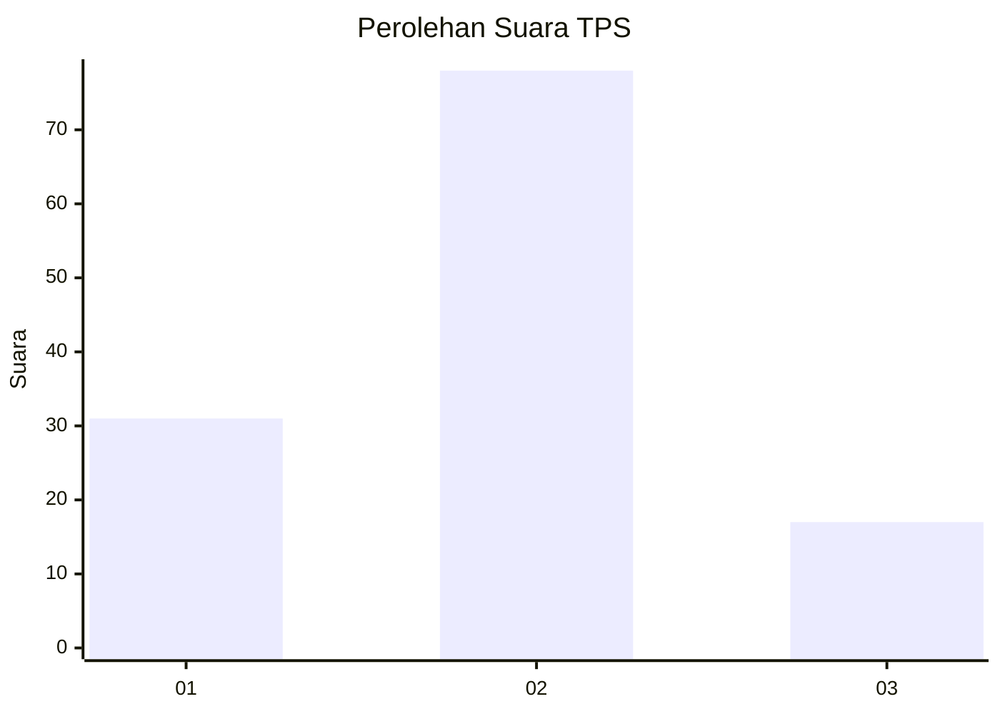
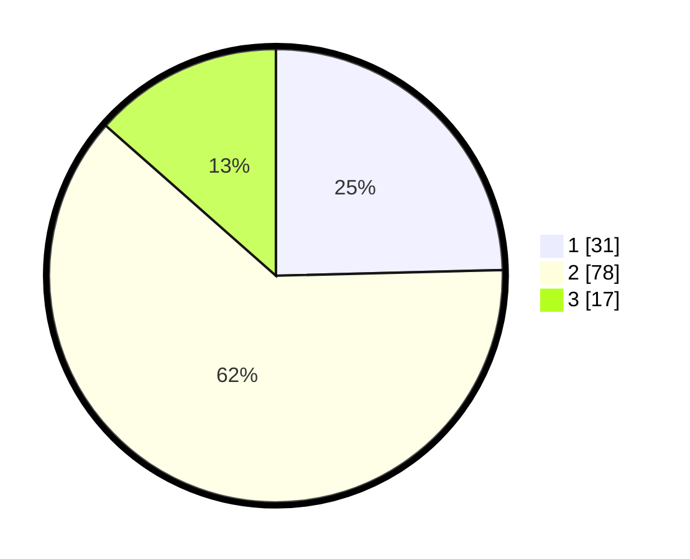

# Hasil

## Grafik

## Tabel

| No. | Nama Paslon    | Suara | Suara (raw) | Persentase |
|:--- |:-------------- | -----:| -----------:| ----------:|
| 1   | ANIES MUHAIMIN | 31    | [31][p-1]   | 24,60      |
| 2   | PRABOWO GIBRAN | 78    | [78][p-2]   | 61,90      |
| 3   | GANJAR MAHFUD  | 17    | [17][p-3]   | 13,49      |

[p-1]: https://github.com/gigit-pemilu/pemilu-2024/blob/main/pilpres/hitung-suara/sub/33-jawa-tengah/sub/29-brebes/sub/05-sirampog/sub/2003-buniwah/sub/005-tps/sub/paslon-1.txt
[p-2]: https://github.com/gigit-pemilu/pemilu-2024/blob/main/pilpres/hitung-suara/sub/33-jawa-tengah/sub/29-brebes/sub/05-sirampog/sub/2003-buniwah/sub/005-tps/sub/paslon-2.txt
[p-3]: https://github.com/gigit-pemilu/pemilu-2024/blob/main/pilpres/hitung-suara/sub/33-jawa-tengah/sub/29-brebes/sub/05-sirampog/sub/2003-buniwah/sub/005-tps/sub/paslon-3.txt

## Foto C Plano

https://sirekap-obj-formc.kpu.go.id/57ce/pemilu/ppwp/33/29/05/20/03/3329052003005-20240215-010957--c0e048a6-bf03-4331-9028-10e6ed7b299b.jpg

https://sirekap-obj-formc.kpu.go.id/57ce/pemilu/ppwp/33/29/05/20/03/3329052003005-20240215-091709--fbf33e2d-af25-4a1e-9b1a-a991d6bdc6a0.jpg

https://sirekap-obj-formc.kpu.go.id/57ce/pemilu/ppwp/33/29/05/20/03/3329052003005-20240215-011153--711e8303-1037-47dd-9c7d-e606f8e8d599.jpg

## Metadata

| Key        | Value               |
| ---------- | ------------------- |
| Time Stamp | 2024-02-16 12:51:22 |

