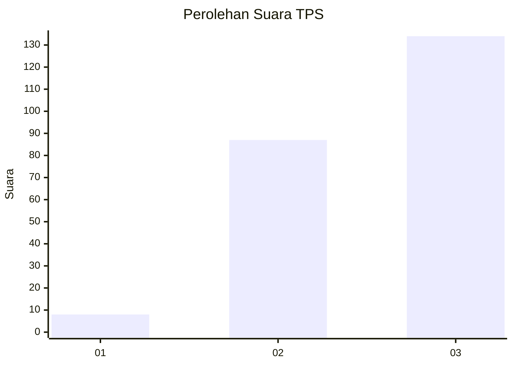
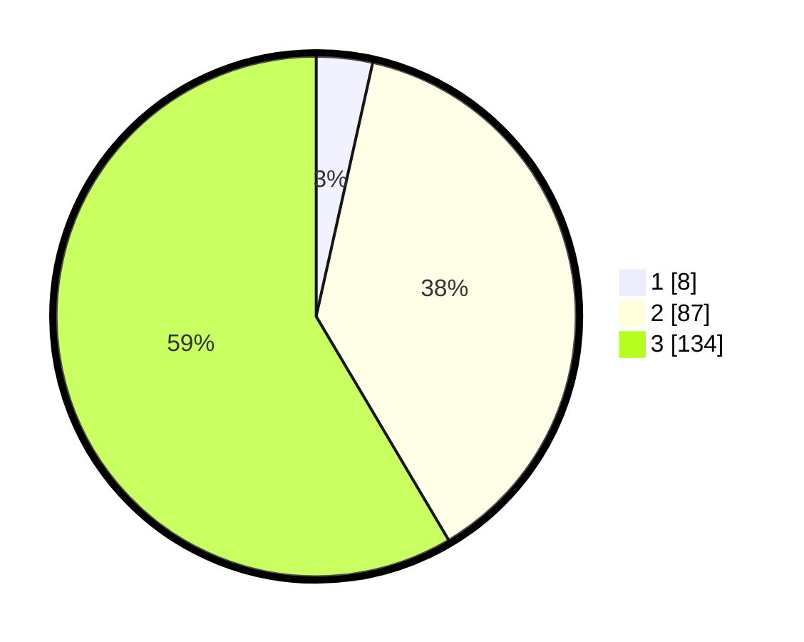

# Hasil

## Grafik

## Tabel

| No. | Nama Paslon    | Suara | Suara (raw) | Persentase |
|:--- |:-------------- | -----:| -----------:| ----------:|
| 1   | ANIES MUHAIMIN | 8     | [8][p-1]    | 3,49       |
| 2   | PRABOWO GIBRAN | 87    | [87][p-2]   | 37,99      |
| 3   | GANJAR MAHFUD  | 134   | [134][p-3]  | 58,52      |

[p-1]: https://github.com/gigit-pemilu/pemilu-2024/blob/main/pilpres/hitung-suara/sub/33-jawa-tengah/sub/29-brebes/sub/05-sirampog/sub/2004-dawuhan/sub/006-tps/sub/paslon-1.txt
[p-2]: https://github.com/gigit-pemilu/pemilu-2024/blob/main/pilpres/hitung-suara/sub/33-jawa-tengah/sub/29-brebes/sub/05-sirampog/sub/2004-dawuhan/sub/006-tps/sub/paslon-2.txt
[p-3]: https://github.com/gigit-pemilu/pemilu-2024/blob/main/pilpres/hitung-suara/sub/33-jawa-tengah/sub/29-brebes/sub/05-sirampog/sub/2004-dawuhan/sub/006-tps/sub/paslon-3.txt

## Foto C Plano

https://sirekap-obj-formc.kpu.go.id/e7f8/pemilu/ppwp/33/29/05/20/04/3329052004006-20240214-232859--1bed432f-db15-4ef4-807b-b6ad587c2106.jpg

https://sirekap-obj-formc.kpu.go.id/e7f8/pemilu/ppwp/33/29/05/20/04/3329052004006-20240215-024222--276beea8-7b55-484f-9c72-1271d0abd0ed.jpg

https://sirekap-obj-formc.kpu.go.id/e7f8/pemilu/ppwp/33/29/05/20/04/3329052004006-20240215-024321--5051fc09-a44d-4fb6-8800-e3db35ae05e5.jpg

## Metadata

| Key        | Value               |
| ---------- | ------------------- |
| Time Stamp | 2024-02-24 22:31:28 |

