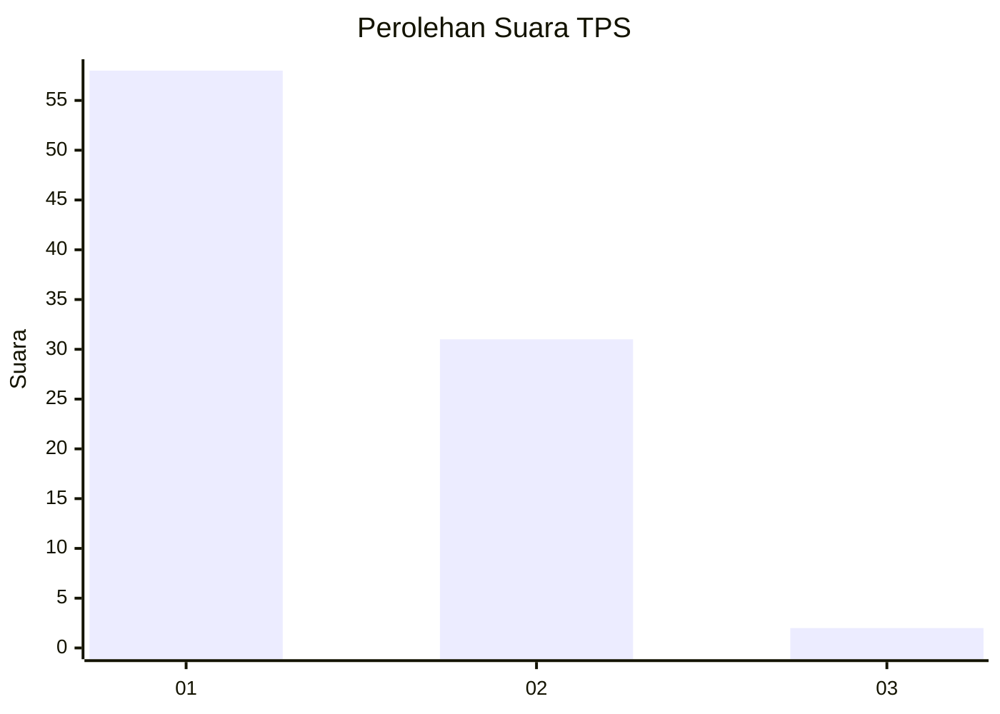
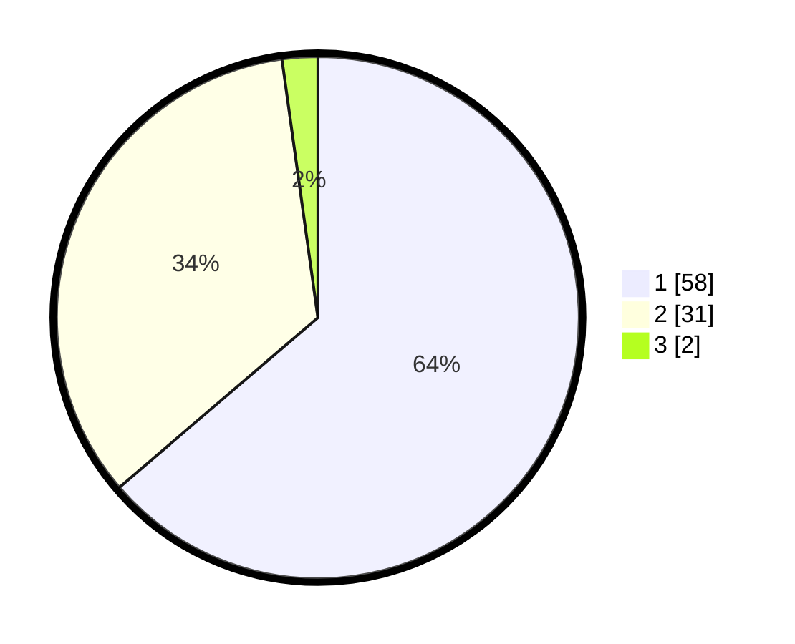

# Hasil

## Grafik

## Tabel

| No. | Nama Paslon    | Suara | Suara (raw) | Persentase |
|:--- |:-------------- | -----:| -----------:| ----------:|
| 1   | ANIES MUHAIMIN | 58    | [58][p-1]   | 63,74      |
| 2   | PRABOWO GIBRAN | 31    | [31][p-2]   | 34,07      |
| 3   | GANJAR MAHFUD  | 2     | [2][p-3]    | 2,20       |

[p-1]: https://github.com/gigit-pemilu/pemilu-2024/blob/main/pilpres/hitung-suara/sub/33-jawa-tengah/sub/29-brebes/sub/05-sirampog/sub/2007-kaliloka/sub/006-tps/sub/paslon-1.txt
[p-2]: https://github.com/gigit-pemilu/pemilu-2024/blob/main/pilpres/hitung-suara/sub/33-jawa-tengah/sub/29-brebes/sub/05-sirampog/sub/2007-kaliloka/sub/006-tps/sub/paslon-2.txt
[p-3]: https://github.com/gigit-pemilu/pemilu-2024/blob/main/pilpres/hitung-suara/sub/33-jawa-tengah/sub/29-brebes/sub/05-sirampog/sub/2007-kaliloka/sub/006-tps/sub/paslon-3.txt

## Foto C Plano

https://sirekap-obj-formc.kpu.go.id/8c13/pemilu/ppwp/33/29/05/20/07/3329052007006-20240215-063620--5cb0b7cc-7011-44d1-8a04-257802276cd0.jpg

https://sirekap-obj-formc.kpu.go.id/8c13/pemilu/ppwp/33/29/05/20/07/3329052007006-20240215-082349--ae95a518-67dc-4b9b-b760-41059a746515.jpg

https://sirekap-obj-formc.kpu.go.id/8c13/pemilu/ppwp/33/29/05/20/07/3329052007006-20240215-083001--18ad5d6b-e3de-4e7f-8ccc-0262b6bdfbf2.jpg

## Metadata

| Key        | Value               |
| ---------- | ------------------- |
| Time Stamp | 2024-02-25 15:00:00 |

