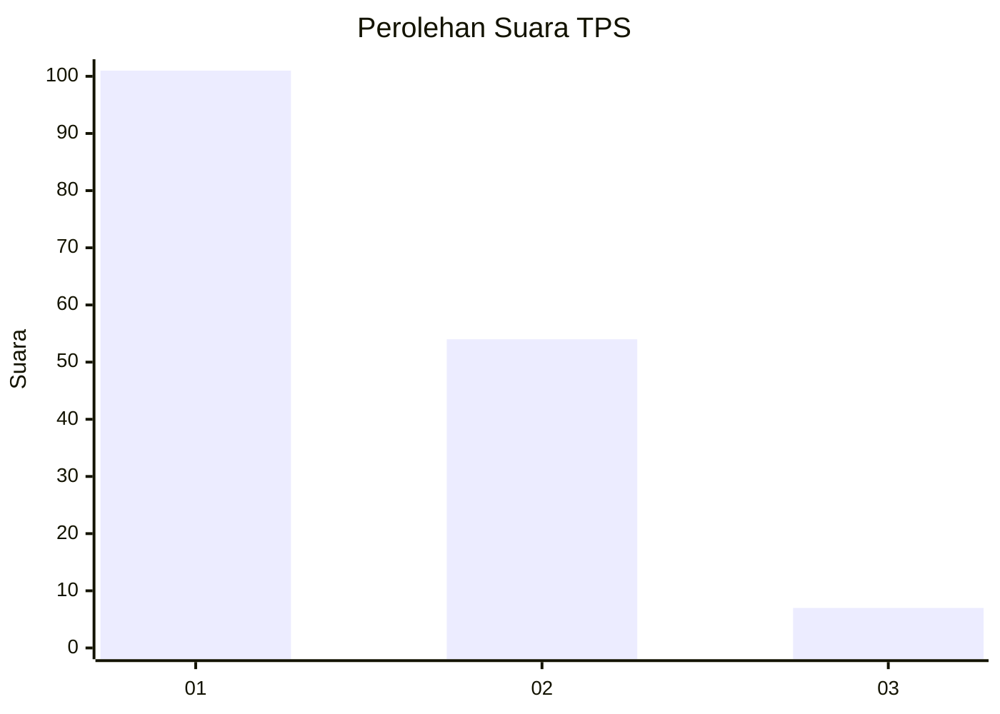
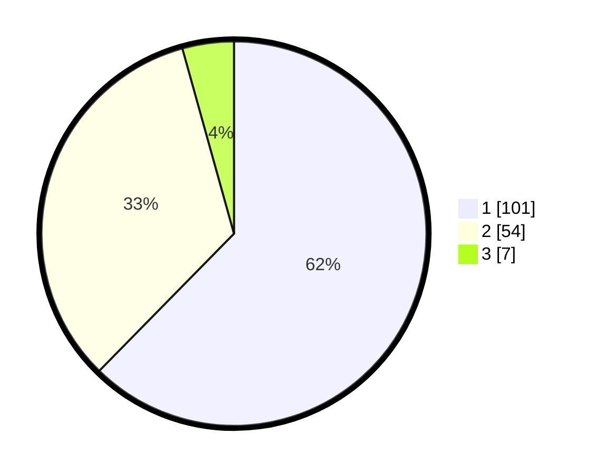

# Hasil

## Grafik

## Tabel

| No. | Nama Paslon    | Suara | Suara (raw) | Persentase |
|:--- |:-------------- | -----:| -----------:| ----------:|
| 1   | ANIES MUHAIMIN | 101   | [101][p-1]  | 62,35      |
| 2   | PRABOWO GIBRAN | 54    | [54][p-2]   | 33,33      |
| 3   | GANJAR MAHFUD  | 7     | [7][p-3]    | 4,32       |

[p-1]: https://github.com/gigit-pemilu/pemilu-2024-33-jawa-tengah/blob/main/pilpres/hitung-suara/sub/33-jawa-tengah/sub/29-brebes/sub/05-sirampog/sub/2007-kaliloka/sub/013-tps/sub/paslon-1.txt
[p-2]: https://github.com/gigit-pemilu/pemilu-2024-33-jawa-tengah/blob/main/pilpres/hitung-suara/sub/33-jawa-tengah/sub/29-brebes/sub/05-sirampog/sub/2007-kaliloka/sub/013-tps/sub/paslon-2.txt
[p-3]: https://github.com/gigit-pemilu/pemilu-2024-33-jawa-tengah/blob/main/pilpres/hitung-suara/sub/33-jawa-tengah/sub/29-brebes/sub/05-sirampog/sub/2007-kaliloka/sub/013-tps/sub/paslon-3.txt

## Foto C Plano

https://sirekap-obj-formc.kpu.go.id/46d6/pemilu/ppwp/33/29/05/20/07/3329052007013-20240214-220226--4bb8afb3-7e9a-452a-bacb-bce9801ed0a2.jpg

https://sirekap-obj-formc.kpu.go.id/46d6/pemilu/ppwp/33/29/05/20/07/3329052007013-20240214-204727--d4056162-1558-4ec6-83c3-b143fe2b8e51.jpg

https://sirekap-obj-formc.kpu.go.id/46d6/pemilu/ppwp/33/29/05/20/07/3329052007013-20240214-205015--44d8032b-2d6d-44c8-9130-48f7517a5dab.jpg

## Metadata

| Key        | Value               |
| ---------- | ------------------- |
| Time Stamp | 2024-02-15 15:00:29 |

