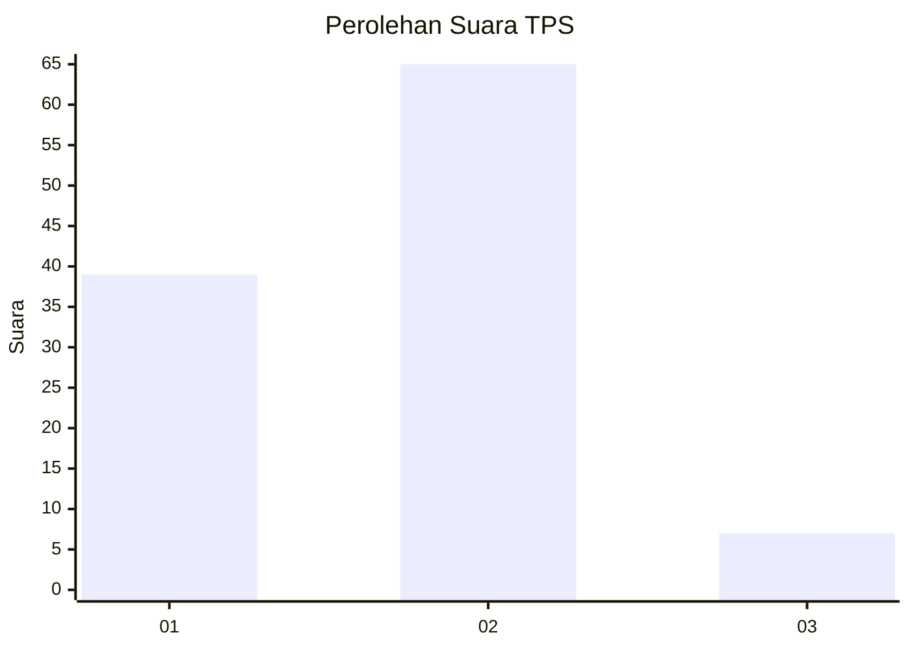
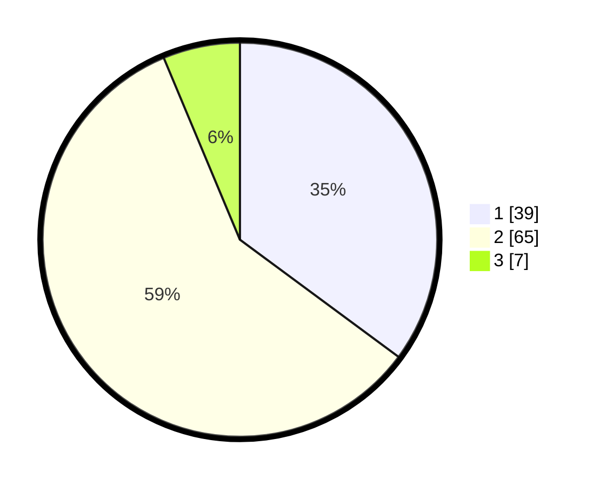

# Hasil

## Grafik

## Tabel

| No. | Nama Paslon    | Suara | Suara (raw) | Persentase |
|:--- |:-------------- | -----:| -----------:| ----------:|
| 1   | ANIES MUHAIMIN | 39    | [39][p-1]   | 35,14      |
| 2   | PRABOWO GIBRAN | 65    | [65][p-2]   | 58,56      |
| 3   | GANJAR MAHFUD  | 7     | [7][p-3]    | 6,31       |

[p-1]: https://github.com/gigit-pemilu/pemilu-2024/blob/main/pilpres/hitung-suara/sub/33-jawa-tengah/sub/29-brebes/sub/05-sirampog/sub/2008-manggis/sub/012-tps/sub/paslon-1.txt
[p-2]: https://github.com/gigit-pemilu/pemilu-2024/blob/main/pilpres/hitung-suara/sub/33-jawa-tengah/sub/29-brebes/sub/05-sirampog/sub/2008-manggis/sub/012-tps/sub/paslon-2.txt
[p-3]: https://github.com/gigit-pemilu/pemilu-2024/blob/main/pilpres/hitung-suara/sub/33-jawa-tengah/sub/29-brebes/sub/05-sirampog/sub/2008-manggis/sub/012-tps/sub/paslon-3.txt

## Foto C Plano

https://sirekap-obj-formc.kpu.go.id/f76e/pemilu/ppwp/33/29/05/20/08/3329052008012-20240217-114809--97fe741c-31c1-44e5-bbed-a4c6772e9be0.jpg

https://sirekap-obj-formc.kpu.go.id/f76e/pemilu/ppwp/33/29/05/20/08/3329052008012-20240217-093132--9dc0b105-719d-4515-9562-ae5dc80a432d.jpg

https://sirekap-obj-formc.kpu.go.id/f76e/pemilu/ppwp/33/29/05/20/08/3329052008012-20240217-124032--de99e1b2-2de1-4a24-ba85-0caee5445340.jpg

## Metadata

| Key        | Value               |
| ---------- | ------------------- |
| Time Stamp | 2024-02-19 06:16:00 |

