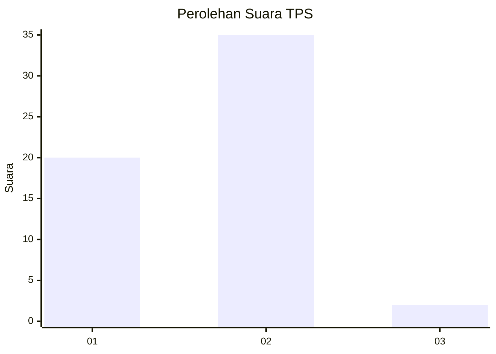
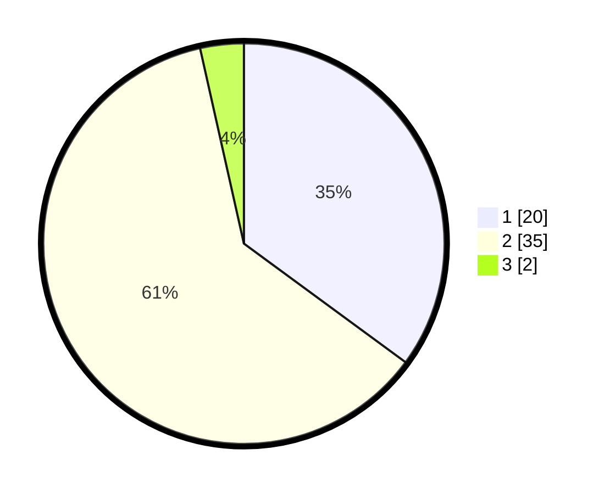

# Hasil

## Grafik

## Tabel

| No. | Nama Paslon    | Suara | Suara (raw) | Persentase |
|:--- |:-------------- | -----:| -----------:| ----------:|
| 1   | ANIES MUHAIMIN | 20    | [20][p-1]   | 35,09      |
| 2   | PRABOWO GIBRAN | 35    | [35][p-2]   | 61,40      |
| 3   | GANJAR MAHFUD  | 2     | [2][p-3]    | 3,51       |

[p-1]: https://github.com/gigit-pemilu/pemilu-2024/blob/main/pilpres/hitung-suara/sub/33-jawa-tengah/sub/29-brebes/sub/05-sirampog/sub/2008-manggis/sub/013-tps/sub/paslon-1.txt
[p-2]: https://github.com/gigit-pemilu/pemilu-2024/blob/main/pilpres/hitung-suara/sub/33-jawa-tengah/sub/29-brebes/sub/05-sirampog/sub/2008-manggis/sub/013-tps/sub/paslon-2.txt
[p-3]: https://github.com/gigit-pemilu/pemilu-2024/blob/main/pilpres/hitung-suara/sub/33-jawa-tengah/sub/29-brebes/sub/05-sirampog/sub/2008-manggis/sub/013-tps/sub/paslon-3.txt

## Foto C Plano

https://sirekap-obj-formc.kpu.go.id/fca2/pemilu/ppwp/33/29/05/20/08/3329052008013-20240224-172447--b18c36df-5c45-40d4-8605-5b6ffafab7ed.jpg

https://sirekap-obj-formc.kpu.go.id/fca2/pemilu/ppwp/33/29/05/20/08/3329052008013-20240224-172539--5cb3d876-1ed7-4e5d-bcea-3dc17709e6d2.jpg

https://sirekap-obj-formc.kpu.go.id/fca2/pemilu/ppwp/33/29/05/20/08/3329052008013-20240224-174416--21ddf1d9-617b-4dee-9d93-8a0098ff68ea.jpg

## Metadata

| Key        | Value               |
| ---------- | ------------------- |
| Time Stamp | 2024-02-25 15:00:00 |

