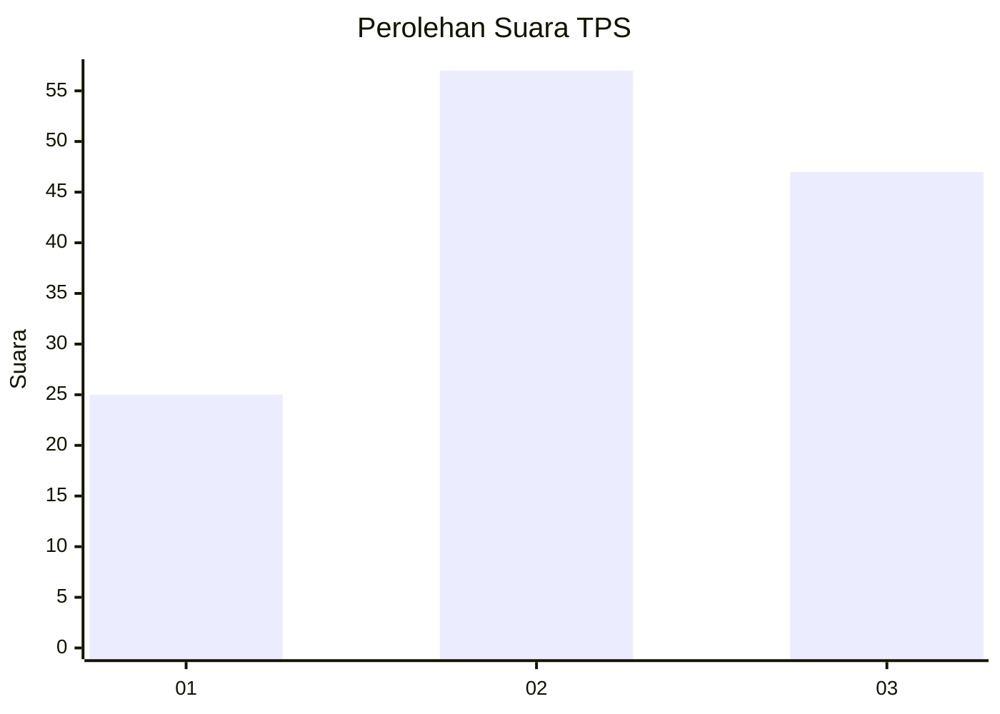
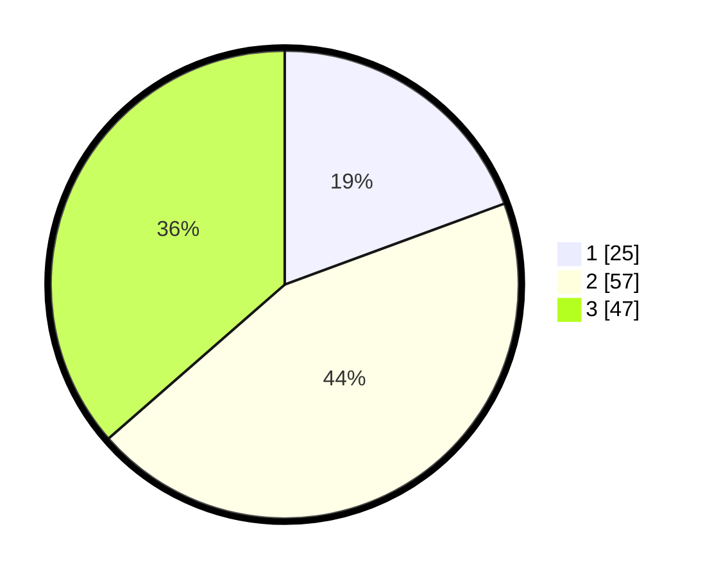

# Hasil

## Grafik

## Tabel

| No. | Nama Paslon    | Suara | Suara (raw) | Persentase |
|:--- |:-------------- | -----:| -----------:| ----------:|
| 1   | ANIES MUHAIMIN | 25    | [25][p-1]   | 19,38      |
| 2   | PRABOWO GIBRAN | 57    | [57][p-2]   | 44,19      |
| 3   | GANJAR MAHFUD  | 47    | [47][p-3]   | 36,43      |

[p-1]: https://github.com/gigit-pemilu/pemilu-2024-33-jawa-tengah/blob/main/pilpres/hitung-suara/sub/33-jawa-tengah/sub/29-brebes/sub/05-sirampog/sub/2009-mendala/sub/003-tps/sub/paslon-1.txt
[p-2]: https://github.com/gigit-pemilu/pemilu-2024-33-jawa-tengah/blob/main/pilpres/hitung-suara/sub/33-jawa-tengah/sub/29-brebes/sub/05-sirampog/sub/2009-mendala/sub/003-tps/sub/paslon-2.txt
[p-3]: https://github.com/gigit-pemilu/pemilu-2024-33-jawa-tengah/blob/main/pilpres/hitung-suara/sub/33-jawa-tengah/sub/29-brebes/sub/05-sirampog/sub/2009-mendala/sub/003-tps/sub/paslon-3.txt

## Foto C Plano

https://sirekap-obj-formc.kpu.go.id/d15d/pemilu/ppwp/33/29/05/20/09/3329052009003-20240214-190530--5d5a9d05-8f19-4320-82f4-6194538ee44f.jpg

https://sirekap-obj-formc.kpu.go.id/d15d/pemilu/ppwp/33/29/05/20/09/3329052009003-20240214-141053--2fba2cc1-6828-43c1-b47c-4f66339e6a9a.jpg

https://sirekap-obj-formc.kpu.go.id/d15d/pemilu/ppwp/33/29/05/20/09/3329052009003-20240214-180221--d166e9c5-b3f7-4a98-a8ca-02f9c3ec59e6.jpg

## Metadata

| Key        | Value               |
| ---------- | ------------------- |
| Time Stamp | 2024-02-14 21:46:01 |

