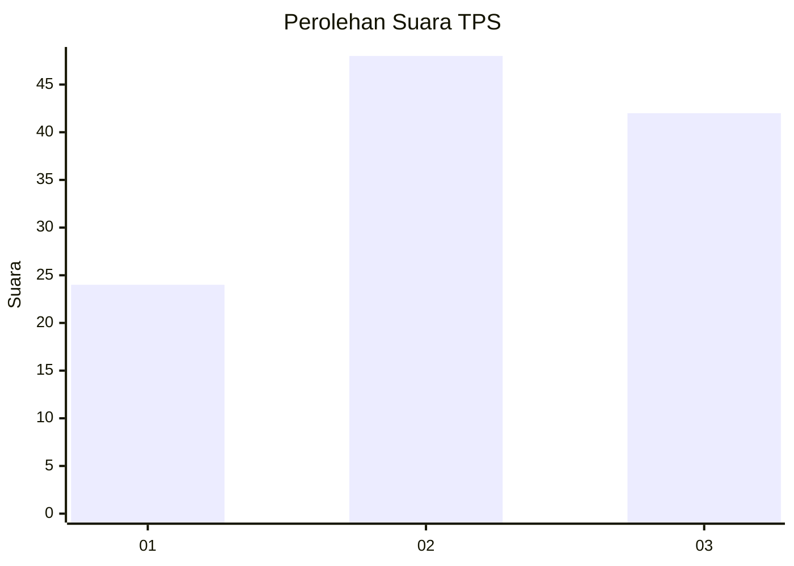
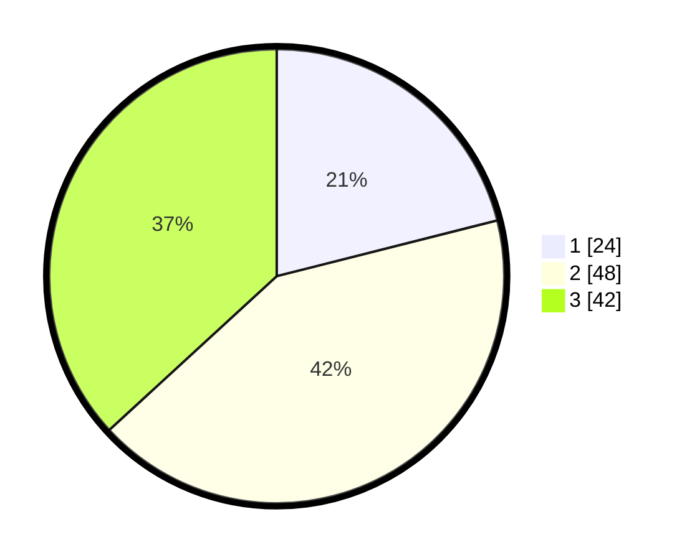

# Hasil

## Grafik

## Tabel

| No. | Nama Paslon    | Suara | Suara (raw) | Persentase |
|:--- |:-------------- | -----:| -----------:| ----------:|
| 1   | ANIES MUHAIMIN | 24    | [24][p-1]   | 21,05      |
| 2   | PRABOWO GIBRAN | 48    | [48][p-2]   | 42,11      |
| 3   | GANJAR MAHFUD  | 42    | [42][p-3]   | 36,84      |

[p-1]: https://github.com/gigit-pemilu/pemilu-2024/blob/main/pilpres/hitung-suara/sub/33-jawa-tengah/sub/29-brebes/sub/05-sirampog/sub/2009-mendala/sub/009-tps/sub/paslon-1.txt
[p-2]: https://github.com/gigit-pemilu/pemilu-2024/blob/main/pilpres/hitung-suara/sub/33-jawa-tengah/sub/29-brebes/sub/05-sirampog/sub/2009-mendala/sub/009-tps/sub/paslon-2.txt
[p-3]: https://github.com/gigit-pemilu/pemilu-2024/blob/main/pilpres/hitung-suara/sub/33-jawa-tengah/sub/29-brebes/sub/05-sirampog/sub/2009-mendala/sub/009-tps/sub/paslon-3.txt

## Foto C Plano

https://sirekap-obj-formc.kpu.go.id/c51b/pemilu/ppwp/33/29/05/20/09/3329052009009-20240214-141737--da7bbe98-dd49-42e8-bedf-4dbaf40d2dab.jpg

https://sirekap-obj-formc.kpu.go.id/c51b/pemilu/ppwp/33/29/05/20/09/3329052009009-20240215-011646--7c7a7b8f-2a77-49b9-b8f7-907e4a4df306.jpg

https://sirekap-obj-formc.kpu.go.id/c51b/pemilu/ppwp/33/29/05/20/09/3329052009009-20240214-190507--184b4432-57c2-4b03-b1d8-1eade0c1d31e.jpg

## Metadata

| Key        | Value               |
| ---------- | ------------------- |
| Time Stamp | 2024-02-24 22:31:28 |

