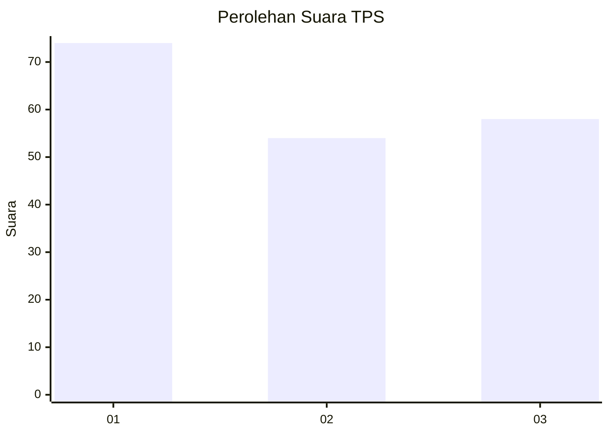
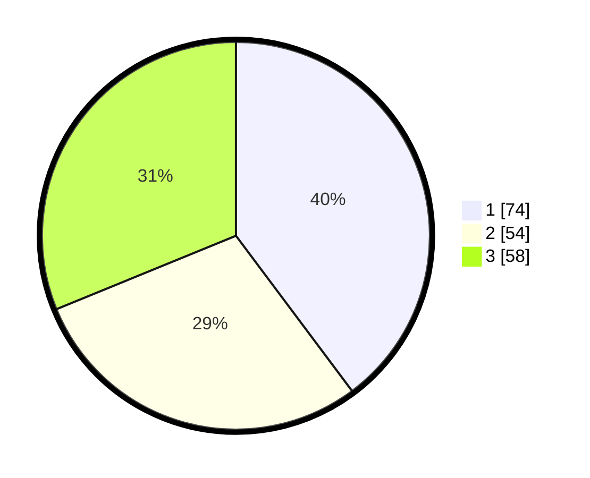

# Hasil

## Grafik

## Tabel

| No. | Nama Paslon    | Suara | Suara (raw) | Persentase |
|:--- |:-------------- | -----:| -----------:| ----------:|
| 1   | ANIES MUHAIMIN | 74    | [74][p-1]   | 39,78      |
| 2   | PRABOWO GIBRAN | 54    | [54][p-2]   | 29,03      |
| 3   | GANJAR MAHFUD  | 58    | [58][p-3]   | 31,18      |

[p-1]: https://github.com/gigit-pemilu/pemilu-2024-33-jawa-tengah/blob/main/pilpres/hitung-suara/sub/33-jawa-tengah/sub/29-brebes/sub/05-sirampog/sub/2009-mendala/sub/011-tps/sub/paslon-1.txt
[p-2]: https://github.com/gigit-pemilu/pemilu-2024-33-jawa-tengah/blob/main/pilpres/hitung-suara/sub/33-jawa-tengah/sub/29-brebes/sub/05-sirampog/sub/2009-mendala/sub/011-tps/sub/paslon-2.txt
[p-3]: https://github.com/gigit-pemilu/pemilu-2024-33-jawa-tengah/blob/main/pilpres/hitung-suara/sub/33-jawa-tengah/sub/29-brebes/sub/05-sirampog/sub/2009-mendala/sub/011-tps/sub/paslon-3.txt

## Foto C Plano

https://sirekap-obj-formc.kpu.go.id/1dc8/pemilu/ppwp/33/29/05/20/09/3329052009011-20240214-221213--3c39126c-22d7-48c0-8c40-9a4ee6f46efc.jpg

https://sirekap-obj-formc.kpu.go.id/1dc8/pemilu/ppwp/33/29/05/20/09/3329052009011-20240214-221557--7429a9c3-a508-4eef-9a68-cbe655809af7.jpg

https://sirekap-obj-formc.kpu.go.id/1dc8/pemilu/ppwp/33/29/05/20/09/3329052009011-20240214-221947--61d6e905-ce45-4e9b-8e5f-878a999c8801.jpg

## Metadata

| Key        | Value               |
| ---------- | ------------------- |
| Time Stamp | 2024-02-25 17:00:00 |

