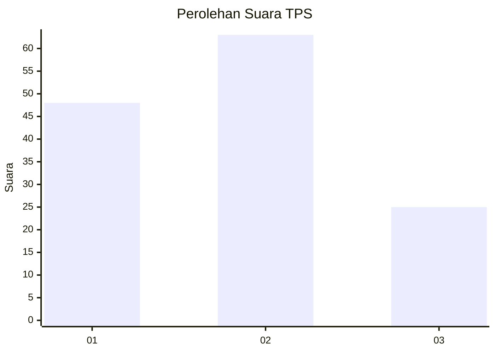
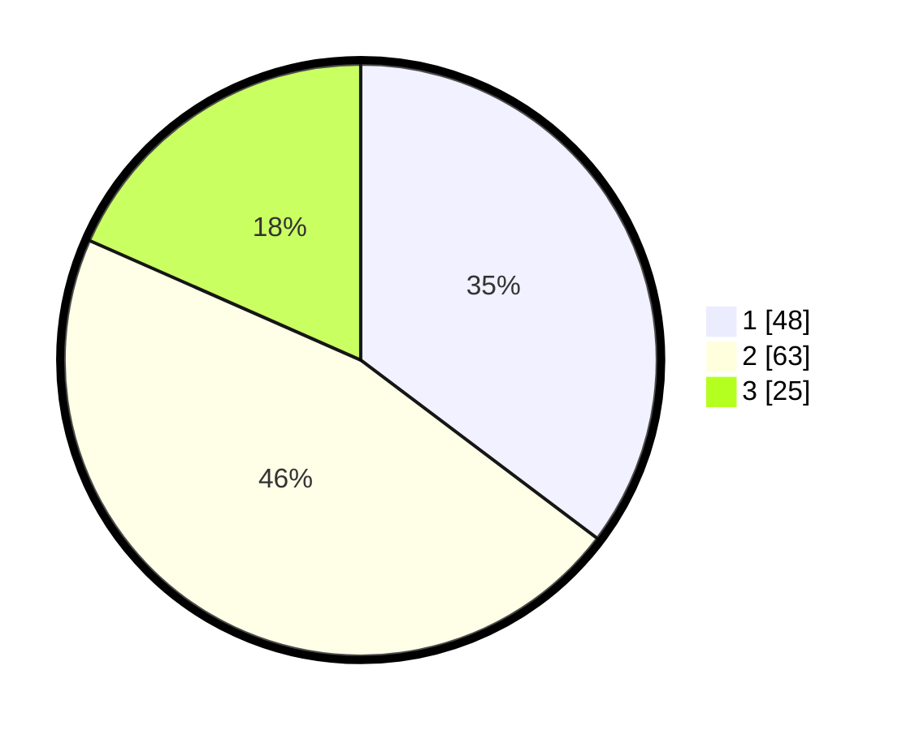

# Hasil

## Grafik

## Tabel

| No. | Nama Paslon    | Suara | Suara (raw) | Persentase |
|:--- |:-------------- | -----:| -----------:| ----------:|
| 1   | ANIES MUHAIMIN | 48    | [48][p-1]   | 35,29      |
| 2   | PRABOWO GIBRAN | 63    | [63][p-2]   | 46,32      |
| 3   | GANJAR MAHFUD  | 25    | [25][p-3]   | 18,38      |

[p-1]: https://github.com/gigit-pemilu/pemilu-2024/blob/main/pilpres/hitung-suara/sub/33-jawa-tengah/sub/29-brebes/sub/05-sirampog/sub/2010-mlayang/sub/001-tps/sub/paslon-1.txt
[p-2]: https://github.com/gigit-pemilu/pemilu-2024/blob/main/pilpres/hitung-suara/sub/33-jawa-tengah/sub/29-brebes/sub/05-sirampog/sub/2010-mlayang/sub/001-tps/sub/paslon-2.txt
[p-3]: https://github.com/gigit-pemilu/pemilu-2024/blob/main/pilpres/hitung-suara/sub/33-jawa-tengah/sub/29-brebes/sub/05-sirampog/sub/2010-mlayang/sub/001-tps/sub/paslon-3.txt

## Foto C Plano

https://sirekap-obj-formc.kpu.go.id/6f06/pemilu/ppwp/33/29/05/20/10/3329052010001-20240214-162240--36065f80-5284-4aa4-a5e9-45bd72b5efe8.jpg

https://sirekap-obj-formc.kpu.go.id/6f06/pemilu/ppwp/33/29/05/20/10/3329052010001-20240214-162247--a19c2ba4-c964-4c1e-97d8-851d6fd1e523.jpg

https://sirekap-obj-formc.kpu.go.id/6f06/pemilu/ppwp/33/29/05/20/10/3329052010001-20240214-235433--a8161feb-aff8-400c-8233-843bff4f306f.jpg

## Metadata

| Key        | Value               |
| ---------- | ------------------- |
| Time Stamp | 2024-02-15 21:30:27 |

