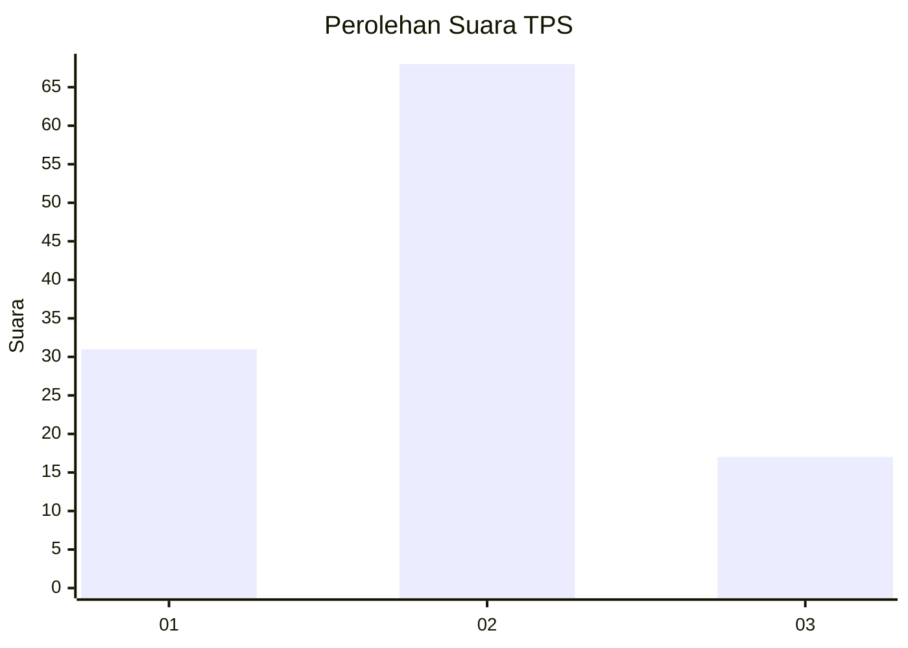
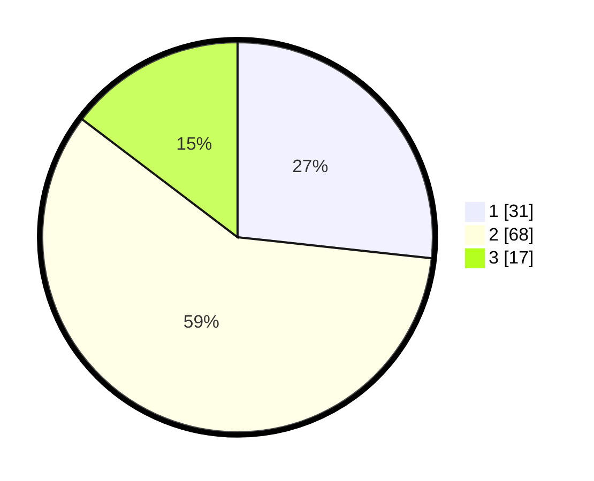

# Hasil

## Grafik

## Tabel

| No. | Nama Paslon    | Suara | Suara (raw) | Persentase |
|:--- |:-------------- | -----:| -----------:| ----------:|
| 1   | ANIES MUHAIMIN | 31    | [31][p-1]   | 26,72      |
| 2   | PRABOWO GIBRAN | 68    | [68][p-2]   | 58,62      |
| 3   | GANJAR MAHFUD  | 17    | [17][p-3]   | 14,66      |

[p-1]: https://github.com/gigit-pemilu/pemilu-2024-33-jawa-tengah/blob/main/pilpres/hitung-suara/sub/33-jawa-tengah/sub/29-brebes/sub/05-sirampog/sub/2010-mlayang/sub/002-tps/sub/paslon-1.txt
[p-2]: https://github.com/gigit-pemilu/pemilu-2024-33-jawa-tengah/blob/main/pilpres/hitung-suara/sub/33-jawa-tengah/sub/29-brebes/sub/05-sirampog/sub/2010-mlayang/sub/002-tps/sub/paslon-2.txt
[p-3]: https://github.com/gigit-pemilu/pemilu-2024-33-jawa-tengah/blob/main/pilpres/hitung-suara/sub/33-jawa-tengah/sub/29-brebes/sub/05-sirampog/sub/2010-mlayang/sub/002-tps/sub/paslon-3.txt

## Foto C Plano

https://sirekap-obj-formc.kpu.go.id/4e7d/pemilu/ppwp/33/29/05/20/10/3329052010002-20240215-024606--0f6ba2ab-9d8c-4d02-9279-89df0f1034a0.jpg

https://sirekap-obj-formc.kpu.go.id/4e7d/pemilu/ppwp/33/29/05/20/10/3329052010002-20240215-024901--3b929579-5c16-423d-b059-1f45df12808c.jpg

https://sirekap-obj-formc.kpu.go.id/4e7d/pemilu/ppwp/33/29/05/20/10/3329052010002-20240215-025006--78018a64-fce2-43d0-ab71-acccacec208f.jpg

## Metadata

| Key        | Value               |
| ---------- | ------------------- |
| Time Stamp | 2024-02-24 22:31:28 |

