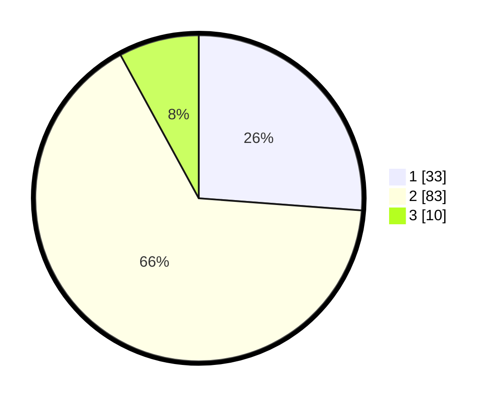

# Hasil

## Grafik

## Tabel

| No. | Nama Paslon    | Suara | Suara (raw) | Persentase |
|:--- |:-------------- | -----:| -----------:| ----------:|
| 1   | ANIES MUHAIMIN | 33    | [33][p-1]   | 26,19      |
| 2   | PRABOWO GIBRAN | 83    | [83][p-2]   | 65,87      |
| 3   | GANJAR MAHFUD  | 10    | [10][p-3]   | 7,94       |

[p-1]: https://github.com/gigit-pemilu/pemilu-2024/blob/main/pilpres/hitung-suara/sub/33-jawa-tengah/sub/29-brebes/sub/05-sirampog/sub/2010-mlayang/sub/003-tps/sub/paslon-1.txt
[p-2]: https://github.com/gigit-pemilu/pemilu-2024/blob/main/pilpres/hitung-suara/sub/33-jawa-tengah/sub/29-brebes/sub/05-sirampog/sub/2010-mlayang/sub/003-tps/sub/paslon-2.txt
[p-3]: https://github.com/gigit-pemilu/pemilu-2024/blob/main/pilpres/hitung-suara/sub/33-jawa-tengah/sub/29-brebes/sub/05-sirampog/sub/2010-mlayang/sub/003-tps/sub/paslon-3.txt

## Foto C Plano

https://sirekap-obj-formc.kpu.go.id/3623/pemilu/ppwp/33/29/05/20/10/3329052010003-20240215-090948--0bc08e58-e44e-4ace-aaf1-4a1f775872a1.jpg

https://sirekap-obj-formc.kpu.go.id/3623/pemilu/ppwp/33/29/05/20/10/3329052010003-20240215-075246--2f24ff11-2773-4e7d-956a-84fd085bd749.jpg

https://sirekap-obj-formc.kpu.go.id/3623/pemilu/ppwp/33/29/05/20/10/3329052010003-20240215-063038--ab2e5c67-21b8-4f3a-bb42-61ee9d95faff.jpg

## Metadata

| Key        | Value               |
| ---------- | ------------------- |
| Time Stamp | 2024-02-16 14:30:33 |

