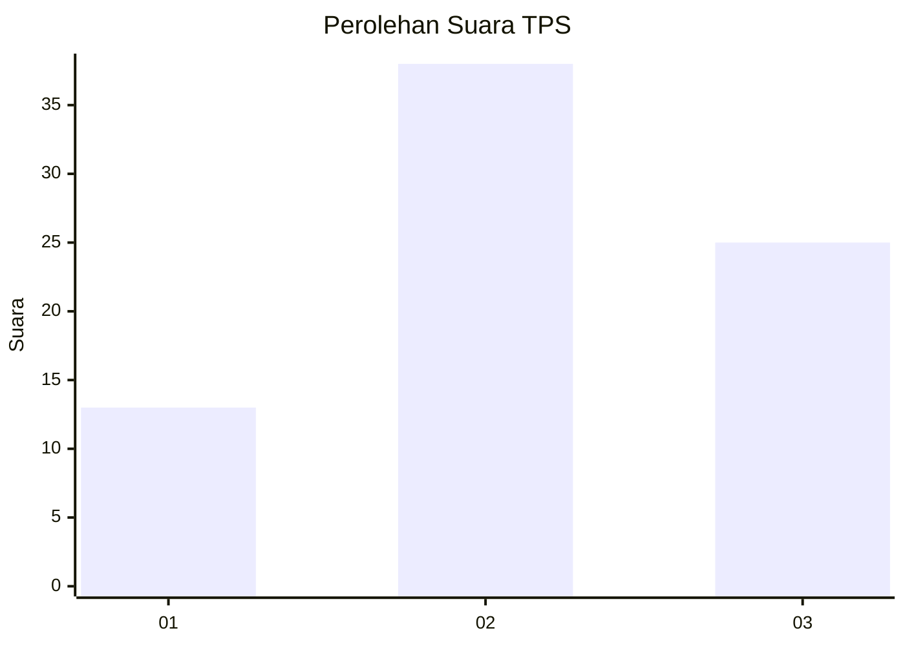
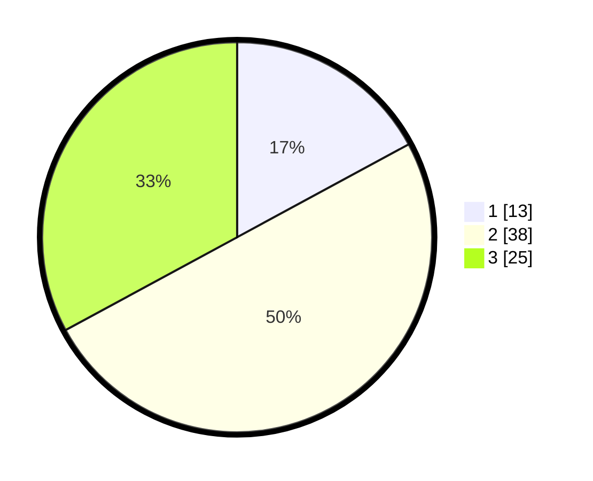

# Hasil

## Grafik

## Tabel

| No. | Nama Paslon    | Suara | Suara (raw) | Persentase |
|:--- |:-------------- | -----:| -----------:| ----------:|
| 1   | ANIES MUHAIMIN | 13    | [13][p-1]   | 17,11      |
| 2   | PRABOWO GIBRAN | 38    | [38][p-2]   | 50,00      |
| 3   | GANJAR MAHFUD  | 25    | [25][p-3]   | 32,89      |

[p-1]: https://github.com/gigit-pemilu/pemilu-2024/blob/main/pilpres/hitung-suara/sub/33-jawa-tengah/sub/29-brebes/sub/05-sirampog/sub/2010-mlayang/sub/012-tps/sub/paslon-1.txt
[p-2]: https://github.com/gigit-pemilu/pemilu-2024/blob/main/pilpres/hitung-suara/sub/33-jawa-tengah/sub/29-brebes/sub/05-sirampog/sub/2010-mlayang/sub/012-tps/sub/paslon-2.txt
[p-3]: https://github.com/gigit-pemilu/pemilu-2024/blob/main/pilpres/hitung-suara/sub/33-jawa-tengah/sub/29-brebes/sub/05-sirampog/sub/2010-mlayang/sub/012-tps/sub/paslon-3.txt

## Foto C Plano

https://sirekap-obj-formc.kpu.go.id/de51/pemilu/ppwp/33/29/05/20/10/3329052010012-20240218-194338--349a456e-7bd4-4c59-ab68-aa1c72f7f4e0.jpg

https://sirekap-obj-formc.kpu.go.id/de51/pemilu/ppwp/33/29/05/20/10/3329052010012-20240218-194530--41051b4a-735a-4d32-abac-209ece85b1df.jpg

https://sirekap-obj-formc.kpu.go.id/de51/pemilu/ppwp/33/29/05/20/10/3329052010012-20240218-194024--f11c0b64-f00f-4462-b6f7-3e071252990e.jpg

## Metadata

| Key        | Value               |
| ---------- | ------------------- |
| Time Stamp | 2024-02-25 15:00:00 |

