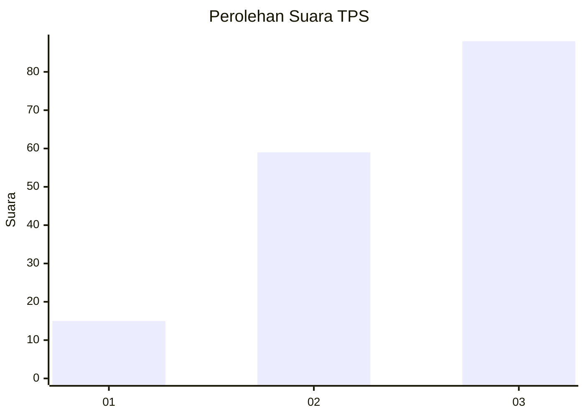
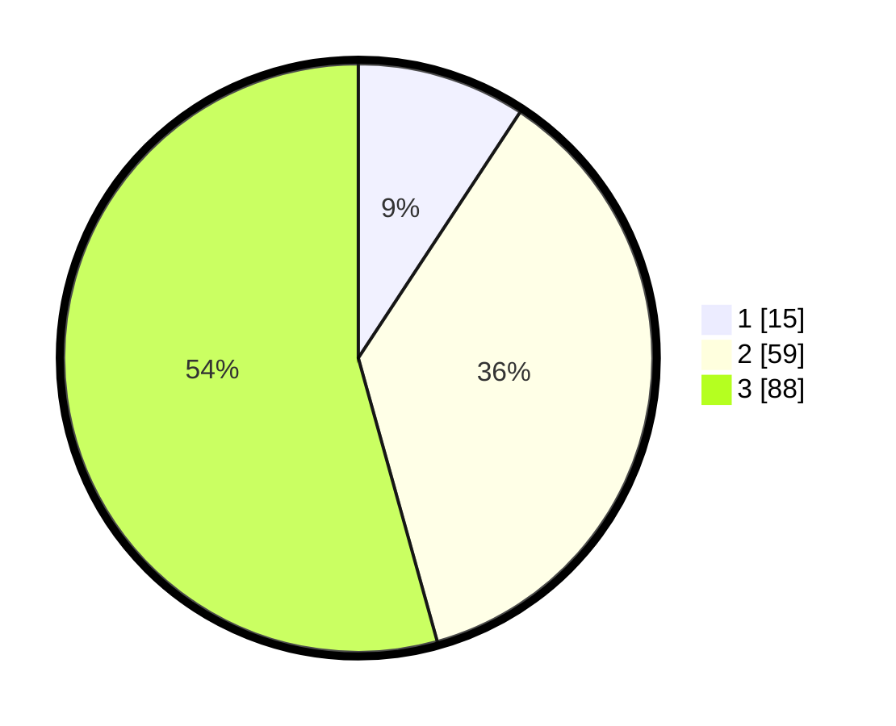

# Hasil

## Grafik

## Tabel

| No. | Nama Paslon    | Suara | Suara (raw) | Persentase |
|:--- |:-------------- | -----:| -----------:| ----------:|
| 1   | ANIES MUHAIMIN | 15    | [15][p-1]   | 9,26       |
| 2   | PRABOWO GIBRAN | 59    | [59][p-2]   | 36,42      |
| 3   | GANJAR MAHFUD  | 88    | [88][p-3]   | 54,32      |

[p-1]: https://github.com/gigit-pemilu/pemilu-2024-33-jawa-tengah/blob/main/pilpres/hitung-suara/sub/33-jawa-tengah/sub/29-brebes/sub/05-sirampog/sub/2011-sridadi/sub/001-tps/sub/paslon-1.txt
[p-2]: https://github.com/gigit-pemilu/pemilu-2024-33-jawa-tengah/blob/main/pilpres/hitung-suara/sub/33-jawa-tengah/sub/29-brebes/sub/05-sirampog/sub/2011-sridadi/sub/001-tps/sub/paslon-2.txt
[p-3]: https://github.com/gigit-pemilu/pemilu-2024-33-jawa-tengah/blob/main/pilpres/hitung-suara/sub/33-jawa-tengah/sub/29-brebes/sub/05-sirampog/sub/2011-sridadi/sub/001-tps/sub/paslon-3.txt

## Foto C Plano

https://sirekap-obj-formc.kpu.go.id/a303/pemilu/ppwp/33/29/05/20/11/3329052011001-20240215-010900--9d703354-d631-46df-ab3e-89e29d983731.jpg

https://sirekap-obj-formc.kpu.go.id/a303/pemilu/ppwp/33/29/05/20/11/3329052011001-20240217-114737--a4a129ad-13fa-4026-a9e7-64e7cb6b5ea6.jpg

https://sirekap-obj-formc.kpu.go.id/a303/pemilu/ppwp/33/29/05/20/11/3329052011001-20240215-011533--35e06e4a-ad32-4cd4-ac92-96f4b28ede6f.jpg

## Metadata

| Key        | Value               |
| ---------- | ------------------- |
| Time Stamp | 2024-02-19 06:16:00 |

