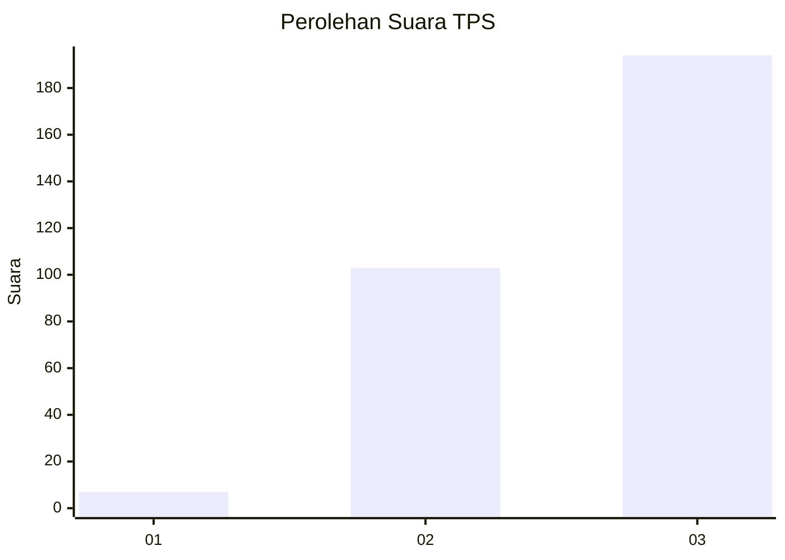
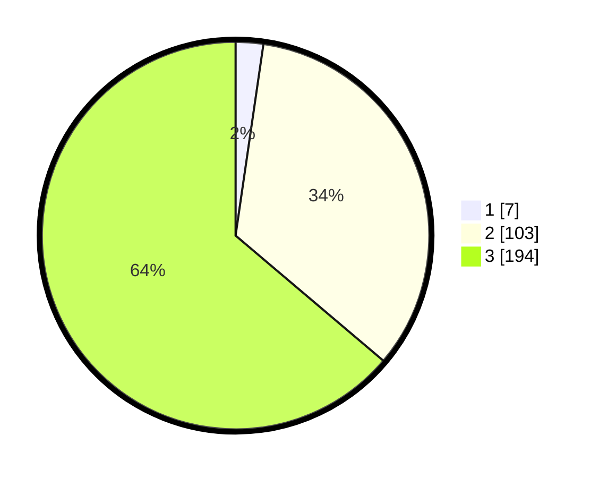

# Hasil

## Grafik

## Tabel

| No. | Nama Paslon    | Suara | Suara (raw) | Persentase |
|:--- |:-------------- | -----:| -----------:| ----------:|
| 1   | ANIES MUHAIMIN | 7     | [7][p-1]    | 2,30       |
| 2   | PRABOWO GIBRAN | 103   | [103][p-2]  | 33,88      |
| 3   | GANJAR MAHFUD  | 194   | [194][p-3]  | 63,82      |

[p-1]: https://github.com/gigit-pemilu/pemilu-2024-33-jawa-tengah/blob/main/pilpres/hitung-suara/sub/33-jawa-tengah/sub/29-brebes/sub/05-sirampog/sub/2011-sridadi/sub/002-tps/sub/paslon-1.txt
[p-2]: https://github.com/gigit-pemilu/pemilu-2024-33-jawa-tengah/blob/main/pilpres/hitung-suara/sub/33-jawa-tengah/sub/29-brebes/sub/05-sirampog/sub/2011-sridadi/sub/002-tps/sub/paslon-2.txt
[p-3]: https://github.com/gigit-pemilu/pemilu-2024-33-jawa-tengah/blob/main/pilpres/hitung-suara/sub/33-jawa-tengah/sub/29-brebes/sub/05-sirampog/sub/2011-sridadi/sub/002-tps/sub/paslon-3.txt

## Foto C Plano

https://sirekap-obj-formc.kpu.go.id/a623/pemilu/ppwp/33/29/05/20/11/3329052011002-20240215-064703--7977ef10-b9c7-4ee4-b94e-1b0882370d61.jpg

https://sirekap-obj-formc.kpu.go.id/a623/pemilu/ppwp/33/29/05/20/11/3329052011002-20240215-064726--dde32cbd-fdd1-4d47-94c5-b3c7cd040246.jpg

https://sirekap-obj-formc.kpu.go.id/a623/pemilu/ppwp/33/29/05/20/11/3329052011002-20240215-064825--f3316087-352c-43bd-bcdc-110474e299e9.jpg

## Metadata

| Key        | Value               |
| ---------- | ------------------- |
| Time Stamp | 2024-02-24 22:31:28 |

