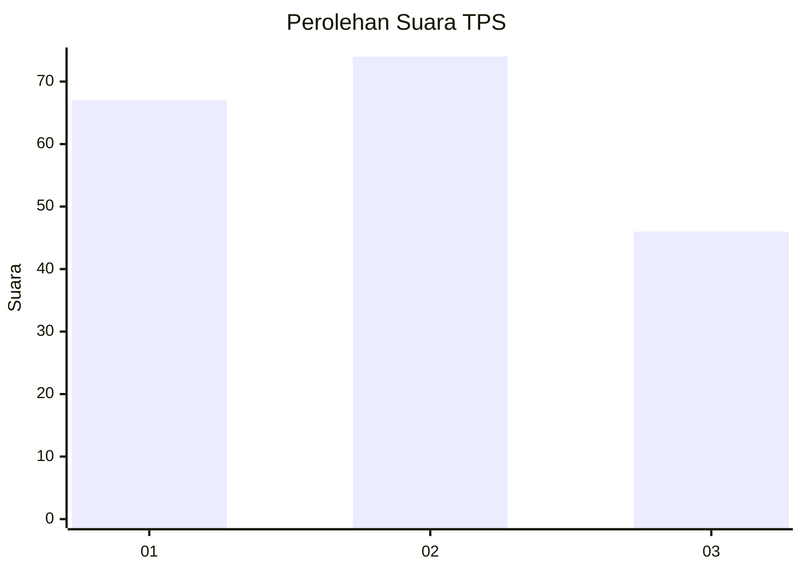
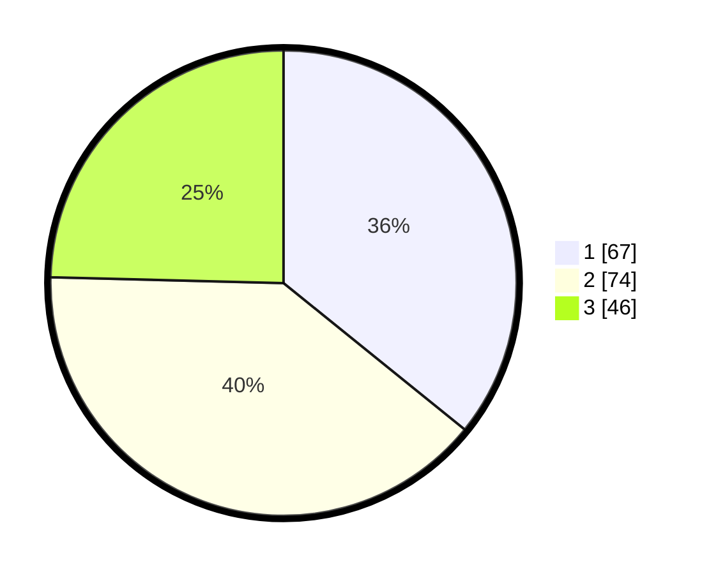

# Hasil

## Grafik

## Tabel

| No. | Nama Paslon    | Suara | Suara (raw) | Persentase |
|:--- |:-------------- | -----:| -----------:| ----------:|
| 1   | ANIES MUHAIMIN | 67    | [67][p-1]   | 35,83      |
| 2   | PRABOWO GIBRAN | 74    | [74][p-2]   | 39,57      |
| 3   | GANJAR MAHFUD  | 46    | [46][p-3]   | 24,60      |

[p-1]: https://github.com/gigit-pemilu/pemilu-2024/blob/main/pilpres/hitung-suara/sub/33-jawa-tengah/sub/29-brebes/sub/05-sirampog/sub/2011-sridadi/sub/004-tps/sub/paslon-1.txt
[p-2]: https://github.com/gigit-pemilu/pemilu-2024/blob/main/pilpres/hitung-suara/sub/33-jawa-tengah/sub/29-brebes/sub/05-sirampog/sub/2011-sridadi/sub/004-tps/sub/paslon-2.txt
[p-3]: https://github.com/gigit-pemilu/pemilu-2024/blob/main/pilpres/hitung-suara/sub/33-jawa-tengah/sub/29-brebes/sub/05-sirampog/sub/2011-sridadi/sub/004-tps/sub/paslon-3.txt

## Foto C Plano

https://sirekap-obj-formc.kpu.go.id/db82/pemilu/ppwp/33/29/05/20/11/3329052011004-20240215-022930--cf911f4e-0b8f-4c22-bac3-fb2bcfe6fa56.jpg

https://sirekap-obj-formc.kpu.go.id/db82/pemilu/ppwp/33/29/05/20/11/3329052011004-20240215-101338--e9f9fc3a-c086-4c24-bbd0-a5ac0b8fa436.jpg

https://sirekap-obj-formc.kpu.go.id/db82/pemilu/ppwp/33/29/05/20/11/3329052011004-20240215-101155--6bc4efd4-2958-4bd2-a82f-898c7b4206cb.jpg

## Metadata

| Key        | Value               |
| ---------- | ------------------- |
| Time Stamp | 2024-02-24 22:31:28 |

