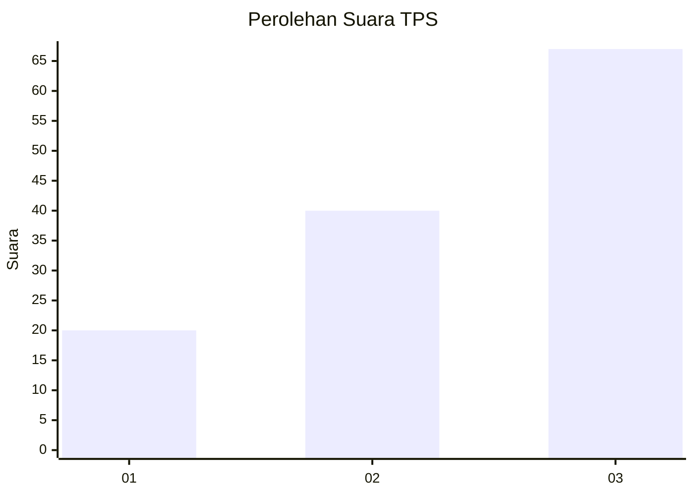
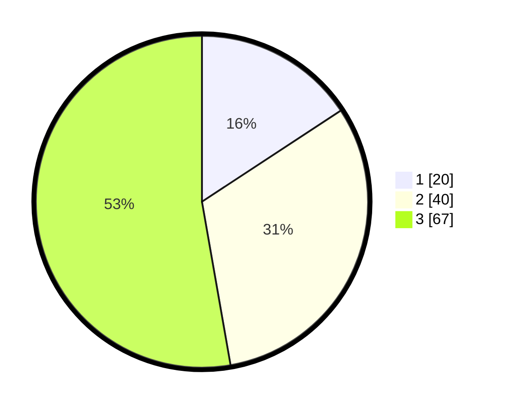

# Hasil

## Grafik

## Tabel

| No. | Nama Paslon    | Suara | Suara (raw) | Persentase |
|:--- |:-------------- | -----:| -----------:| ----------:|
| 1   | ANIES MUHAIMIN | 20    | [20][p-1]   | 15,75      |
| 2   | PRABOWO GIBRAN | 40    | [40][p-2]   | 31,50      |
| 3   | GANJAR MAHFUD  | 67    | [67][p-3]   | 52,76      |

[p-1]: https://github.com/gigit-pemilu/pemilu-2024-33-jawa-tengah/blob/main/pilpres/hitung-suara/sub/33-jawa-tengah/sub/29-brebes/sub/05-sirampog/sub/2011-sridadi/sub/008-tps/sub/paslon-1.txt
[p-2]: https://github.com/gigit-pemilu/pemilu-2024-33-jawa-tengah/blob/main/pilpres/hitung-suara/sub/33-jawa-tengah/sub/29-brebes/sub/05-sirampog/sub/2011-sridadi/sub/008-tps/sub/paslon-2.txt
[p-3]: https://github.com/gigit-pemilu/pemilu-2024-33-jawa-tengah/blob/main/pilpres/hitung-suara/sub/33-jawa-tengah/sub/29-brebes/sub/05-sirampog/sub/2011-sridadi/sub/008-tps/sub/paslon-3.txt

## Foto C Plano

https://sirekap-obj-formc.kpu.go.id/b66d/pemilu/ppwp/33/29/05/20/11/3329052011008-20240214-221357--2efd206e-7a26-460b-851e-ad9cf6515a6e.jpg

https://sirekap-obj-formc.kpu.go.id/b66d/pemilu/ppwp/33/29/05/20/11/3329052011008-20240214-221529--a6018123-b322-463a-98ef-24a55f335378.jpg

https://sirekap-obj-formc.kpu.go.id/b66d/pemilu/ppwp/33/29/05/20/11/3329052011008-20240214-221608--4bfe5a6a-3776-42aa-a8ed-2de79bcee373.jpg

## Metadata

| Key        | Value               |
| ---------- | ------------------- |
| Time Stamp | 2024-02-25 15:00:00 |

