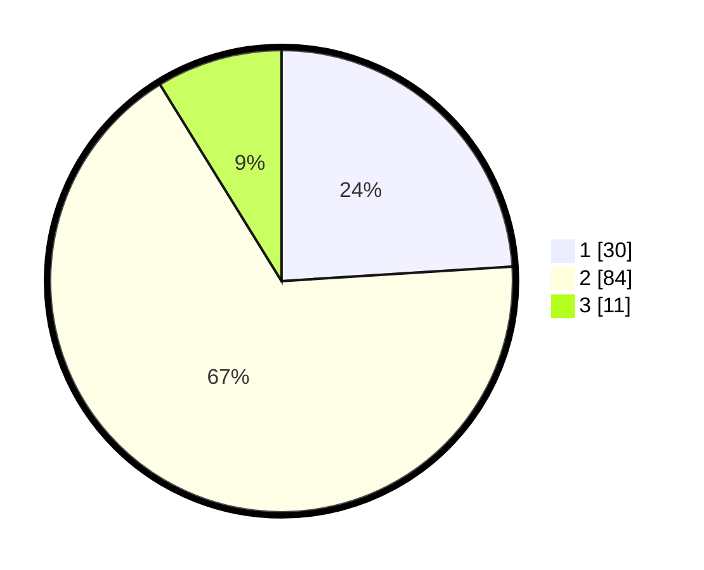

# Hasil

## Grafik

## Tabel

| No. | Nama Paslon    | Suara | Suara (raw) | Persentase |
|:--- |:-------------- | -----:| -----------:| ----------:|
| 1   | ANIES MUHAIMIN | 30    | [30][p-1]   | 24,00      |
| 2   | PRABOWO GIBRAN | 84    | [84][p-2]   | 67,20      |
| 3   | GANJAR MAHFUD  | 11    | [11][p-3]   | 8,80       |

[p-1]: https://github.com/gigit-pemilu/pemilu-2024-33-jawa-tengah/blob/main/pilpres/hitung-suara/sub/33-jawa-tengah/sub/29-brebes/sub/05-sirampog/sub/2012-plompong/sub/016-tps/sub/paslon-1.txt
[p-2]: https://github.com/gigit-pemilu/pemilu-2024-33-jawa-tengah/blob/main/pilpres/hitung-suara/sub/33-jawa-tengah/sub/29-brebes/sub/05-sirampog/sub/2012-plompong/sub/016-tps/sub/paslon-2.txt
[p-3]: https://github.com/gigit-pemilu/pemilu-2024-33-jawa-tengah/blob/main/pilpres/hitung-suara/sub/33-jawa-tengah/sub/29-brebes/sub/05-sirampog/sub/2012-plompong/sub/016-tps/sub/paslon-3.txt

## Foto C Plano

https://sirekap-obj-formc.kpu.go.id/5f30/pemilu/ppwp/33/29/05/20/12/3329052012016-20240214-141127--4a624bd3-eea4-4859-b193-c51cdbf960e3.jpg

https://sirekap-obj-formc.kpu.go.id/5f30/pemilu/ppwp/33/29/05/20/12/3329052012016-20240214-223427--d21d28f4-8a8b-4659-aa77-9c6552b28d69.jpg

https://sirekap-obj-formc.kpu.go.id/5f30/pemilu/ppwp/33/29/05/20/12/3329052012016-20240215-025059--b7738e8f-211e-4181-9944-1330811c2e0e.jpg

## Metadata

| Key        | Value               |
| ---------- | ------------------- |
| Time Stamp | 2024-02-25 15:00:00 |

