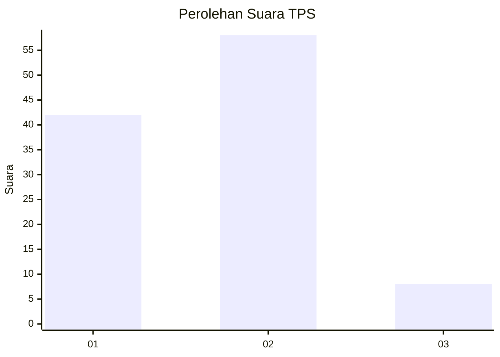

# Hasil

## Grafik

## Tabel

| No. | Nama Paslon    | Suara | Suara (raw) | Persentase |
|:--- |:-------------- | -----:| -----------:| ----------:|
| 1   | ANIES MUHAIMIN | 42    | [42][p-1]   | 38,89      |
| 2   | PRABOWO GIBRAN | 58    | [58][p-2]   | 53,70      |
| 3   | GANJAR MAHFUD  | 8     | [8][p-3]    | 7,41       |

[p-1]: https://github.com/gigit-pemilu/pemilu-2024-33-jawa-tengah/blob/main/pilpres/hitung-suara/sub/33-jawa-tengah/sub/29-brebes/sub/05-sirampog/sub/2012-plompong/sub/017-tps/sub/paslon-1.txt
[p-2]: https://github.com/gigit-pemilu/pemilu-2024-33-jawa-tengah/blob/main/pilpres/hitung-suara/sub/33-jawa-tengah/sub/29-brebes/sub/05-sirampog/sub/2012-plompong/sub/017-tps/sub/paslon-2.txt
[p-3]: https://github.com/gigit-pemilu/pemilu-2024-33-jawa-tengah/blob/main/pilpres/hitung-suara/sub/33-jawa-tengah/sub/29-brebes/sub/05-sirampog/sub/2012-plompong/sub/017-tps/sub/paslon-3.txt

## Foto C Plano

https://sirekap-obj-formc.kpu.go.id/003c/pemilu/ppwp/33/29/05/20/12/3329052012017-20240215-050200--43599036-8fc9-452b-9d9d-e18d892eb999.jpg

https://sirekap-obj-formc.kpu.go.id/003c/pemilu/ppwp/33/29/05/20/12/3329052012017-20240216-155149--117d54f4-2f38-4536-8bbb-9d3cd8eeeb43.jpg

https://sirekap-obj-formc.kpu.go.id/003c/pemilu/ppwp/33/29/05/20/12/3329052012017-20240214-141138--4ce07b2e-76f8-4ce3-b215-614d2108fed9.jpg

## Metadata

| Key        | Value               |
| ---------- | ------------------- |
| Time Stamp | 2024-02-24 22:31:28 |

