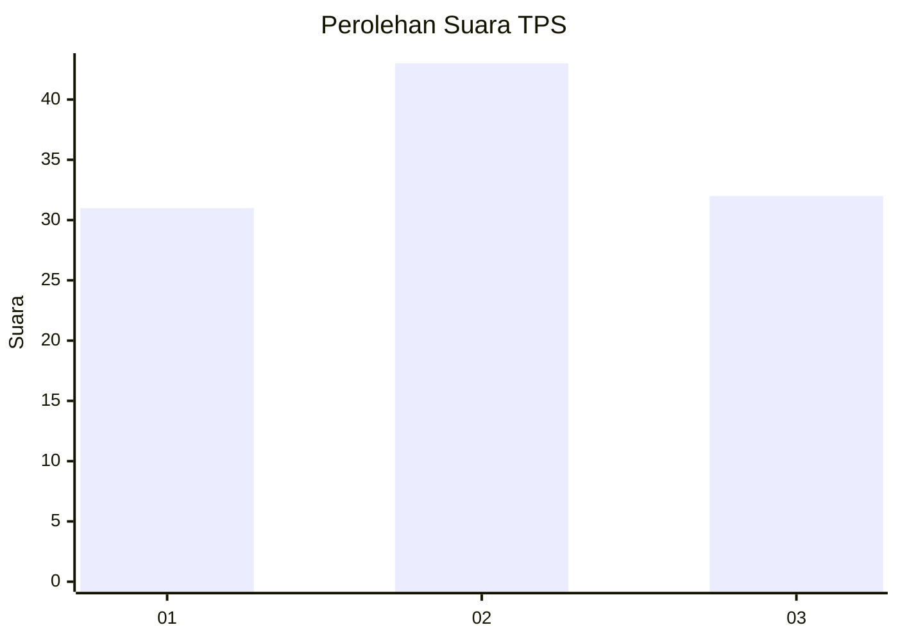
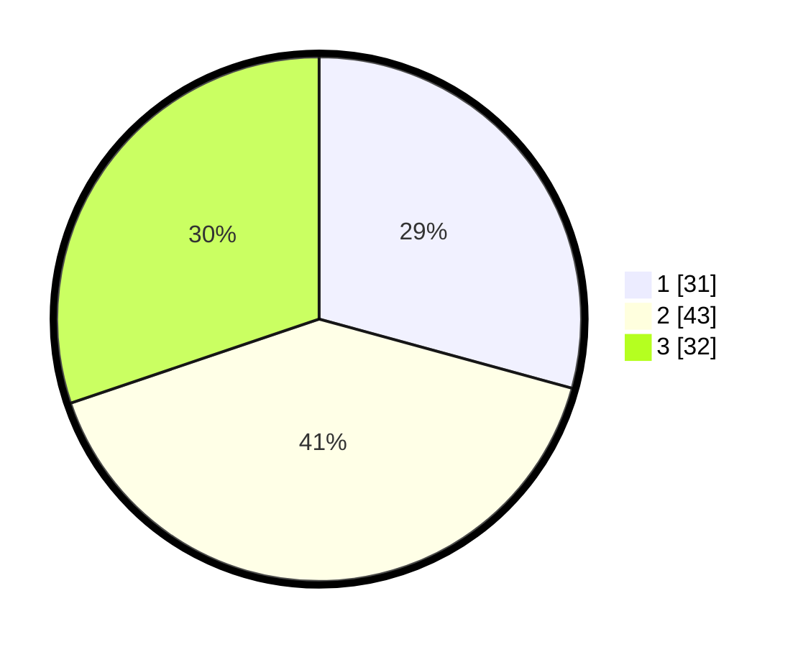

# Hasil

## Grafik

## Tabel

| No. | Nama Paslon    | Suara | Suara (raw) | Persentase |
|:--- |:-------------- | -----:| -----------:| ----------:|
| 1   | ANIES MUHAIMIN | 31    | [31][p-1]   | 29,25      |
| 2   | PRABOWO GIBRAN | 43    | [43][p-2]   | 40,57      |
| 3   | GANJAR MAHFUD  | 32    | [32][p-3]   | 30,19      |

[p-1]: https://github.com/gigit-pemilu/pemilu-2024/blob/main/pilpres/hitung-suara/sub/33-jawa-tengah/sub/29-brebes/sub/05-sirampog/sub/2012-plompong/sub/023-tps/sub/paslon-1.txt
[p-2]: https://github.com/gigit-pemilu/pemilu-2024/blob/main/pilpres/hitung-suara/sub/33-jawa-tengah/sub/29-brebes/sub/05-sirampog/sub/2012-plompong/sub/023-tps/sub/paslon-2.txt
[p-3]: https://github.com/gigit-pemilu/pemilu-2024/blob/main/pilpres/hitung-suara/sub/33-jawa-tengah/sub/29-brebes/sub/05-sirampog/sub/2012-plompong/sub/023-tps/sub/paslon-3.txt

## Foto C Plano

https://sirekap-obj-formc.kpu.go.id/9ab7/pemilu/ppwp/33/29/05/20/12/3329052012023-20240215-105939--2ce57133-57ee-44d5-a370-df2d40cc85ee.jpg

https://sirekap-obj-formc.kpu.go.id/9ab7/pemilu/ppwp/33/29/05/20/12/3329052012023-20240215-114128--ac71b037-8fab-42ab-8ca0-0c9ba00b16e5.jpg

https://sirekap-obj-formc.kpu.go.id/9ab7/pemilu/ppwp/33/29/05/20/12/3329052012023-20240215-105828--cdeed3b0-057a-45c8-9902-1fc3850772aa.jpg

## Metadata

| Key        | Value               |
| ---------- | ------------------- |
| Time Stamp | 2024-02-26 23:00:00 |

